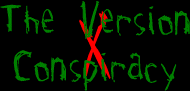

ext: htm
body:

  
by 8t88

     Some of you may have noticed
that a lot of levels are released to the general public that are chock
full of bugs, and the authors know that the bugs are there. You may be
wondering why. Well I'm here to clear up this matter in a summary I like
to call **The Version Conspiracy**.

     One of the biggest problems with
levels today is that they are released too soon; in effect creating a
plethora of bug-ridden levels that you are unknowingly downloading. The
cause of this anomaly is the brute known as **Version\!** He is a
ruthless killer of time and fun. He'll strike at any moment. He shows no
mercy. He could be lurking around the next corner...

     Who could create such a vile,
detestable creature? Would you believe it was **The Code Alliance**? The
very group that makes these, and actually good, levels possible\! They
added the **Version** heading in the level authors text file. But The
Code Alliance did not knowingly create this menace to society. Quite the
contrary; they created it so authors could endlessly improve on their
levels without having to do it all at once. You could call them modern
Dr. Frankensteins. But, once again, nature and it's unpredictableness
has spawned this weed that chokes the healthier crop of levels that were
painstakingly made by devoted authors everywhere.

     **Version** is commonly found in
readme files included with zips of levels and cripples that level that
had a chance to be something, and destroys authors that would have
otherwise made a name for themselves. It is disheartening to see these
poor frail levels hanging together with what strength they have, and
their broken authors clinging to what sanity they have left. I also feel
for the people who live from day to day; wondering when the next
**version** of a level will rear it's ugly head, posted on a JK news
site. Woe to you who are naive enough to persist in the pursuit of "the
next **version**".

     To you authors of bug-ridden
levels; pull this thorn from our sides, and make sure that it never
returns. For if you do not heed the words of your victims; may you earn
a name for yourself that is so unholy I am almost afraid to speak it;
you **Versionaire\!**

     Why do people need these
**versions**? It may be that people desire to improve upon themselves
and in that leave their creations flawed so they may improve it as they
would try to improve themselves. Every time they release a new
**version** in their minds they are improving upon themselves.

     Do you think having **versions**
is worth it? Do the ends justify the means? That decision is not yours
or mine but the decision of the author. Choose wisely...

"When someone desires information,
they come to me." - 8t88
