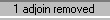

Author: 8t88

  - Usage - Press the "A" key to adjoin, press "Alt + A" to unadjoin; in
    surface mode, adjoins/unadjoins sectors.
  - Adjoining is connecting two sectors that have a common surface,
    enabling the player to walk between the two sectors and making the
    common surface invisible. Adjoining is also used for creating
    slashable grates and water surfaces. Unadjoining is just the
    opposite of adjoining. When you unadjoin two adjoined surfaces, you
    split the surfaces into their original surfaces essentially
    separating the sectors.

  
  
Select this surface and press "A" to adjoin or "Alt + A" to unadjoin.

  
  
  
  
You should see one of these messages.

