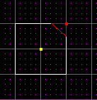
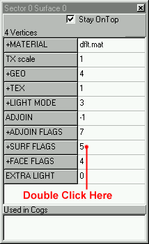
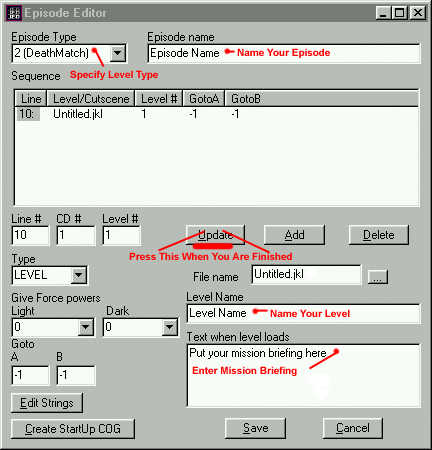

First of all, don't worry if you don't fully understand the previous 2
lessons. There was a lot of information covered, and you will be exposed
to it over and over. Pretty soon, it will become second nature. This
lesson assumes that you've chosen Jed, which is by far the most powerful
and easy to use program out there right now.  
  
In this lesson, we are going to get our hands dirty by actually creating
a level. It will be a small one room multi-player level intended for
practice only. Please understand that this level is NOT intended to be
released, EVER. Nor should you ever release your practice levels. You
should practice until you have a working knowledge of how to do
something, then start from scratch on a level you intend to release.  
  
Jedi Knight level editing is both an art and a skill. First, you must
learn and practice enough so that you can create a "functional" level.
Once you are proficient at that, you can go on to create artistic,
releasable levels. Remember that there are over 180 JK levels released
as of the writing of this article. I have played most of them, and to be
honest, only about 5-10 actually have a permanent place on my hard
drive. Please, play all the levels you can get your hands on to get a
feel for quality (and in most cases, the opposite of quality). Try to
release a level that is on par with LEC levels. It CAN be done, it just
takes time and practice.  
  
Okay, now for some fun. Start up Jed, and you will see a purple grid
with a red or white square in the center. The grid is what you use to
line up your "cleaves," which will be discussed later. This is a top
down view of your level. Hold down the \[shift\] key, and press the
arrow keys a few times. You will notice that the box in the center is
actually a 3d cube. This is a sector, as defined in lesson 1. As for the
colors, if it's white, it's normal, if it's red, it's selected.  
  
You can switch back to the top view automatically by holding down
\[shift\] and pressing the \[1\] key on the top of your keyboard. Also,
hold down \[shift\] and use the numbers 1-6. You will notice this snaps
the camera to a bunch of different views. I use 1-3 exclusively, as this
gets me all the angles I need.  
  
Also note that inside the default sector are two dots/things. The one on
the top (as seen from a side view: \[shift\] + 2 or 3) is a light. We
aren't concerned about that yet, so leave it alone. The bottom one is
what's called a "walkplayer." A walkplayer is basically a spawn point
for the player. If you are creating a single player level, you would
only have one, whereas a muli-player level will have many.  
  
Now we will discuss the different modes of editing. Across the top you
will find a bunch of buttons. These are the modes, as shown below.  
  
  
  
For now, leave it in sector mode. If you want, feel free to experiment,
just start a new project when you come back.  
  
Now, here are the goals of the rest of this tutorial:

  - Change the shape of the default sector.
  - Texture the sector.
  - Place a new "thing" such as a powerup.
  - Save the level correctly.
  - Test the level in JK.

  
## Cleaving a Sector
We are now going to do a very simple change to the default sector.
First, click on the default sector. You will know it is selected when it
turns red. Then, press \[shift\] + \[1\] to switch to the top view.
After that, press and release the \[c\] key. This will drop you into
"cleave" mode. This is how you will do most of your editing. The cleave
tool is a lot like a knife, where it's main purpose is to cut through
sectors, surfaces, etc.  
  
Note that if you use the \[+\] and \[-\] keys on the number pad, you can
zoom in and out.  
  
Now, press the mouse button and drag the cleave tool across one corner
of the sector. This will cut it along the line you just drew. Once you
let go, you will be out of cleave mode. Notice it is now two separate
sectors. Click on the corner you just cleaved off until it turns red,
then press the \[delete\] key. You can use the \[shift\] + arrow keys
combo to check out what you just did to the room.  
  
  
  
It is important that you understand this, as cleaving and deleting is
the best way to create architecture.  
  
## 3D Preview and Texturing
Now, press the \[F12\] function key. This will bring up the 3D preview,
which allows you to walk around in real time, and see how your level
looks. Notice the yellow checkered textures. To change these, just
double click on one. You will be presented with a texture selection
screen. Find a texture you like, and press okay. Notice that some of the
textures are messed up, with pink or sometimes blue splotches through
them. This is normal, and is a result of JK's different colormaps. They
will be discussed later, so for now, just choose a texture that isn't
messed up.  
  
An important thing to remember: If you single or double-click on a
surface in the 3D preview, the main editing window will automatically
switch to surface mode, and select that surface.  
  
Once you have textured all the surfaces, click on the floor (to select
it in the main window) and then close the 3D preview.  
  
## Surface Flags
When you get back to the main editing window, you will notice that the
floor is selected. You can verify this by using the \[shift\] + arrow
keys. Now, press \[Enter\] to bring up the item editor.  
  
Why are we doing this? Well if you remember lesson 2, we discussed
"surface flags." To make the floor solid, we must set it's flag to
"floor." Now, find the surface flags box in the item editor, and double
click on the number directly to the right of it. Make sure the flag
"floor" is checked, along with dirt, metal, or whatever else you'd like.
Please only choose one of those, so as not to confuse anyone.  
  
  
  
## Inserting "Things"
Now we are going to insert a powerup. This is very easy. First, select
thing mode. You will notice that the walkplayer is now selected, as it
is the only "thing" in the level so far. Now, switch to top view,
position the mouse somewhere inside the sector, and press \[Insert\].  
  
It is important to remember that we are editing in 3D space, so, to
position the item correctly, you must switch to a side view \[shift\] +
\[2\] to check it. If you need to move it, hold down the \[Ctrl\] key
and click/drag it to where it should go.  
  
Now that it is positioned correctly, we get to choose what "thing" its
going to be. With it selected, press \[Enter\] to bring up the item
editor. Now, you will see that under "+name" it says "walkplayer." Just
click on the word "walkplayer" and you will be able to choose a new
"thing." Please choose a powerup like "strifle" because if you choose an
enemy or something else, it might not work in multi-player. You will
learn more about that later.  
  
## Project Directory and Saving Correctly 
Now it is time to save your level. There are a lot of small mistakes you
can make, so be sure to follow this exactly.  
  
First, you need a project directory. A project directory is a directory
on your hard drive that you use to save all the files related to ONE
level. So, each new project you start should get its own project
directory. Once you have created your project directory, you are ready
to begin the saving process.  
  
Save your level by going up to file/save. Pick a name, and save it in
your project directory. Next, you have to fill out the episode editor.  
  
First of all, this next step needs to be done only once per level,
although you can edit it many times if you'd like. You need to fill in
all the information in the "episode editor." To get there, go to "tools"
then "episode editor."  
  
Fill out all the information highlighted below.  
  
  
  
When you are done with that, press the "UPDATE" button. If you do not do
this, it may not work correctly. After that, save the level again, by
hitting "file" then "save." Then, press "save JKL" this saves the JKL
file, which is in a format readable by JK. Put the JKL file in your
project directory also. We are not done yet. Most sites won't post a
level unless it's in gob format. So, after you save the JED and JKL
files, press "gob project." Do not put this file in your project
directory. Instead, save it in your JK/episode directory, so you can
play the level.  
  
Once it is saved in the JK/episode directory, just start up JK and you
should find your level in the multi-player level selection screen\!  

