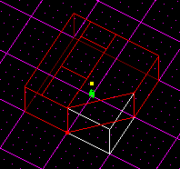

Author: 8t88

  - Usage - Press the "C" key; in sector mode, cleaves sectors; in
    surface mode, cleaves surfaces; in edge mode, cleaves edges.

  - Cleaving is the basic tool in JED. The cleave tool is used to shape
    sectors into what you want them to be (i.e. - a square, triangle,
    octagon, etc.). Cleaving is an alternative to moving the sector or
    parts of the sector (i.e. - moving surfaces, edges, or vertices)
    which can cause errors especially when adjoining or merging.
    
         Cleaving is also used for "cutting" holes in surfaces to join
    two sectors (rooms) by creating a hallway between them. Cleaving is
    also helpful for aligning or adding different textures to your
    level(s). You can also use the cleave tool to split an edge into two
    edges (though not often used).
    
         Now, let's get started. Switch to sector mode and select a
    sector. Press "Shift + 1" to switch to top view and align the grid.
    Press "C" and you should see a "lightsaber" : ). Right-click and
    drag and you should see a red line. Drag the line across the sector
    and release the button. Try cleaving from different direction (i.e.
    - top to bottom, bottom to top, left to right, etc.). You should
    notice that it selects different sectors when you cleave from
    different directions
    
         Next we'll cleave a surface. Switch to surface mode and make
    sure you're in a top view. Select a surface and do as above;
    clicking and dragging and from different directions. Pretty easy.
    
      
    Sector and Surface cleaving in action.

