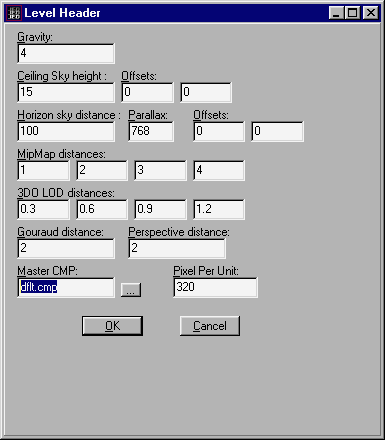

title: Colormaps
ext: htm
body:

Author: Brian Lozier

If you have gone through texturing, and noticed that a lot of the
textures you'd like to use are all garbled up with messed up colors
(like pink) then you have run into a colormap problem. Most cmp problems
don't appear with 3d acceleration turned on, so please, before releasing
any level, be absolutely sure to check the level in unaccelerated
mode.  
  
In Jed Beta .94, we have to change the colormap of all the sectors. So,
making sure that all the sectors are multiselected, press enter to
invoke the Item Editor. Notice that the third box down is called
"+Colormap.". Change it to whatever colormap works best for the textures
that you would like to use in your level.  
  

  
  
Now you must change the global colormap. In Jed Beta .94, there is an
option to select the colormap for the whole map. Look under the tools
menu, then click on "level header editor." There is a box there that
lets you choose what colormap you want. Select the same .cmp that you
used for all of your sectors.  
  

  
  
One more thing. It's difficult to choose a colormap without being able
to preview how the textures will look. To get a preview, double click on
any texture in the 3D preview, and there is a box towards the bottom
that lets you change the colormap. Change it, and scroll through the
textures to see what they look like. *You must still change the global
colormap for it to work correctly.*

