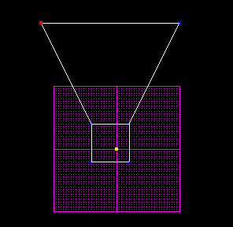
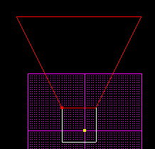
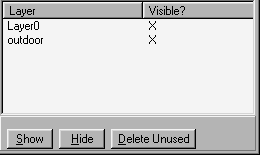
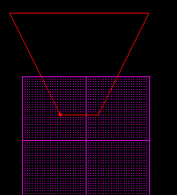

Author: EvanC

Layering is one of the best inventions for level editing. It allows you
to edit/view only part of a level at one time. It is also simple to
use.  
  

  
  
This value appears in the item editor of surfaces, things, sectors and
lights. You can fill in a name here.  
  
## How to use them  
Lets use an example to show how they work. You are making a level with
two different areas, a large outdoor area and a small indoor one. Here
is the whole level's picture:  
  

  
  
Now, we want to edit the outdoor sector ONLY. We don't want to see the
rest. What we do is click on the sector and fill in the '+layer' value
like so:  
  

  
  
Now, the sector has just been assigned to the layer 'outdoor'. We no
longer have to view the entire level when we want to edit the outdoor
area. Go to the window, 'map settings'. Down the bottom is the list of
layers:  
  

  
  
Click on the layer 'Layer0' and hit the 'Hide' button. Then click on the
'outdoor' layer and then return to the main JED screen. Here is what you
should see:  
  

  
  
Layer0 is hidden so although it is still "there" it isn't shown in the
JED screen.

You can have layers for every different part of the level. You may
choose to have the lights on a separate layer than the rest of the
level. You might put all things on a different layer so that you can
easily see the layout of them without getting the screen cluttered.  
  
## Things to remember

It is good to have layers for each part of a level. If you are making a
level of the beach you should have a layer for the underwater part and a
layer for the sand.

Layers can be assigned to surfaces, sectors, things and lights.

Just because you can't see a layer in the JED screen doesn't mean that
it isn't there when you play JK.

