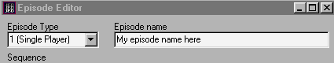

Author: EvanC

A lot of people don't know the correct way to save a level in JED. This
should help.  
  
The first thing you will need to know is what your project directory is
for. This is where you save your JED file. If there is anything else
that your level needs to run(eg: Home-made cogs) they must be put in
your project directory.  
  
Now, once you have saved your JED file in the project dir you need to
save your JKL file. Once you have done that you need to save the gob.
The gob is a container file that stores all the add-on files. This makes
it easier to distribute your level because it means that there is only
one file that people need to install to run your add-on.  
  
Once you have the gob saved place it in your jediknight/episode folder.
This is where JK looks for new add-on levels. When you start up JK it
will have your level listed under the appropriate place (for single
player missions it will be under the single player-new game menu. For
multi it will be under multiplayer-host game).  
  
## Saving your episode

If you want to save your level episode with a name other than "New
Level" then you need to use the episode editor. This is a handy new tool
that comes with JED 0.5 that is very easy to use. It is found in the
options menu. Here is what it looks like:  
  

Obviously, you put your episode name where 'my episode name here' is.
Push the update button in the editor.  
  
## Things to remember

  - Don't save each new level under the same directory. JED will take
    all the JK files in the dir and gob them up which means that the gob
    size might be huge.
  - Don't have unnecessary cogs/3dos in the project dir because they
    will also take up space.
  - I would recommend not having any non-JK files in the dir. I think
    JED ignores these but it is better to be safe than sorry.
  - Each new level should have its own directory to keep things tidy.
  - Make sure you push 'update' whenever you change your episode editor.

