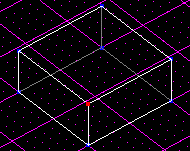

Author: 8t88

There are some essential terms you need to know while working with JK
levels.

**Sector** - A sector is basically a room made up of vertices, edges,
and surfaces.  

**Surface** - A surface is one side of a sector, a flat shape (like a
wall of a room), made up of vertices and edges.  

**Edge** - An edge is where two surfaces meet and is represented by a
line drawn between two vertices.  

**Vertex** - A vertex is a single point, like a period on this page,
that connects edges and makes angles possible.

Objects in red are defined below each image.

<table>
<colgroup>
<col style="width: 50%" />
<col style="width: 50%" />
</colgroup>
<tbody>
<tr class="odd">
<td style="text-align: center;"> 
Sector</td>
<td style="text-align: center;"> 
Surface</td>
</tr>
<tr class="even">
<td style="text-align: center;"> 
Vertex</td>
<td style="text-align: center;"> 
Edge</td>
</tr>
</tbody>
</table>
