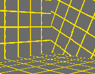

Author: 8t88

Aligning textures is one of the hardest parts of level editing, but is
also one of the most important. With a few tips, you'll be well on your
way to the rigors of texture alignment. One of the easiest ways to align
textures is a method called stitching. First, in the 3D Preview window,
select the texture you want another texture aligned to and press Ctrl +
Insert, then you select the texture you want aligned to the previous
texture and press Shift + Insert. This will align the texture to the
initial texture and set the newly aligned texture as the starting stitch
point like when you press Ctrl + Insert. Also, if the two surfaces have
different textures on them, JED will change the texture to match the
stitch starting texture and align the texture. The ; and ' buttons can
be used to take the place of Ctrl + Insert and Shift + Insert
respectively.  

Sometimes stitching just won't work, so you have to get down to
basics. Once again in the 3D Preview window, select the texture you wish
to align and from here you can do a number of things:  
  

|     Action      |  Key           |
| --------------- | -------------- |
| Move Up/Down    | < , \>        |
| Move Left/Right | Shift + < , \> |
| Rotate Texture  | Ctrl + < , \>  |

| Unaligned | Aligned |
| ----------|---------|
| | |

