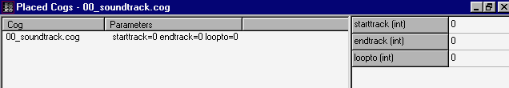

title: Sound Tracks
ext: htm
body:

Author: EvanC

This tells you how to add a soundtrack to the level.  
  
All you need to use is 00\_soundtrack.cog. This cog will play background
music from the JK cd.  
  
In JED: Click on the 'options-placed cogs' menu. Down the bottom of the
window should be a button called 'add cog'. This will bring up a new
window with a list of cogs in it. 00\_soundtrack.cog should be somewhere
near the start. Double click on it and it will appear in the previous
menu. There should be a screen like this:  
  

Now you need to find the track you want to play. Most computers have a
cd player somewhere on them so use that. Listen to the cd until you find
the music that you would like to hear in your level. Remember its
number. Go back to JED and then fill in the starttrack with the track
number. Find another track and put that in the endtrack. Now put the
first number into the loopto value. Save your level and then you're
ready to play with a nice soundtrack in the background.

