> *We've received reports from the Chandrilans that some cultists have
> broken into an ancient tomb that is supposedly the burial site of a
> Jedi Knight. Hurry there and stop them from siphoning that Force
> power.*

You begin the mission sliding down a shaft in a passage seemingly
blocked by boulders and debris. Use Force Push to clear the path. In the
process you'll rid yourself of a trooper standing guard just beyond.
Nice work.

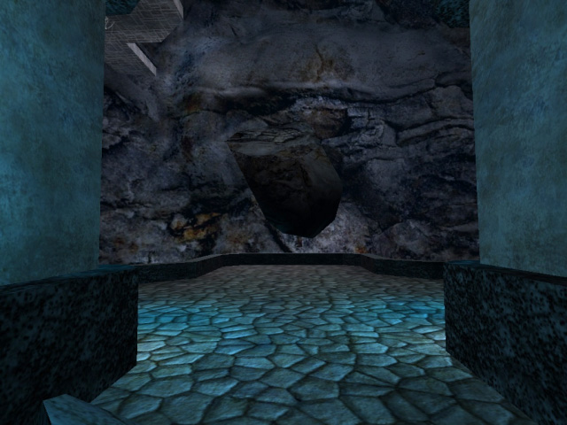

Stepping onto the terrace and looking to your right, you'll see you're
in a large rift. A Cultist wielding dual sabers will drop from high
above and try to surprise you. Try to stay way from the edges of
terrace, as the rift is bottomless. After dispatching the Cultist, head
to the ledge on the right. As you approach you'll hear a conversation
between a pair of troopers below. You can drop from ledge to pillar to
column without being detected. The trooper on the right is wielding a
concussion rifle, so take him out first.

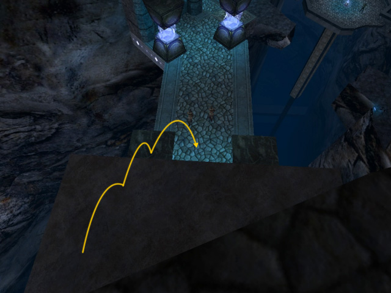

Step across the bridge and walk down the path. The Cultists standing at
a terrace just beyond will more than likely have detected you and will
make their way over to you. One of these Cultist has no saber, simply a
Force user, but be careful; they are strong with the Force and can Push
you off the ledge in no time. If you've got Force Absorb, it'll come in
very handy with these guys. The narrow bridge to the right of the path
you just came down is broken, but you can easily Force Jump across the
space to reach the Shield Booster on the other side.

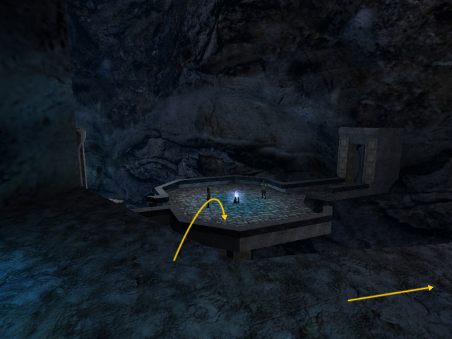

From the now-vacant terrace, head to your left and hop across the series
of ledges hugging the cliff side. One of these ledges will partially
collapse once you land on it, but there is another ledge just below it
to catch your fall. If you have a Disruptor Rifle for this mission, you
will make it easier for yourself if you take out the troopers standing
guard across the rift from here.

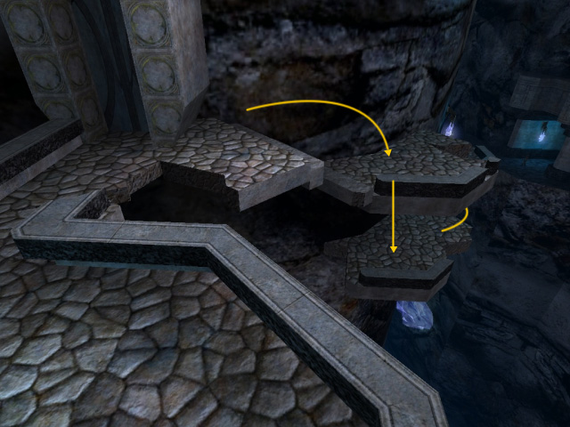

Once you cross the narrow bridge across the rift's expanse, you can go
through the doorway to the right to proceed with the mission, or jump
atop the doorway on the right to access the [first secret
area](#secret_01).

The doorway leads you down a winding passage to a grand bridge. As you
approach the bridge you'll hear the cues of a detonator pack being
activated, and sure enough, as you step onto the bridge the det pack
explodes, taking out the middle of the bridge. Force Jump across this
gap to proceed to the hall and chamber beyond.

At the end of the hall three Cultist await you. The one on the left will
fight you one-on-one, but the two on the right will attack you
simultaneously. Once they've been eliminated, approach the door to the
right and use Force Sense. This will reveal markings on the door and the
floor and will allow you to open it using Force Pull. Do so to proceed.
A Cultist waits for you in the hall beyond.

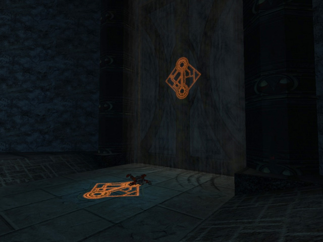

Walking to the end of this hall will bring you to a crumbling terrace. A
Cultist will jump up from the ledges below to attack. Bring the fight
back into the hall to avoid any frustrating Pushes. Once he's gone, head
back to the terrace and angle yourself to drop down to the ledge below.
Continue making your way down the ledges or pause for a moment to access
the [second secret area](#secret_02).

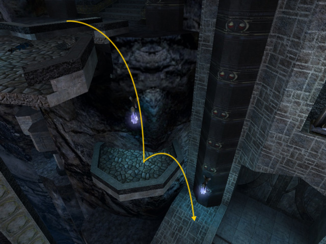

A Cultist awaits you at the landing below. You'll notice the remains of
another bridge across the rift's expanse here, but this one is too wide
for you to clear. While you can combine Force Speed with Force Jump to
clear it, you're meant to go another way. To the left of the landing is
a column that's collapsed onto the side. Jump on and slide down this
column to proceed in the mission, or before you do that, head to the
right of the landing to access the [third secret area](#secret_03).

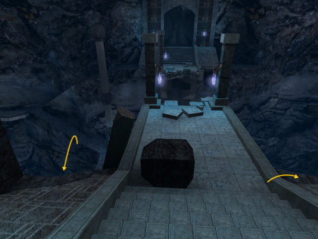

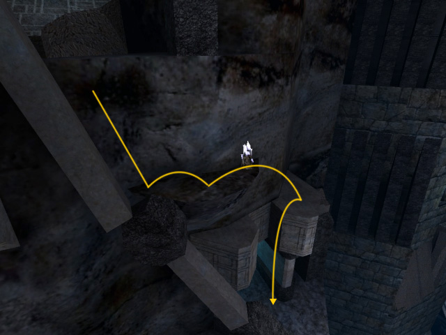

Once you've slid and dropped down from the column and ledges a trooper
guarding a Shield Booster waits in an alcove to your left. Cross the
narrow bridge to the right and prepare yourself for a Cultist who hides
behind a column at the far end. Make your way up the path to your left
to a mezzanine. Here you can do three things: 1) continue up the path to
get to the landing on the far side of the collapsed bridge you just
passed and take out the Cultist and trooper lying in wait, 2) drop down
from the mezzanine to the space below and to the left to take out the
Cultist there and proceed with the mission, or 3) have a look at the
ledge hugging the cliffside above and in front of you to reach the
[fourth and final secret area](#secret_04).

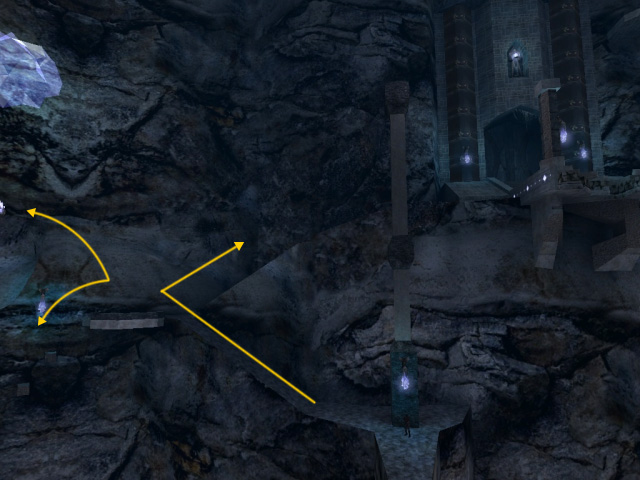

After you've eliminated the Cultist in the space below the mezzanine,
cross the narrow bridge and along the narrow ledge. If you continue on
this narrow ledge a Cultist waits for you at the very end, but at
midpoint you will see a slim walkway below and to your right. The next
stage consists of a series of downward jumps from doorway ledge to
doorway ledge. You'll have made your way down completely when you reach
a broad walkway lit by crystals. Cross this walkway to another narrow
ledge.

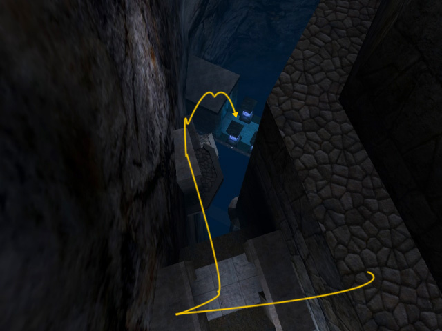

Again, at midpoint you will see another walkway you can jump down to.
Before you do, you may once again want to use the Disruptor Rifle to
snipe the troopers than lay ahead. Use the scope to find them and pick
them off. Parts of this walkway have collapsed, but it won't collapse
any further. Just jump and walk down it until you've attracted the
attention of the Cultist at the far end. Battle carefully. Once they're
gone jump up atop the doorway at the end of the walkway, then look to
your right to jump onto the terrace you will see there.

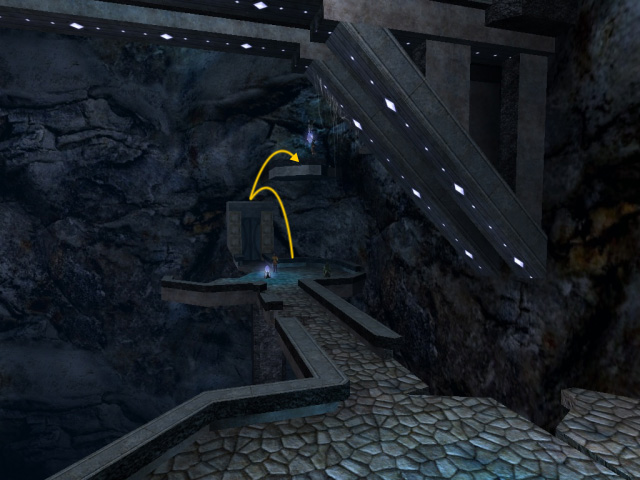

From this point you will see where you need to get to proceed. You can
either jump carefully onto the slim planks that jut out from the
cliffside, or just use Force Jump to clear the whole mess and reach the
landing ahead.

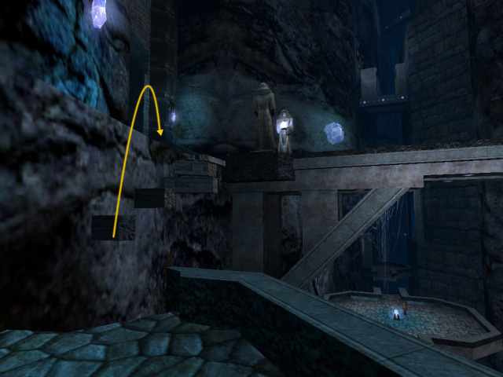

To your right is one last bridge. Don't worry, it won't collapse on you.
Yet. This is the home stretch. Run across the bridge and take out the
pair of Cultist that wait for you at the other end. Then proceed into
the knight's tomb. Halfway into the passage two more Cultist will attack
from either side. After them, there's just one more Cultist in the
chamber at the end of the hall, wielding a lightstaff and guarding the
actual tomb.

After getting rid of this last Cultist, you conclude you need to seal
the tomb completely. In order to do this, use Force Sense to discover
the markings on the walls on either side of the tomb. Fake areas of the
walls directly beneath these markings will disappear to reveal square
blocks. Use Force Push to move these blocks and begin the process of
sealing the tomb.

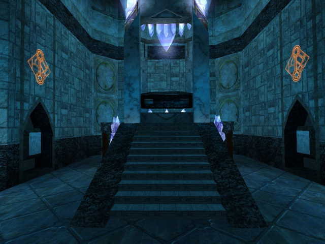

As this is happening, the tomb will begin to fall apart. This is your
cue to head back down the hall and out of the tomb. Watch your head: a
column will crumble and block your path, and debris will fall from high
above. You're safer taking one of the slim walkays on either side of the
hall.

Make your way out and back to the bridge as the tomb is sealed
completely. The bridge itself will begin to crumble, so use Force Jump
to make your way back across it. Once you're there, the cutscene takes
over and your mission is complete.

## Secrets

**Secret Area 1**

Go left instead of right and jump atop the doorway to reach the terrace
above. A trooper armed with a conc rifle will be waiting for you. Once
he's gone enter the passage to find a Shield Booster and a Medpack.

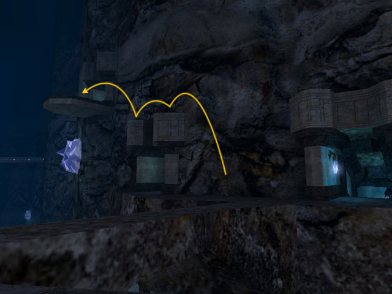

**Secret Area 2**

Before dropping any further, look up to the landing you dropped from and
you'll find a small alcove cut into the cliff face. It's very dark, but
you can use Force Sense to reveal a marking in the stone that hints at
where you should jump. Rocket ammo waits for you here.

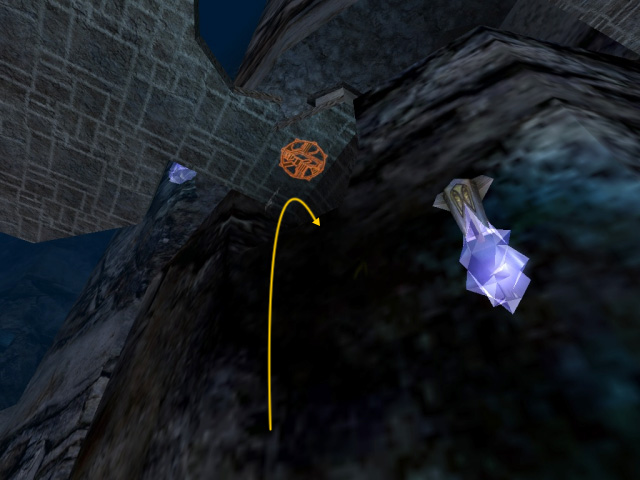

**Secret Area 3**

At this collapsed bridge's landing, head to the right to find a small
ledge within Force Jump distance. A trooper will be standing guard with
a Bowcaster. You'll find a Shield Booster here.

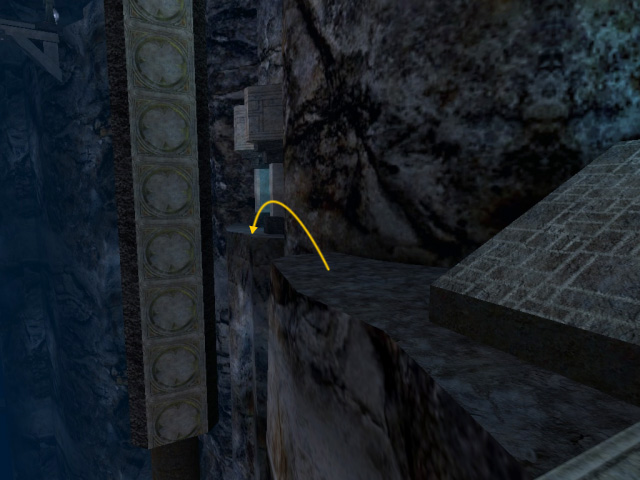

**Secret Area 4**

From the mezzanine, look at the cliffside above and ahead of you to find
small ledge you can jump to. From here, you'll have just enough Force
Jump power to make it atop the large block beyond. Along the ledges up
here you will find Rocket ammo, two Medpacks and a large Shield Booster.
To avoid sustaining any falling damage, head back the way you came to
the mezzanine to proceed with the mission.

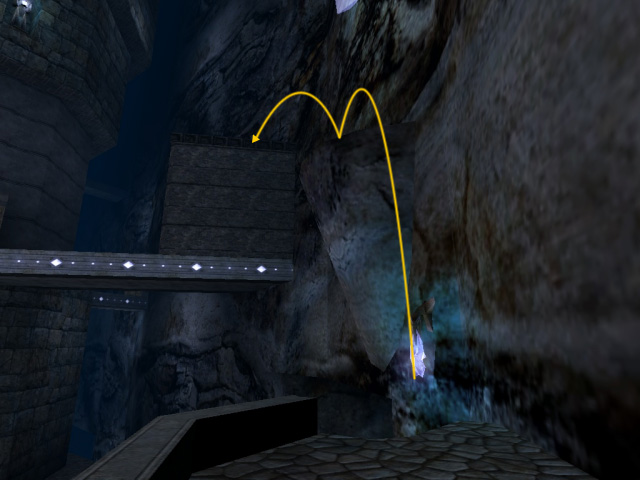

* Back: [Mercenary Activity - Tatooine](../tatooine/)
* [Return to Table of Contents](/guide/walkthrough/jademo/)
