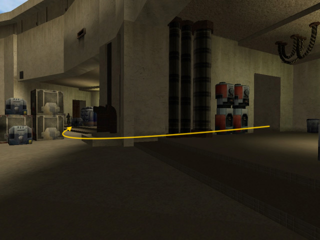
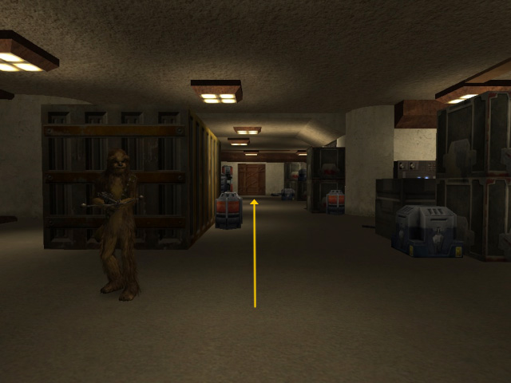
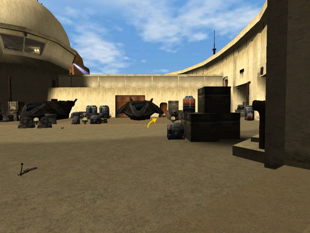
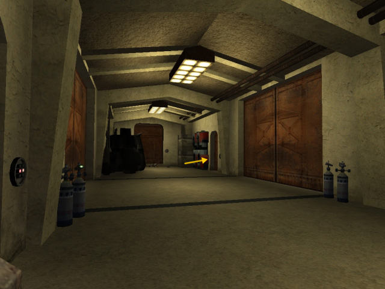
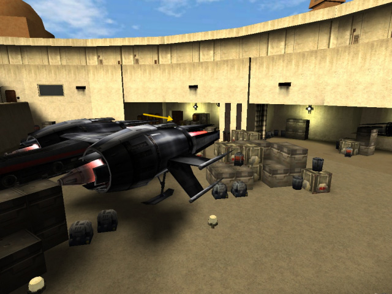
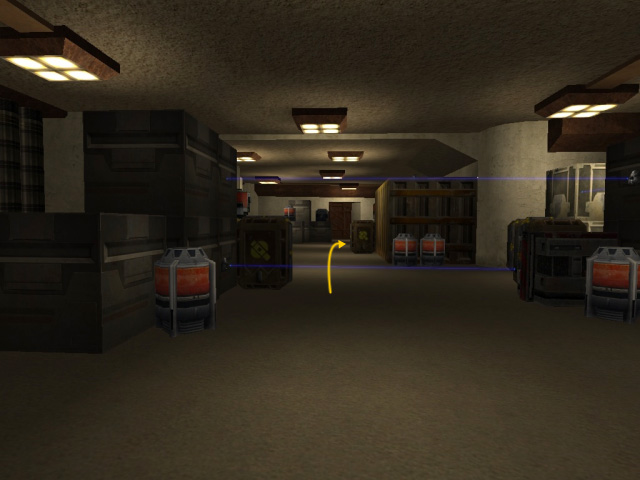
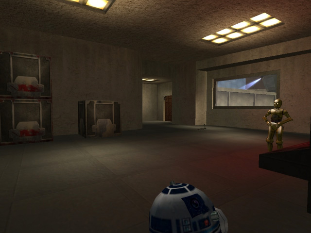
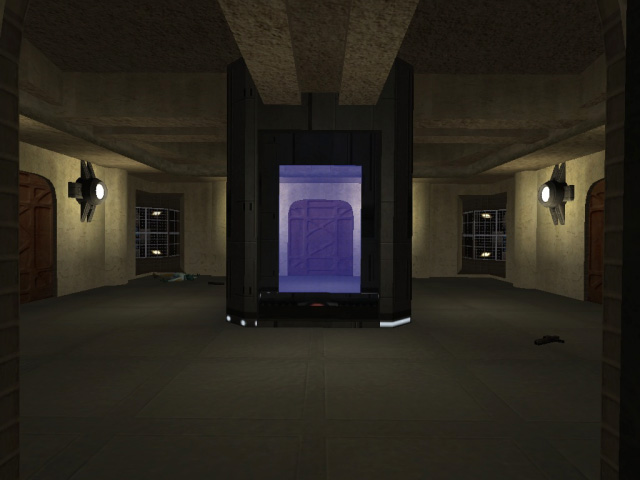
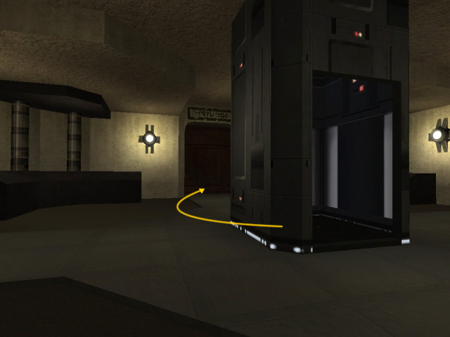
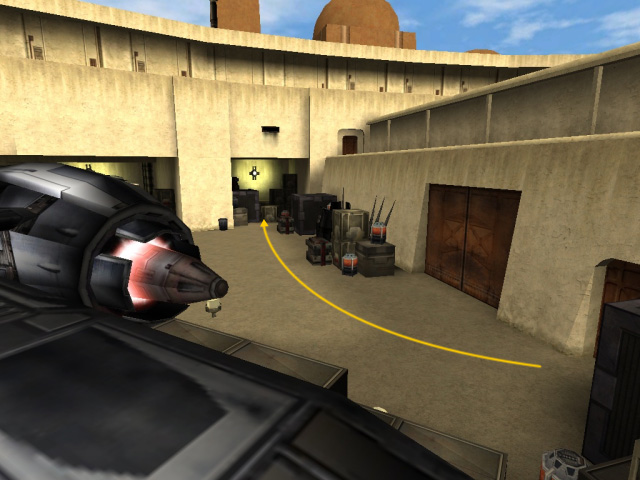

> *We've been receiving a number of reports that the Disciples of Ragnos
> have been trying to hire mercenaries and smugglers to haul some cargo.
> If we can contact one of these mercenary groups, maybe we can find out
> the cult's base of operations. One of the smuggling rings that we know
> about is based at Mos Eisley. Go there and see what you can find out.*

The mission begins with a series of cutscenes. Kyle heads off to one of
the cantinas while you're left to wait by the door in case things get
sticky. Things *do* get sticky, but as it turns out, Chewbacca's the one
in the middle of it. You go with Chewie to get rid of the riff-raff.

You begin at a doorway that leads to a vacant landing pad. Ducking
behind various crates and containers are rodians, trandoshans, etc. You
realize you need to get back indoors to steer away from the crossfire.
Make your way to a doorway to the far right of the pad, nearly behind
where you came in.

Once inside make your way through the room, taking out the goons ducking
behind crates on either side. Head for the door directly opposite from
where you came in.

Walk through the series of doorways and henchmen that follow — it's
pretty linear — till you get to the next landing pad are. This one's got
a couple of smugglers' ships docked. You'll need to clear out all the
stooges that make an appearance here before you can proceed, which will
involve moving through the storage areas and back again. Watch for the
gran upon the far ledge hurling thermal detonators down at you. You'll
know you're done when a cutscene takes over showing the *Falcon* and the
*Raven's Claw* pinned down by tractor beams. Once you're done in this
area head for the door across the pad, behind the docked ships, to
proceed.

Inside, head left, take out the trando and trooper at the end of the
hall, and exit through the last door on the right.

You'll find yourself at the landing pad where the *Raven's Claw* is
docked. Head to the far right corner of the pad to access a [secret
area](#secret_01). You'll need walk over to the storage area to the far
left, at the ship's rear, before a cutscene takes over. Goons of all
kinds come pouring in through a door, pinning you and Chewie down behind
some crates.

Chewie agrees to hold them off while you try to deactivate the tractor
beams. As you head through the doorway a rocket slams into the
containers behind you, blocking your path back to Chewie. Onwards\!
Follow the doors through to a storage room with trip mines planted
across the way. Keep an eye out for trandos with repeaters\! Make your
way to the end of the room and head through the door on the right.

The moment you walk through the door a thermal detonator is hurled at
you from a staircase ahead of you and to the right. Don't run into the
room or you're sure to be within its blast radius. Once it's clear have
something handy with which to dispatch the gran at the top of the stairs
before he hurls another detonator at you. At the top of the stairs head
right down the hall and then left into the room. A few stooges are
milling about here, along with a couple familiar-looking droids... the
doorway you're looking for is to the left.

This leads you out onto a strip of walkway above one of the landing pads
and towards the central building where the tractor beam controls are
located. A rodian comes out to greet you with his disruptor rifle. Get
rid of him and enter the building. After walking through another doorway
or two you'll get to the very center of the building where you'll found
an elevator that looks suspiciously out of place. A couple of rodians
are milling about in here, too. Take them out, then take the elevator up
one level.

Ahead of you is a panel with a switch you can use to deactivate one of
the tractor beams. To find the other switch, turn around and head
through the doorway behind you. You'll also find a Cultist here waiting
for you. Once he's been dispatched, deactivate the second beam and head
back to the elevator. It will automatically take you two levels down.
Here, walk to the doorway directly behind the elevator. This area seems
a bit buggy, but the door *should* open to reveal Chewie waiting for you
on the other side.

Head through the hall to the last doorway on the right. You'll exit out
onto the pad where the *Falcon* docked. You're not out of the woods yet
though, as more goons are hiding behind boxes and crates for one last
shot at you. Once you've cleared them out the cutscenes will take over
and you're done with the mission, receiving high praise from the
Wookiee, no less.

## Secrets

**Secret Area 1**

At the landing bay where the Moldy Crow's docked, there's a storage area
to the far right nearly blocked with crates. Jump past the crates to
find a Medpack and a stash or thermal detonators.

* [Return to Table of Contents](/guide/walkthrough/jademo/)
* Next: [Cult Sighting - Chandrila](../chandrila/)
