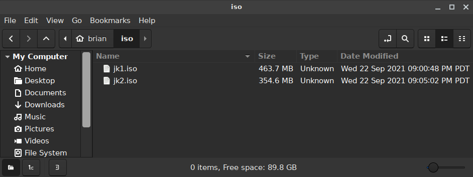
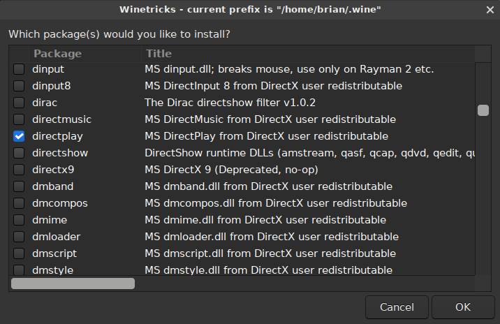

[TOC]

## Steam Note

If you have Steam on Linux, you can install and use JK.  After you run the install in Steam, you need to right click the game, click Properties, click Compatibility on the left, check the "Force the use of a specific Steam Play compatibility tool" and then select "Proton 5.0-10". When I did that, the single player worked, same as running it under vanilla wine. But the multiplayer is broken completely.

## Prerequisites

* have a working Linux install; I'm using Ubuntu 20.04 (but this also worked
  on 18.04)
    * If you're on a different distro, you'll need to figure out the wine
      installation yourself, but the rest of the instructions should work
* have 2 ISOs, one for each original JK CD

If you don't have these ISOs, but you do have a computer with a CD drive, and each of the 2 JK disks, you can follow these instructions to rip an ISO of each:

[Create an ISO Image from a CD under Linux](https://www.thomas-krenn.com/en/wiki/Create_an_ISO_Image_from_a_source_CD_or_DVD_under_Linux)

Please Note: it is possible to use wine to run the installers from the CDs directly.  I have done it in the past but my JK CDs are so old and messed up I just ripped ISOs that I will save for later.

In my case, I ripped ISOs from the two JK CDs and I'm using those.  The filenames of the ISOs are `jk1.iso` and `jk2.iso`.



## Install Wine

Note: the default `wine` package you get if you install `wine` is the 64-bit package.  For JK, it's easier to get things running if you just install `wine32`.  This works fine even on a 64-bit system.

In a terminal, run:

```
    sudo apt install wine32
```

Run `winecfg` and on the default screen (Applications), at the bottom, next wo Windows Version, select Windows XP.  This makes the installer run better.  With the default (Windows 7) selected, the windows appear huge and it doesn't quite work right.  Click Apply then OK.


## Install winetricks (optional)

This is optional.  If you want any hope of getting multiplayer working, you need this.  If you just want to play single-player, you can skip it.

First you need to install some prerequisites:

```
    sudo apt install cabextract
```

`winetricks` is an open source program that allows easy install of components (such as vc++ redistributables, directx, etc.).  Follow the instructions here for installation:

[https://github.com/Winetricks/winetricks](https://github.com/Winetricks/winetricks)

Please note that the winetricks package in Ubuntu 20.04 is out of date severely enough that it simply does not work.  Install from the github repository.

### Install directplay

Run `winetricks`.  You will be asked what you want to do.  First select "Select the default wineprefix" and then click OK.


On the next screen, choose to "Install a Windows DLL or component" and click OK.


Scroll down and fine `directplay`; select it and click OK.



When it's done, it will drop you back to the main screen.  Just click the X to close the program.

## Mount the first disk ISO.

Create a directory into which you will mount the ISO.  In my case, the directory I want is `/home/brian/fake_cd_drive`:

```
    cd
    mkdir fake_cd_drive
```

Now mount the ISO into the directory that was just created:

```
    sudo mount -o loop /home/brian/iso/jk1.iso /home/brian/fake_cd_drive
```

Example output:

```
    brian@oree:~$ sudo mount -o loop /home/brian/iso/jk1.iso /home/brian/fake_cd_drive
    mount: /home/brian/fake_cd_drive: WARNING: device write-protected, mounted read-only.
    brian@oree:~$ 
```

Verify it by changing into the directory and listing files:

```
    cd /home/brian/fake_cd_drive
    ls -l
```

Example output:

```
    brian@oree:~/fake_cd_drive$ ls -l
    total 576
    dr-xr-xr-x  1 root  root    2048 Sep 11  1997 ./
    drwxr-xr-x 58 brian brian   4096 Sep 22 21:22 ../
    -r-xr-xr-x  1 root  root      52 Sep 11  1997 autorun.inf*
    dr-xr-xr-x  1 root  root    4096 Sep 10  1997 directx/
    dr-xr-xr-x  1 root  root    2048 Sep 10  1997 gamedata/
    dr-xr-xr-x  1 root  root    2048 Sep 11  1997 install/
    -r-xr-xr-x  1 root  root  214528 Sep 11  1997 jedi.doc*
    -r-xr-xr-x  1 root  root  309760 Sep 11  1997 jedi.exe*
    -r-xr-xr-x  1 root  root    1736 Sep 11  1997 jedi.txt*
    -r-xr-xr-x  1 root  root   31319 Sep 11  1997 readme.txt*
    -r-xr-xr-x  1 root  root   16896 Sep 11  1997 setup.exe*
```

## Run the installer

Run the installer using wine.

Still in the `fake_cd_drive` directory, run:

```
    wine setup.exe
```

This should open the installer, and it looks mostly like it does on Windows:


Run through the installation steps as normal.

* Choose Complete Installation when prompted
* The default Destination Directory is fine
* The start menu nonsense is nonsense
* Jedi Knight does appear in the "Wine" section of my Cinnamon "start" menu

After installation, you should see the launcher.


Click Play!

Everything works for me.  Important things to set up once the game is launched:

* Enable 3d Acceleration
* Choose the resolution that matches your monitor

<a href="game.png"></a>

## Launching the game

After you exit the game, you can launch it again by finding the Jedi Knight entry in your "start" menu.  If you can't find it in your start menu, by default everything is installed in `.wine/drive_c`, so you can launch it like this:

```
    cd .wine/drive_c/Program\ Files/LucasArts/Jedi\ Knight/
    wine jk.exe
```

## What about the CD music?

It doesn't seem to work with the ISO.  However, if you have a CD drive and you can install from the original JK CDs, and you leave the CD inserted while playing, the music works.

## It prompted me for Disc 2

I think you can alt-tab out of the game to do this.

Unmount the first ISO, and then mount the second one using a similar command.

```
    sudo umount /home/brian/fake_cd_drive
    sudo mount -o loop /home/brian/iso/jk2.iso /home/brian/fake_cd_drive
```

Then alt-tab back into the game.

## Multiplayer?

If you installed `directplay` via `winetricks` you should be able to load the multiplayer screen and host a game.  You can walk around in the multiplayer levels by yourself.  To get other people to join or to join someone else's game, you will probably need to configure/open some ports on your router.  I haven't gotten to that point yet.

