Author: Brian Lozier  

The purpose of this tutorial is to demonstrate how to make a 3do in JED,
and once made, how to use it in your level. It covers texturing the 3do
in JED also.

First off, there are some rules to remember when making 3do's with JED.
If you don't understand these, that's fine, they will be covered in
depth later in the tutorial.

  - Sectors used in 3do construction CAN BE non-convex.
  - You can only export ONE sector as a 3do, so anything you want
    included must be merged together.
  - 3do's can be created and resized, so if it's easiest to get the
    detail you want by making a huge 3do, that if fine, you can just
    scale it down when you're ready to export.
  - Flag your starting sector as 3do before you begin cleaving. This
    will make texturing and previewing a lot easier later on. To do
    this, select your sector, press \[enter\] to invoke the Item Editor,
    and double click on the sector flag box. At the very bottom of the
    list, select "preview as 3do."

I think that's about all to remember for now, on to the tutorial.

## Step 1: Does it need to be a 3do?

> It is important to know which things should be 3do's and which should
> not be. If you are creating a 3do of a beam to put in a room over and
> over, I think it's pretty much pointless, as you get far better
> framerates and lighting effects if you just use JED and make the beams
> part of the level geometry.  
>   
> 3do's should be things like ships, new doors, any "thing" that needs
> to move in-level, and things that you can use more than once in a
> level. That said, we are going to work on our first 3do.  
>   
> For the purpose of this tutorial, I chose a see-through steel grate
> door that can be used in dungeon/prison type levels. Of course you can
> choose whatever you want, but it will be easier to follow along if you
> use this as your learning project.

## Step 2: Cleave an outline.

> This should be the basic shape of the outside of your 3do. This
> probably doesn't apply if you are making a very complex 3do, but for
> our purposes, this is the way to start.  
>   
> I have reshaped the default JED sector below. I just switched to
> vertex mode and pulled them in from all angles. I used the walkplayer
> "thing" to help me size my 3do. It is going to be a door, so is a
> little larger than the walkplayer. Remember, to get the sector sized
> correctly, you will have to change your grid snap to something a lot
> smaller than the .2 default. I used 0.01 for the sector shown below.  
>   
> 
> 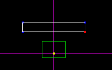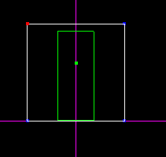
> 
> Left: Top view, Right: Side view.
> 
> The green rectangle is the walkplayer.
> 
>   
>   
> Notice I made the door line up with the grid dots. This makes for
> easier implementation to your level. Why? Because it's way easier to
> cleave to the correct size when you can see that an object's size
> matches up with the grid dots. (This isn't applicable for things like
> ships, etc.)

## Step 3: The details.

> Remember I said we were going to make this like prison bars? Well now
> it's time for that. First off, you can move the walkplayer out of the
> way, to get a better view.  
>   
> Then, cleave the center out of the 3do. This will allow us to create
> the jail bars after the fact. To do this, go to sector mode, and
> cleave the center out as shown below. When the cleave is done, you
> just select the center sector, as shown, and delete it. Remember that
> this is all done in side view.  
>   
> 
> 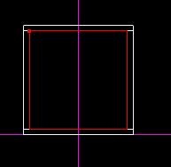
> 
>   
>   
> You will then have something like this:  
>   
> 
> 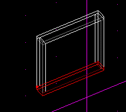
> 
>   
>   
> Okay, now it's time to decide what exact shape the bars will be. To
> make bars, we select the surface as shown below, cleave the shape of
> the bars out of it, and extrude. That sounds a little confusing, I
> know, but bear with me, it will all be explained. First, select the
> surface that the TOP of each bar will connect to, shown below:  
>   
> 
> 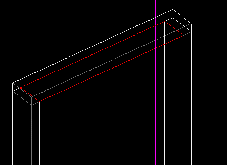
> 
>   
>   
> Now, with that surface selected, switch to top view, using
> \[shiftf+1\]. Cleave the the surface to divide up how many bars you
> are going to have, as shown below:  
>   
> 
> 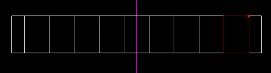
> 
>   
>   
> Now, select one of the surfaces you just cleaved, and cleave a jail
> bar from that. It's shown below in yet another screen shot.  
>   
> 
> 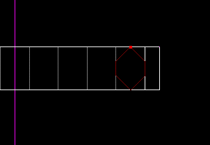
> 
>   
>   
> Now, with the jail bar surface selected, extrude it using the \[X\]
> key. Then, switch to a side view, and you can see your bar. you will
> need to select the bottom surface of the bar, and extend it down by
> dragging with \[cntrl\] held down. This is needed to line it up with
> the bottom surface also.  
>   
> 
> 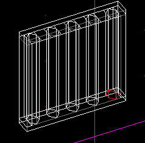
> 
> Notice I did it several times.
> 
>   
>   
> Okay, read this carefully: There is NO NEED to adjoin the bottom
> surface (as shown above) of each bar. 3do's go by different rules than
> regular level geometry does.  
>   
> Okay, notice how my jail bars on the outside are touching the outside
> frame. I did that on purpose because you can get a cool effect. Just
> select the outside SIDE sector, and delete it. I deleted both on the
> picture below:  
>   
> 
> 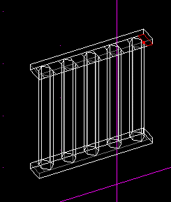
> 
>   
>   
> Okay, after that is all done, it's time to merge all these sectors
> into one sector. To do this, go to each of those jail bar surfaces you
> extruded, and press the \[M\] key. The reason for this? Remember
> above, I said that you have to have ONE sector to export, multiple
> sectors will not export together. Also, as I said, this DOES create a
> non-convex sector, but it's okay because 3do's can use them.  
>   
> 
> 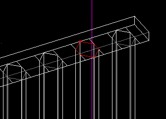
> 
> This is an example of which surface you should merge.  
>   
> Okay, notice below that we have one big sector. The bottom is not part
> of it, so you must merge the two remaining sectors to create only 1.  
>   
> 
> 
> 
>   
>   
> To get the bottom to join up also, you will have to adjoin and merge
> only ONE of the jail bars. There is no need to merge them all (like we
> did for the top) as merging only one will cause everything to become
> one sector. To do this, select the TOP surface of the bottom sector,
> as shown below.  
>   
> 
> 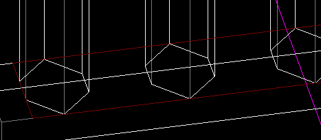
> 
>   
>   
> Now, switch to top view, using \[shift+1\], and cleave out ONE jail
> bar.  
>   
> 
> 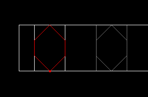
> 
>   
>   
> Now, adjoin the surface using the \[A\] key, then merge it using the
> \[M\] key. Now, as shown below, you now have one BIG sector.  
>   
> 
> 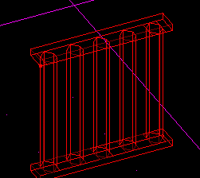

## Step 4: Texturing.

> Texturing 3do's is much like texturing normal level geometry in JED.
> Remember at the beginning I told you to flag your sector as 3do? This
> is important - if you did not, you must do so now. This assures that
> you get a good view of your 3do in the 3d preview, as opposed to the
> backwards view you would get if its not flagged correctly. Feel free
> to test it out both ways, I'm sure you will notice the difference.  
>   
> Anyway, just go to 3D preview, and double click on a surface. This
> will bring up the normal list of textures. If you want to use a custom
> mat, just put it in your project directory. If you want to access the
> mats that are used with JK 3do's, just click on the 3do folder in the
> top left hand corner of the texture selection screen. Below is a shot
> of my 3do textured. Notice Kyle the convict back there.  
>   
> 
> 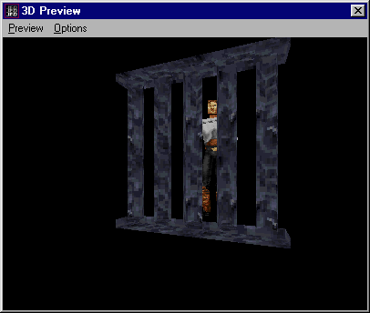

## Step 5: Exporting.

> Just select the sector, then go the the
> File menu, and click "export as 3do."
> Then you will be prompted to pick a name and location. If you plan on
> following the rest of this tutorial, make sure you put the 3do in the
> project directory of the level you will use it in. Once you save it,
> you can use Code Alliance's 3do viewer to check it out:  
>   
> 
> 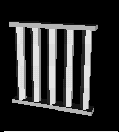
> 
>   
>   
> Yeah I know there are no textures showing, that's because the viewer
> doesn't support them.

## Step 6: Adding a template.

> What's a template? Well the template file for JK, called master.tpl,
> is the file that shows JK which 3do's are available for use. If your
> 3do isn't in the template file, then it won't show up when you start
> your level.  
>   
> To learn to create a template, just jump on over to the [templates
> tutorial](/tutorials/templates/).

## Step 7: Insert the 3do into JED.  
  
Now, start up JED, insert a new "thing," which will default to the last
"thing" you entered. Then, double click on the name to change it, and at
the very end of your list, you should see your entry. Just select it,
and it will show up in JED\! Wonderful eh?  
  

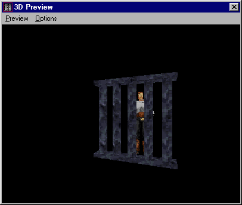

Look familiar? This is the 3do this time, not the sector.

You can now use your 3do as a door, elevator, or anything else you want.
If you have any questions, feel free to use the [message
board](http://forums.massassi.net/).

