Author: Ventrue\_Vanula/Andrew

Today we'll be using the TX-500 Triax Borg Rail gun from the "Rifts"
source book. Using these techniques will help in all 3DO construction.
I'm using a gun for an example for it uses a good variety of techniques.

It would be best if you have a picture you can look it while your making
your 3do, either one from a book or one you drew yourself will work
best.

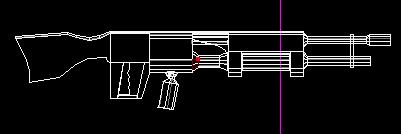

Now what you want to do is stretch out the basic shape of the gun using
the starting square sector.

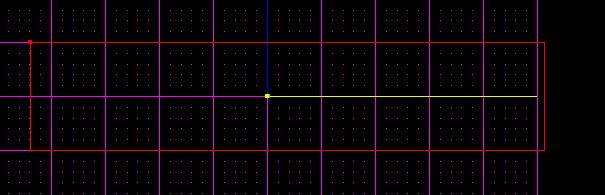

Next make some basic up and down cuts to divide your gun into sectors.
Be very picky about the proportions of the gun because now is the best
time to do it.

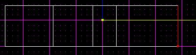

Now cut the sideward angles out from the gun. This will be the basic gun
shape.

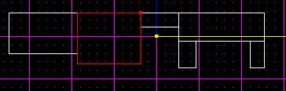

Now go to the top view and figure out the widths of each sector. If two
sectors will be the same size, then it's best to multi-select both
sectors and then make the cut so that it's more clean.

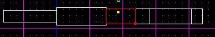

Now select the middle sector and give it its own layer so you can get
the other sectors out of view. Then view that sector and give it a nice
curve on the bottom by cleaving out the angles. Then just with surface
cuts, cut out a design of a smaller circle. If you can't seem to cut
your circle round enough don't fret. Go to vertex mode and hand move the
vertexes that make up the circle to make it rounder. This allows for
more flexibility while making it.

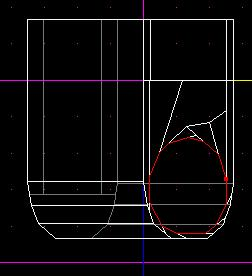

Next go to the surface that you just made a circle and extrude it. Then
go to the outer vertexes of the circle and drag each one of them inwards
to create a smaller circle. A good way to do that is to view the circle
at a slight angle, pick all the vertexes that are on the top and move
them outwards, not caring how it looks. Then view it straight on and
then straighten the vertexes to make a smaller circle.

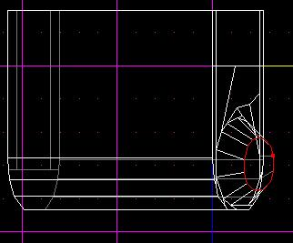

From the smaller surface of the circle extrude a sector and then take
the later surface and stretch it to come close to the side you want it
connected to. Then extrude another sector that you should align to meet
perfectly with the other side. After that do the same thing as above
except make the circle larger, not smaller. Don't worry, that's the last
circle you'll have to make.

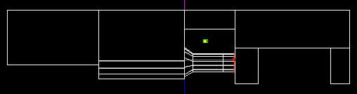

Now select the sector above it and give it its own layer:

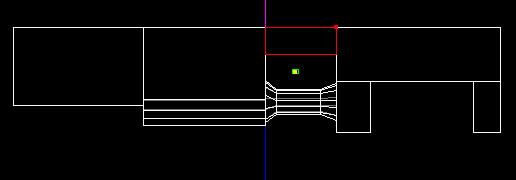

Now do the same thing as last time and cut it out so its more rounded,
but leave the top alone. We'll round that out later.

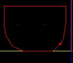

Ok, now select the sector right next to this one but to the end of the
gun. Now you'll see a scramble of surfaces from your last cut you made
on your sector. Select those surfaces and merge them together. Now make
a clean swipe down to both sides of the cut and then extrude the surface
to form a new sector.

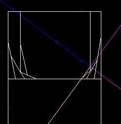

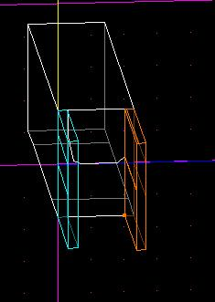

Next you'll want to keep the whole gun in view and stretch out the two
extruded sectors to fit the size of the space it's filling. Again, to do
that select the end surfaces of both sectors and drag them to the other
side. Keeping the grid aligned as always.

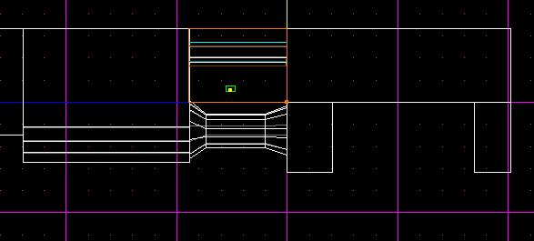

Now, keeping the whole gun in view, cut a good angle on the gun to make
it curve. As you'll see from the first picture there's a sector in red
you'll have to delete. After that the curve will be complete.

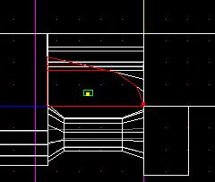

Now select the two sectors of the gun that stick down from the body.
It's right under the sector you just extruded from. Give them an angle.

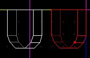

This next part's easy: select the cylinder shaped sector that you made
earlier, then copy-n-paste it. Now you'll have two cylinders. Move the
new cylinder to the area between the sectors you just carved out. You
can enlarge it maybe 1.3 in the tool window. Fit it to fill the area
inbetween.

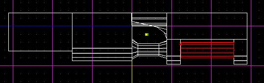

OK, it's time to curve the entire top of the gun. Go to the front view
and then hold down ALT and drag your mouse so that every sector is
higlighted. With the grid aligned make curving cuts to curve out the
shape of the top. With every single cut you'll have to reselect every
sector. After all that is done delete all the sectors that don't belong.

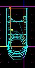

Bingo. It's all curved.

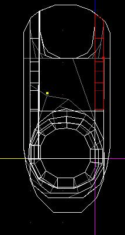

In the next two pictures you will notice I'm not too fond of the height
of the gun, so select each sector on the top and then cut across it.
Select again the sectors on the very top, then from side view drag it
down to give it a respectable height. After that, merge the sectors you
cut in half back together, then merge the surfaces back together and it
will be as good as new.

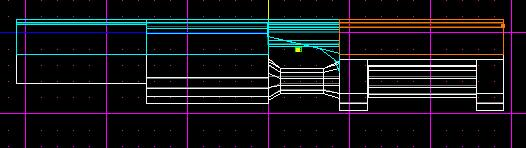

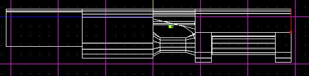

Now you'll see I copied the cylinder shaped sector again, plus I copied
the cone end and pasted it in the front to be the gun barrel.

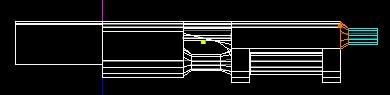

I also pasted it again but moved it further down. Now just take the
whole thing and shrink it down to size. After that only select the
barrels and make them a little smaller, then take the end surfaces and
slide them over to make the barrel longer.

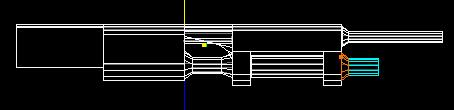

Now cut the first sector into three parts. Make the end sector a good
(-) in width. The middle sector just cut out a small slab that you'll
see is selected red. Delete the middle sector which will allow you to
move it over to the end of the gun so you can shape it accordingly.

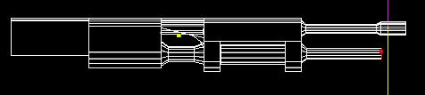

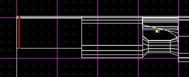

Now I find the end of the gun too long, so I select every sector that
will move, go into surface mode, select the two surfaces that will also
move, then easily slide it over.

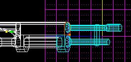

Now select the first sector of all of them and give it its own layer.

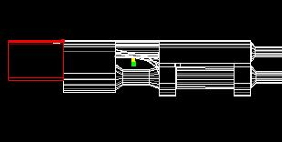

Now view that one sector from the bottom and cut out a pattern on the
surface of it of the handle and trigger. It should look like the picture
below:

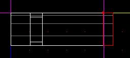

OK good. Now extrude the surfaces for the handle and trigger. Drag them
down to the length of the handle. The trigger sector should be a little
shorter. Cut the handle at an angle but leave the back intact. Now for
the trigger select the end surface and drag it to angle with the handles
new cut.

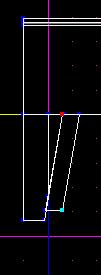

Now in vertex mode take both vertexes on the end and drag them outwards
away from the handle so it pounds straight down from the top. If you
want to get creative you can select the side surface and cut it up a few
times. Now from the side drag every other two vertexes in a slight
degree so you get a finger hold effect.

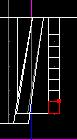

Now extrude the hand guard part of the handle.

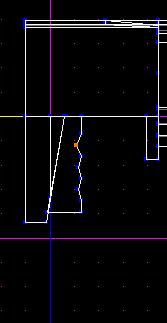

Stretch it down and move it out. Cut the front surface close to the top
and the back surface right next to the bottom. Go into vertex mode and
drag the two vertexes to fit the shape you see in the picture:

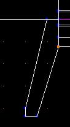

Next, all you'll need to do is make one more extrusion to complete the
handle and then adjust it properly.

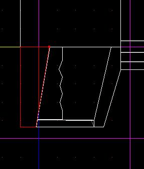

By selecting the back end sectors of the trigger and the surface above
you can slide the handle over in case you don't like the current size. I
didn't.

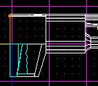

Now on the upper sector extrude another sector

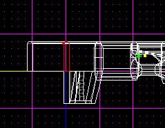

Make the basic shape of a stalk.

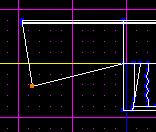

By cutting the surfaces on all the sides you can reshape the gun very
easily.

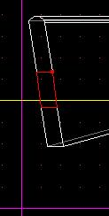

Go into vertex mode and from the side view, grab the vertexes with
ALT-mouse-drag and shift the vertexes from different points.

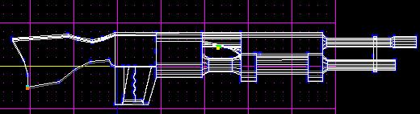

Grab any of the sectors you've made that look like a cone and paste it
down under the main part.

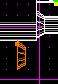

Using rotate, rotate the sector so it faces upwards and move it to
position on the gun.

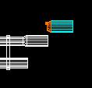

Now select both a cone and a cylinder and paste it down below, then
alter its rotation till it slants backwards a slight ways and move it
into position.

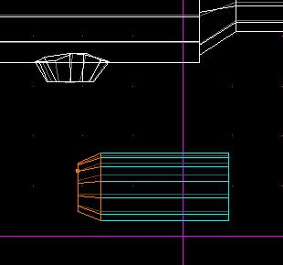

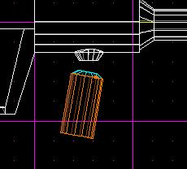

Now you can extrude the top surface by making a smaller cylinder and
resizing it to fit your liking.

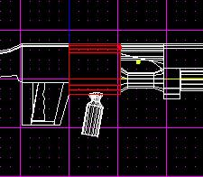

Now you need to go over your whole gun again and merge every surface you
can see that can be merged. Don't worry, you'll still keep the same
curves of the surfaces so feel free to merge all surfaces you like
together, especially on flat areas.

