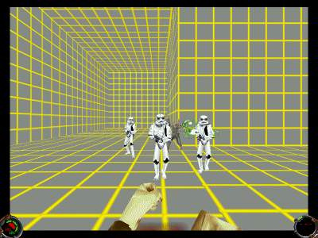

Author: Fourwood

This tutorial will teach you how to take any actor (some harder than
others) and turn them into friendlies who follow you around (and shoot
enemies if possible). It is fairly simple to do, and involves only 2
cogs. For this tutorial you need to be able to extract files from a
.gob, make a simple level, and understand things, sectors, and how to
use a cog. Also, for part you need to know .ai, but you can follow this
tutorial without .ai knowledge.

The first step for battling actors is to create a simple level, just a
few rooms. Add the actor you want in somewhere away from the view of
enemies. For the rooms, make it so that not all of them can be seen, so
that the enemies are hidden at the start. Add whatever enemies you want
out of view of the walkplayer and the actor who will follow you and help
you.

After that is done, extract the cogs 06\_max.cog and 06\_maxstart.cog
from the JK1.gob. Add those cogs to your level. Descriptions of how to
use the cogs:

> 06\_max.cog:
>
> trigger(sector): Not too sure about this.  I think it might be the
> sector that you have to trigger to wake up the actor.  
> max(thing): The thing \# of the actor you want.  
>   
> 06\_maxstart.cog:
> 
> max(thing): Same as above.  mainmax(cog): The cog of the actor. In this case, 
> 06\_max.cog.

**Note:** For non-attacking actors, the
enemies are not necessary to the level.

**Note 2:** If you know much about .ai
files you can change the damage in the .ai so your actor hits harder.
You can also change other things in it so he shoots more often.

That's it\! Save/gob your level and play. The actor should follow you
around, and if it's a combatant, attack the enemies when it sees them.

**Another note:** Don't rely on the actor
to wipe out all the enemies for you. Sometimes the actor will attack
instantly, other times he/she will not attack at all.

  
Tusken Raider attacking Stormtroopers.

**WARNING:** It is possible for the actor
to attack you. This seems to occur with Dark Jedis. If this happens, I
have not found a way to turn them back. I have messed around with some
cogs a little, but everytime I change something it messes something else
up. If anyone finds a solution, please email me.
