Author: Daft\_Vader

First off, this tutorial is meant for people who have been around JED a
little while, but still aren't very confident in their level-making
abilities. This tutorial focuses on cleaving, so if you are already
proficient in this area, you might want to consider moving on to
something different, like cogging or 3dos. If, however, you feel your
architecture skills leave some more to be desired, this tutorial offers
easy ways to dramatically improve the quality and appearance of your
level. So let's begin.

I have seen many new levels lately (both multiplayer and singleplayer)
which, while having great potential, are sometimes ruined by boxy,
uninteresting sectors. Now obviously some rooms have to be rectangular,
like most rooms in your house probably are, but chances are your level
does not revolve around your house, but instead some far-off
intergalactic locale\!

If you've ever seen a Star Wars movie (I wonder what the chances of that
are? :-) you'll probably notice that each room is as intricate and
unique as the next. In a shady cantina, you notice cracks and chunks
missing from the decrepit walls, arches and small nooks and crannies
where just about anyone or anything hangs out. In the Temple on Yavin
you'll observe towering pillars and elaborate domes. Even on a Spartan
Star Destroyer, if you look closely, you can appreciate the detail
presented in the sloped wall edges and numerous consoles and and buttons
protruding from the walls. All of this gives each scene a fresh, and
appealing look. ***Your*** levels should be no different.

I am going to cover three simple examples for how to improve your
level's architecture:

[TOC]

## Example \#1 - A Hangar Bay

I'll begin with a Hangar Bay. So open up JED, and we'll begin. You see
the default sector of course, and for the purpose of this tutorial,
we're going to enlarge its x axis by 1.5 and its y and z axis by two (be
sure of course to un-check the box that says "ignore axis setting, scale
on all"). Now in "shift-1" view, cleave the sector vertically into
thirds. Your sectors should now look like this.

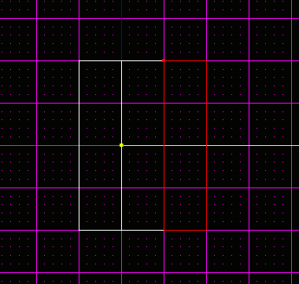

After that, go to "shift-2" view and cleave until your level now looks
likes this.

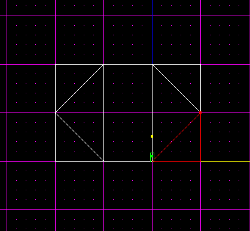

Go back to "shift-1" and systematically cleave the new "corner" sectors
until they appear as so.

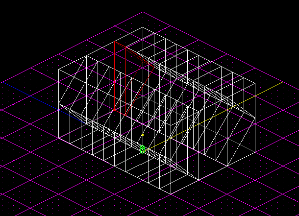

Finally, just delete every other corner sector, making sure the top and
bottom are consistent. To spruce the appearance up a bit, I've textured
the level, and now let's see just how much it really looks like a hangar
bay.

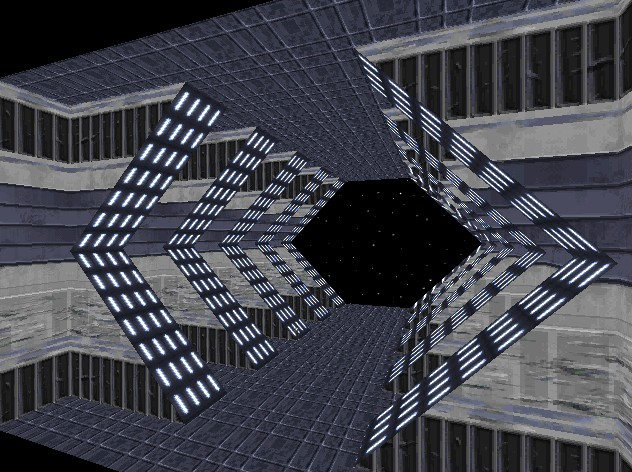

Looks pretty good to me. See what a difference that cleaving makes\!

  
## Example \#2 - A Corridor

Now I'm going to show you a few variations on different corridor designs
you can do.

So, start a new project in JED. For the first variation, I'll do
something really simple, similar to the hangar bay. Resize the default
sector, by cleaving it to 6 JKUs in width (x) and 4 in height (z). Leave
length (y) alone. Press F4 and select "Snap every 0.05" for your
cleaving. Now go to "Shift-2" view and cleave until the corridor looks
like the pic below. To get the two little sectors coming off at the
sides, simply extrude the side surfaces by 0.05.

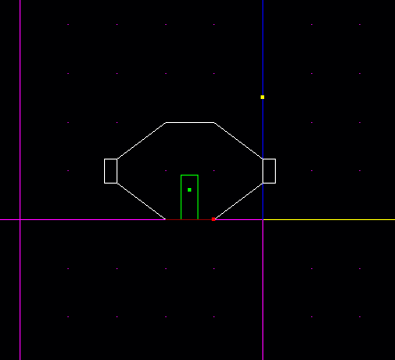

And here's a picture of the textured corridor.

On to another corridor variant. Again, start a new JED project. Make a
corridor according to the parameters for the previous hallway. This
time, we're going to make "arches" every 4 jkus. Divide up the sector
like so.

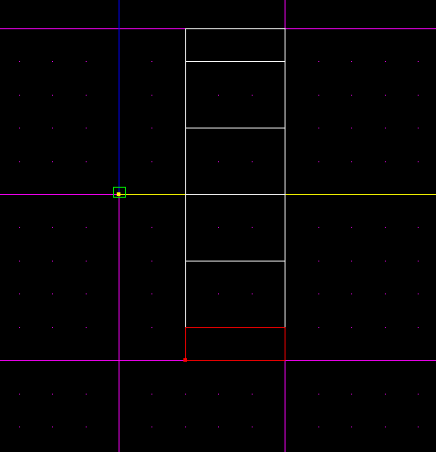

Next, select "Snap every 0.02" and cleave out the top rectangle to form
a doorway. Cleave a smaller sector for the door out of the rectangle,
and cleave the corners off the two rectangles on either side of the new
doorframe.

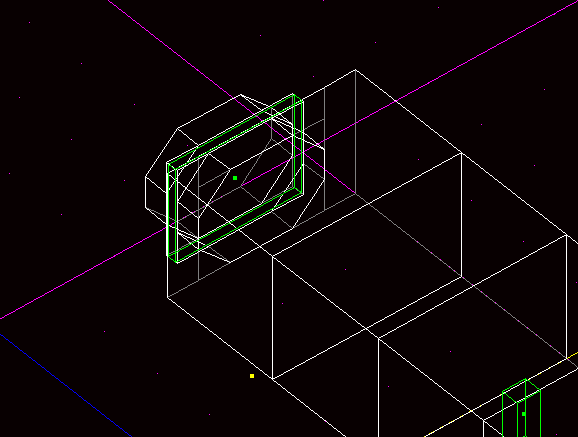

And now for the "arches." Change your cleave size again, and select
"Snap every 0.05," and cleave the corners off the third and the fifth
box down. Slap on a few textures and Voila\!

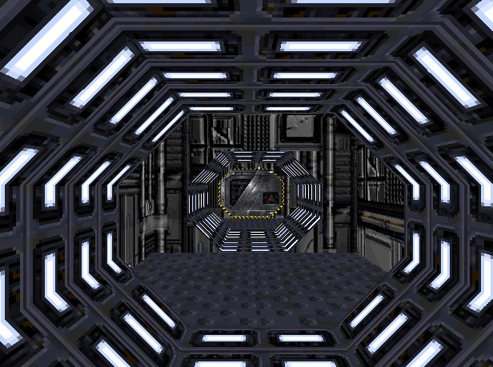

These simple cleaves don't take long, and they add a lot of character to
levels. Never settle for a sub-par room. Think up your own methods for
expanding and improving it further\!

## Example \#3 - A Cargo Vessel

For the last time in this tutorial, start a new project. Enlarge the
default sector by two, for all three axis at once. Cleave around all the
edges of the sector as shown in the picture.

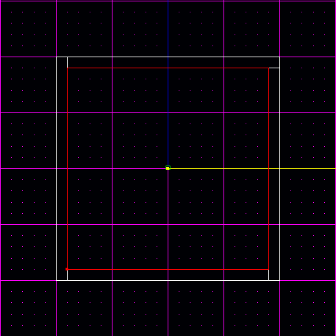

Now cleave out new, long sectors that run along the edges of these outer
sectors. Then cleave an "X" shape into the sector left in the middle of
them. Once done, delete the "X" and the long sectors that it connects to
like a frame.

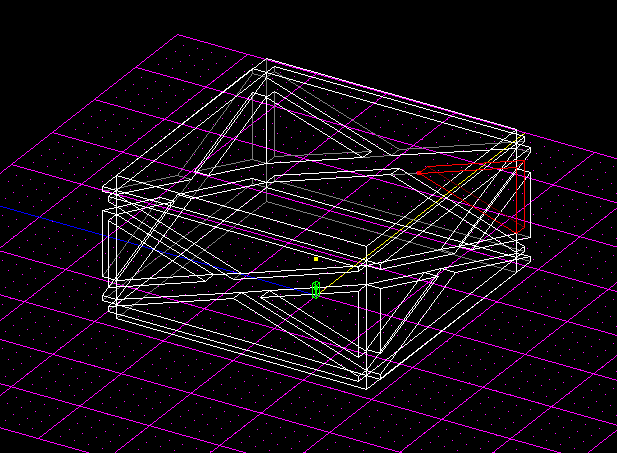

If you want, you can add some ventilation shafts in the upper regions of
the central sector, which would give a more convincing look to an old
space freighter. See the picture for ideas on how to do so.

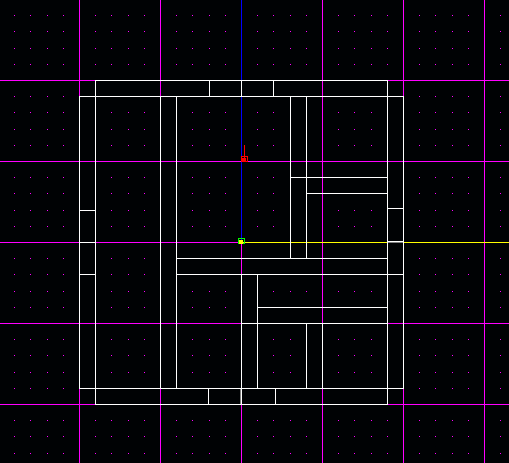

I'll just add some crates and cargo and we're done\! The finished
Result:

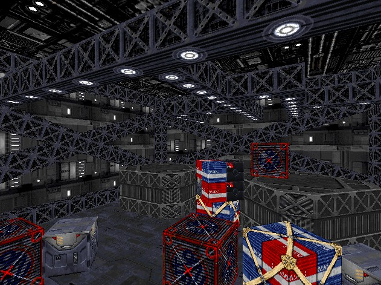

Well, thanks for taking the time to read this tutorial. Hopefully it
helped you slightly. Don't forget that ramps, staircases, and spiral
staircases are, of course, also welcome additions to any level. If in
doubt try creating some domes and/or beams in your levels. Consult the
tutorial by SavageX for [an excellent method for confronting
domes](/tutorials/domes_by_hand/), one that makes it both easy and
painless.

Until next time\!

\- Daft\_Vader, July 12, 2003
