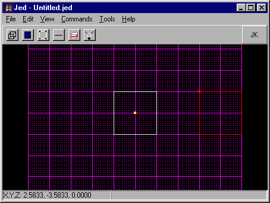
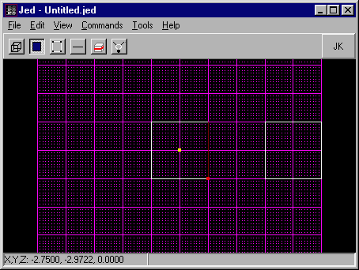
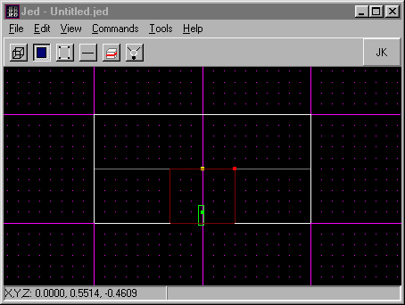
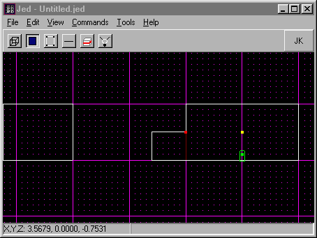
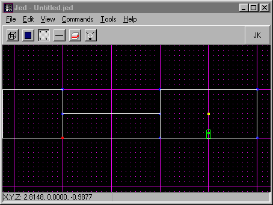
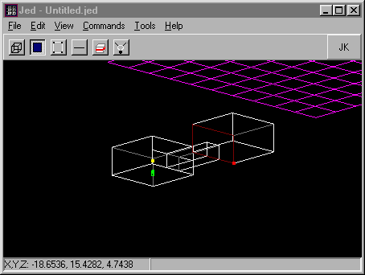
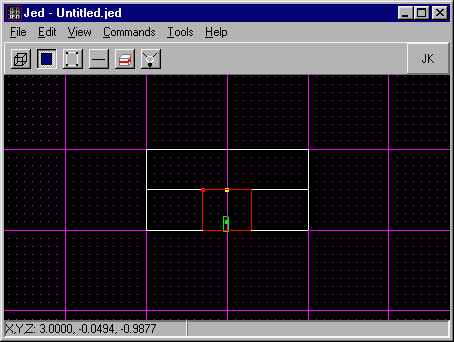
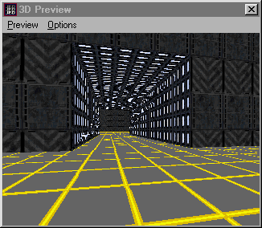

Author: Brian Lozier

Adjoining is used for a multitude of
things. The first, and easiest to explain, is creating hallways from one
sector to another. As a brief overview, we will present a simple adjoin
example, and then discuss the "rules" of adjoining.  
  
In Jed, go to sector mode, select the default sector, and position
your mouse to one side of it. Press the \[Insert\] key to insert a new
sector. The insert key will automatically insert a sector that is
identical to the one that is selected, which, in this case, is the
default sector. Drag (use the mouse, while holding down the \[ctrl\]
key) this new sector away from the original sector, so that you have
room for a hallway between the two.  
  
Make sure the sectors are lined up from the side view. Press \[shift+2\]
to get to a side view. If they aren't lined up, hold down \[ctrl\] and
drag the sector so both floors line up. If it's already lined up, just
switch back to top view and continue \[shift+1\].  
  

  
Now switch to the surface mode, and on the original sector, select
the one surface that faces the new sector.  
  

  
  
Now press \[shift+3\] to give you a better view of that surface (if
your sector is positioned differently, you may have to use \[shift+2\]).
Notice that this also positions the grid relative to the view. Now,
press the \[c\] key and cleave the shape of a square door in the
surface. To get a better view, you can use the arrow keys and the
\[+,-\] keys on the number pad. For more information on cleaving, please
see our in-depth [Cleaving Tutorial](/tutorials/cleaving/).  
  

  
  
With the door surface selected, press the \[x\] key to "extrude" the
surface. To see what the extrude key did, hold down \[r\] and move the
mouse around.  
  

  
  
Now, still in the \[shift+2\] (or \[shift+3\]) sideview, select the
surface at the end of your new hallway. Once selected, hold down
\[ctrl\] and drag it till it meets up with the other sector. They should
overlap exactly along that one surface. If they are not exact, your
adjoin will not work.  
  

  
  
Now you should have a set of 3 sectors that looks like the following
diagram. The next step is to select the surface that meets up with the
hallway. Not the original surface you extruded, but the one that is in
the second room. Refer to the following diagram.  
  

  
  
If you go to the 3D preview, you will be able to see that from the
original sector, the one we extruded from, there is a hallway going
towards the other sector. You cannot, however, enter the other sector.
This is because they are not adjoined. To adjoin them, select the
surface as shown above, and hit \[shift+3\] (or \[shift+2\]) to get it
at a better angle. Now, cleave that surface exactly as you cleaved the
original surface to create the hallway. The two surfaces have to match
up EXACTLY for adjoining to work.  
  
Now, after that is done, select the surface that you just cleaved to
be the doorway, and press the \[a\] key. If all goes well, you should
see a note in the message window letting you know that the adjoin was
formed. If not, start over and practice until you get it.  
  

  
  
This is what the finished product looks like, with a few textures
added to define detail:  
  

