Author: Brian Lozier

This tutorial is intended to teach some very basic adjoining techniques.
It is intended for beginning level editors who are having problems with
the old adjoining tutorials (they were written a long time ago, when Jed
had a lot less features than it does now).

To begin, we will create two rooms connected by a small hallway. There
are many ways to do this, but this tutorial will only focus on one of
them. As we do with most tutorials, we will start off with the default
sector in Jed. Go to the 3d preview (\[F12\]), and click on a wall. If
you click back over to the main editing window, you will see that one of
the walls is now selected.

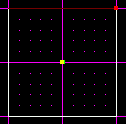

As a note, every time you click on a wall in the 3d preview, Jed will
automatically select that wall, as well as put you in surface mode. You
can learn about the different modes in the Basic Editing Lessons.

Now we will do a little bit of surface cleaving. Basically, we are going
to cleave the shape of a doorway out of this wall. Remember, you can
only cleave in a straight line, so you will actually have to make 3
cleaves to get the doorway.

The first thing you will want to do is get a good view of the surface
(you don't want to cleave from the top view, as shown in the above
picture). The best way is to use \[Shift+2\] or \[Shift+3\], whichever
gets you a good view.

To invoke the cleave tool, simply press \[c\]. You will have to press
\[c\] each time you want to make a new cleave. If you mess up while
cleaving, before you let go, press \[Esc\]. If you realize that you
messed up after you let go, you will either have to start over, or try
the undo function (under the Edit menu). The undo function can create
errors, though, so be careful with it (we won't discuss how to fix the
errors here, so it's probably better to just start over).

Cleave the top half off, then cleave twice down from there. Remember, do
not cleave unless you have the correct surface selected. You can click
on the surface in the 3d preview, click on it in the main Jed editing
window, or use the \[n\] and \[p\] keys to scroll through all the
surfaces in that sector (n stands for next, p stands for previous). When
the cleaves are done, the sector should look something like the
following picture.

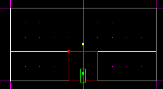

Now we will talk about extruding. Extruding is one method of getting new
sectors in Jed. You simply select a surface, and press the \[x\] key.

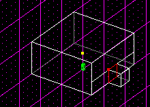

Extruding by itself is pretty useful, but by just hitting \[x\], you
have no control over how far the sector will get extruded. Jed actually
calculates it based on the size of the selected surface, but that
doesn't really matter. What does matter is that sometimes you know your
hallway needs to be a certain length. In this case, we want our sectors
to line up with the grid, so we want our hallway to be exactly 1 grid
square long (grid *square*, not dot). To do this, we can simply select
the correct surface, and press \[Shift+x\]. A small box will pop up
asking you how far. Just type 1 in the box, and click okay. Below is a
screenshot of the sectors in top view (\[Shift+1\]).

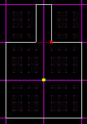

Now, if you look at your project in 3d preview, you will see that we
have one room, with a long hallway leading out of it.

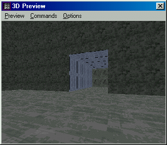

Our next step is to create a room on the other end of the hallway. The
easiest way to create another sector (other than extruding, because
extruding will only make the new sector the size of the old sector - and
we need another room-sized sector, not another hallway sized sector) is
with the \[k\] key. All you have to do is go to sector mode, press
\[k\], and then draw a line the size you want your sector. For the
purposes of this tutorial, that will be 2 grid squares tall. Don't worry
where you put it, we will move it into place later.

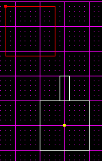

Now that the new sector is there, we will have to move it into place.
First, start with the top view, and drag it exactly where it should be.
To move a sector, select it, then hold down the \[Ctrl\] key and drag it
with the mouse.

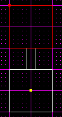

Now that it's in position from the top, we have to make sure it's in
position from the side (we're working in 3d space, so this is
important). Just go to either side view (\[Shift+2\] or \[Shift+3\]),
and drag it into place.

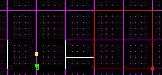

You will notice from the above screenshot that the new sector is taller
than the old sector. This is because the \[k\] key actually causes the
new sector to become a perfect cube. Since it's 2 grid squares wide, it
also has to be 2 grid squares tall. So, we will cleave the top part off
the new sector and delete it. Make sure you are in sector mode, and
cleave the top off. Then select the top sector, and delete it
(\[Delete\]).

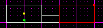

Now that our sectors are lined up, it is time to connect the end of the
hallway to the new room. Note that just placing them on top of
eachother, as we've done, does not actually connect them. To connect
them, you have to use an adjoin.

Adjoining is fairly simple once you know what the goals are. Basically,
you can only adjoin surfaces that are exactly the same, and that are
occupying the exact same space. So, if you have two surfaces that are
exactly the same, but are not occupying the same space, you can't adjoin
them. Conversely, if you have two surfaces that are occupying the same
space, but are not the exact same dimensions, you can't adjoin them. The
pictures below illustrate when an adjoin *is not* possible.

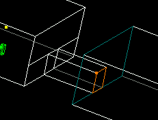 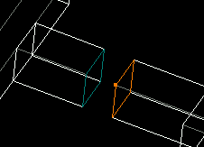

Now that we know we can't adjoin them as they are, even if they are on
top of eachother as they should be, how do we make it so we can adjoin
them? It's actually fairly easy. We just have to cleave the big surface
to match the small surface. So, select the big surface, go to side view,
and cleave it just as you did on your first set of cleaves.

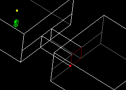

Now that the surfaces match eachother exactly, you can select either
side of it, and press the \[a\] key to adjoin. You have now adjoined
your sectors, and if you play your level, you will be able to walk
through your hallway.

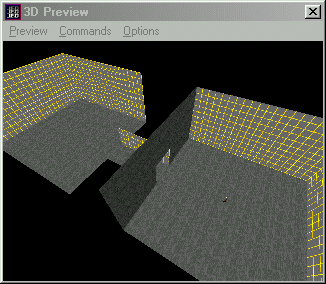

*Some notes on Extruding:* When you extrude, Jed creates a new sector.
Just to let you know, Jed automatically adjoins the two sectors. That is
why we didn't have to bother adjoining them the first time.

If you have any questions on this stuff, feel free to visit [The
Massassi Temple Message Board](http://forums.massassi.net).
