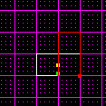
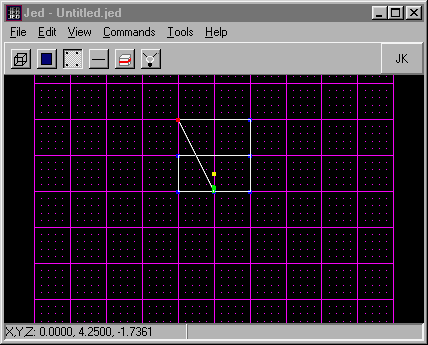
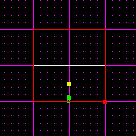
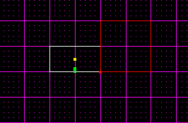
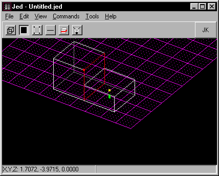
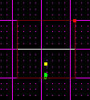
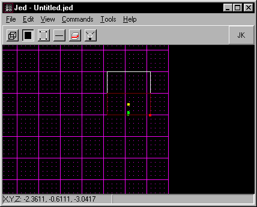
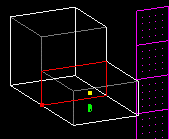
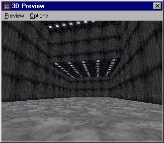

Author: Brian Lozier

Okay, this is a tutorial on VERY BASIC adjoining. If you know anything
about it, you might want to just leave now :-)

In JED, open a new project. Notice the default sector in the center of
the screen. Press \[shift+2\] to go to a side view. Staying in "sector"
mode, position the mouse near the outside of the sector, and press the
\[insert\] key. This will insert a new sector as shown below.  
  

  
  

Now, switch to the other side view by pressing \[shift+3\]. As shown in
the picture below, the new sector (still selected) is thinner than the
original one. We can take care of that.  
  

  
  

All you have to do is switch to the "vertex" mode, and select each
vertex on the side you want to expand, press and hold \[ctrl\], and drag
them out to be as wide as the first sector. In the diagram below, I have
moved the top two vertices.  
  

  
  

Now, in the next diagram, I have moved the bottom two vertices, and then
switched back to sector mode.  
  

  
  

Next, switch back to the original side view \[shift+2\], and holding
down \[ctrl\], move the larger sector so the edge meets with the
original sector.  
  

  
  

Now switch to the "surface" mode, and select the surface of the bigger
sector that is facing the original sector. Sometimes it is easiest to
just select any surface on the appropriate sector, and then use the
\[n\] and \[p\] keys to go to the Next and Previous surfaces. In
"surface" mode, the \[n\] and \[p\] keys will not jump to other sectors,
it will just keep scrolling through surfaces in the same sector.  
  

  
  

Next, use the \[shift+3\] keys to go to the other side view, as shown in
the diagram below.  
  

  
  

Remembering we're in "surface" mode, we are going to cleave the surface
selected to match the height of the original sector. This is done
because to adjoin surfaces/sectors, the surfaces that are being adjoined
must be exactly the same.  
  

  
  

Now, select the surface where the two sectors meet, and press the \[a\]
key. If you have done everything right, the sectors will adjoin, and you
will be able to walk between them.  
  

  
  

Shown below, is the fruit of our efforts, textured for clarity of
course\!  
  

