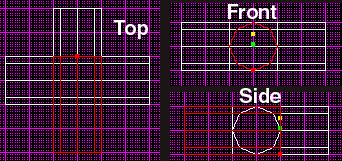
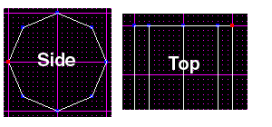

Author: Brian Lozier

There has been quite a bit of discussion lately on what's the best way
to do certain things. This article will discuss how to do things, as
well as why. This tutorial centers on, and uses screen shots from, JED.
JkEdit doesn't really ever allow you to see all the individual sectors,
nor does it allow you the control needed to do things like this, so it
really doesn't apply.

First off, we will talk about perfect polygons. There are two tutorials
on perfect polygons in the tutorials section. I suggest you use perfect
polygons whenever you can. Most times, they allow your later cleaving to
be more efficient, and they also allow you to create advanced
architecture that is just not feasible otherwise. Really, the only time
you do **not** want to use perfect polygons is with outdoor
architecture\!

The first example of this is the following pipe junction. This pipe
junction uses very few sectors for its complexity, and is relatively
easy to create. I challenge anyone who doesn't use perfect polygons to
try to mimic this in a reasonable amount of time.

![\[Final Result\]](final.gif)

If you take a look at the selected sector, you will see the shape of
each and every polygon. They are all shaped the same, with the point at
the end. This point allows all the ends to line up perfectly. The first
step in the process is to get all the horizontal pipes completed and
adjoined. First off, use the perfect polygons tutorial and create a pipe
that has 8 sides and is 1 grid square wide. If you already know how to
create perfect polygons, and don't want to mess with making some more,
feel free to download the following JED file.  It includes a wide selection of
perfect polygons, merged and otherwise. Please use one of the merged
ones for this exercise.

[Download Perfect Polygons Prefab](perfect_polygon_prefab.jed)

Now is a good time to discuss the impact of the number of sides. 8 is a
pretty good number because it's fairly simple, yet still looks
relatively round. I will demonstrate later in the tutorial the impact of
jumping from an 8-sided polygon to a 12-sided polygon in complex areas.
Experiment around to see which works best for you. Suffice it to say
that the more sides the polygon has, the more time it will take to make,
and the bigger the impact on framerate will be.

One thing that is very important in the creation of advanced
architecture is the use of the \[F9\] tools dialog. This allows you to
rotate and scale sectors or groups of sectors, among other things. The
ability to rotate and scale sectors gives editors an incredible amount
of flexibility. You can create pipes and corridors that shrink, grow,
twist and turn with relative ease.

On to the rest of the article. The first thing you need to do is arrange
four of your pipe sectors so that they overlap exactly one grid square.
To do this, you will need to copy \[ctrl-C\] and paste \[ctrl-v\] your
original pipe sector. Once you do that, you will need to line it up
vertically and horizontally. If you do not know how to do this, please
refer to the basic editing section as well as the simpler tutorials on
our tutorials page. You should use the \[F9\] tools menu to rotate your
sectors around the *Z* axis. Please, save a copy of your starting sector
for later use (it will make things a lot easier).

There's a lot of information I have to throw out there before we can
actually get into this (when outlining the article, this kind of stuff
didn't occur to me). I am a big fan of cleaving things the most
efficient way possible. This allows you to create large complex areas
with great framerate -- even on lower-end machines. Sometimes, however,
there is just no way to cleave things and have optimized sectors. This
is where merging comes in. There are times when you MUST cleave
something into pieces, and then merge it back, to get the best, most
optimized set of sectors.

The perfect polygons tutorial is a perfect example. Sure, you could
leave your pipes carved into pie-shaped pieces if you really wanted to.
However, this creates un-wanted and un-needed sectors. These extra
sectors bring down framerate, up the file size, and make it a nuisance
when adjoining/cleaving later on.

Now, you should arrange your sectors as follows. Here they are shown
from the top, side *and* front views so you can get a better idea of how
it should look. Basically, you start with one sector, insert it again,
overlapping by *exactly* the width. Then, you copy it again, use the
\[F9\] tool to rotate it around the Z axis 90°, overlap it, and do the
same one more time.

It is important that you get these lined up *perfectly*. If they aren't,
you'll spend a lot of time following the rest of the tutorial, only to
find that your sectors won't adjoin at the end. The best thing to do is
to use JED's grid snap \[Shift+s\] to align to one vertex, then use that
vertex for all subsequent alignment. It's best to use one of the side
vertices, as shown below (highlighted in red).

When you are done with these four sectors, they will all be cleaved and
adjoined such that they make up the horizontal layer of pipes. The first
thing you have to do is multi-select all the sectors. There are two ways
of doing this. First, select a sector, press the spacebar, then click on
another sector. This should change the color blue, and the sector will
be multi-selected. Do this will all four sectors. Alternately, you can
hold down the \[alt\] key and drag a box around all the sectors. For
future reference, you can un-multi-select all the sectors using the
\[Backspace\] key.

Once they are selected, switch to the top view and cleave diagonally
across the overlapping sectors, as shown below. You must get this
*exactly* correct or it won't work. I always use JED's snap-to vertex
option. I've dragged the extra pieces (the ones you just cleaved off) to
the side to show exactly what you should have (they are shown in blue).
In your case, however, these extra sectors should be deleted (I only
kept them for demonstration purposes).

![\[Cleave like this\]](2.gif)

Once those sectors are deleted, multi-select the whole mess once again,
and cleave diagonally *opposite* of the way your originally cleaved.
This will create an "X" of sorts. I have once again dragged the extra
sectors off to the side, but you should delete them.

![\[Delete the extra sectors\]](3.gif)

Your project should look like the picture above. If you go into 3D
preview, you will be able to select and adjoin the pipes -- they should
line up perfectly (these last steps can actually be accomplished with
non-perfect polygons, however, the next few steps cannot be).

Now, select your starting sector (you saved it right?), copy it, and
paste it in again. This should be done twice so you have two new
sectors. Rotate these 90 degrees around the *Y* axis this time. If you
switch to side view, you should see them perpendicular to the rest of
your sectors. Line them up so that they overlap each other, and the
other horizontal sectors, exactly. Please refer to the screenshot below.
Remember, keep snapping the grid to the same vertices you used before,
or they won't line up correctly.

![\[Overlap exactly or you'll get an error\]](4.gif)

Now it's time for the tough stuff to begin. Basically, we are going to
select a few sectors, and cleave them so they make a point (just like
the very first picture in this tutorial). In order to get this to work
right, you must select the correct sectors. Below is a screenshot of
which sectors you have to select.

![\[Multi-Select these sectors\]](correct.gif)

It's very difficult to explain exactly which sectors to select. If
you're at the \[Shift+2\] view, select all the sectors that aren't
facing directly at you.

Now it's time to do the X cleave once again. Remember, this is only
cleaving 4 of your six sectors. You don't want to cleave them all
because you'll chop up two of your polygons length-wise (and you don't
want that\!). So, cleave diagonally across just like we did in the top
examples, and delete all the extra sectors. You should end up with 6
sectors still, so if you have more, hunt for the ones you didn't delete.

Now you have to do the other side view \[Shift+3\]. Select the correct
sectors (just like above, except not the ones facing you -- you'll have
the two sectors facing up and down, and then the sectors facing left and
right, not the ones facing directly at you). Then, cleave them
diagonally as well. Remember not to align your grid to anything that
will mess up the alignment. Working with such complex cleaves, little
movements of the grid can mess up the whole project.

Then delete your extra sectors. Below is a screenshot within the 3d
preview **after** I've deleted the extra sectors. Notice the spikes
coming up out of the floor and down from the ceiling. You can select
these and adjoin them to make a perfect pipe junction. (the spikes are
textured for ease of viewing).

![\[Spikes\]](spikes.gif)

Now, go to 3D preview and adjoin all the sectors -- this will complete
your pipe junction. Below is a picture of right after the bottom half
was adjoined, and then with it all adjoined.

![\[End Result\]](finally.gif)

Thanks to Farrax for the additions/changes to the original tutorial.
