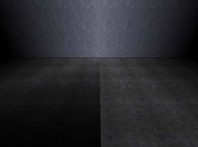
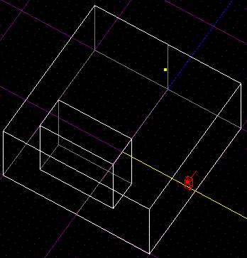
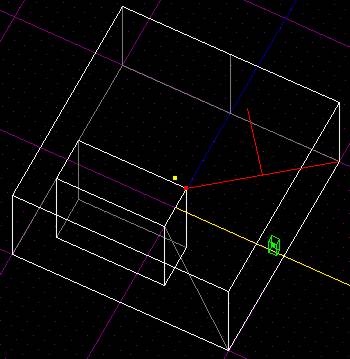
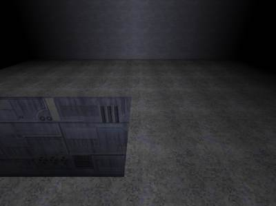
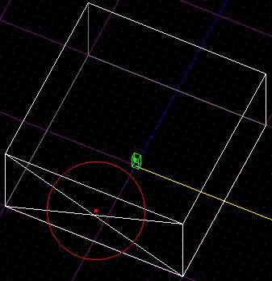
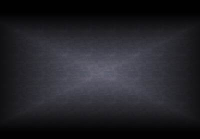
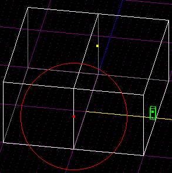
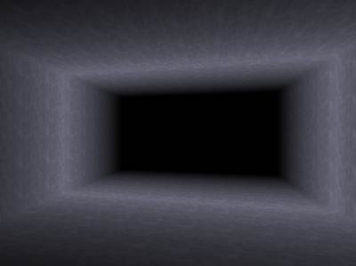
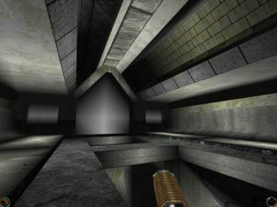

Author: Freelancer

Well, before you read any of this, it would be a good idea to get
acquainted with the JK lighting system, both through practicing in Jed,
and by experiencing changes in lighting in-game as you swing a
lightsaber around or run through the level with the headlight on.
However, I do assure you of one thing; this will take practice,
tweaking, and a lot of it. This won't come overnight, and some of the
techniques may become ugly if over-used or implemented improperly. Now
that that's out of the way, on to the tutorial\!

## Ridding Your Levels of Lighting Skews

I've seen this problem in far too many peoples' levels. Observe:

Pretty dang recognizable, isn't it? ;) No doubt, you've seen something
similar to this. If not in your own levels, then in someone else's,
(Ha\!). Here's the truth: There is absolutely NO reason for this to be
seen in your levels. In fact, and here comes the part that will knock
your socks off; there is no extra cleaving required to fix this
problem\! Yes, you heard me correctly. Here's the wireframe of the above
shot:

Of course, it's not too complex for simplicity's sake. You know I could
never create such a boxy level except in a case like this. ;) Anyway, in
a situation like this, it all depends on the edges, and how they are
aligned. Simply merge them, and re-cleave the surface to look like this:

Note that I also moved the light, so that it would run along the edges
more nicely, (and symmetrically). End result:

So, there you have it. Same number of surfaces + much better lighting =
sure-fire method\! Now, I hope never to see such an ugly error again,
ever, in my entire life, in any of your levels\! :)

## The 'X' Cleave

Alright, this is some important knowledge to have in your JK lighting
arsenal. Essentially, you start with any surface, and cleave vertex to
vertex to form a central point, over which your light will be. Of
course, the surface doesn't even have to be symmetrical or a perfect
polygon for this to work, and you don't, by all means, need an edge
coming out of every vertex. Observe:

This produces the below:

An important thing to note is that if your light's range exceeds that of
the surrounding vertices, this effect will be ruined. This is a very
useful affect, but be forewarned: Do not overuse it. It will look
extremely unnatural if overused, not to mention to many surfaces would
be created, at least for my liking.

## Linear Gradient

So, you don't think the 'X' cleave would look good in a certain spot,
but you still want it to look spiffy? This technique is perfect for you.
It only requires one cleave, and certain conditions for it to be
effective. Observe:

This produces the below:

Pretty nifty, huh? There's only one thing you need to be aware of when
doing this, however. The light's range should only cover two vertices.
The top and bottom one of each surface.

-----

That's all, folks...

That's about it. These are the three fundamental techniques all editors
should be familiar with when lighting. There are many more things to be
discussed, however. This is just scratching the surface\! Wait until my
next installment to find out about advanced intensity/range tweaking,
how to use existing geometry to your benefit while lighting, and how to
add dynamic lighting for greater effect\! Now, for the final test:

All three techniques are in there; see if you can use your keen eye to
find them all\! Until next time,

\-Freelancer-

