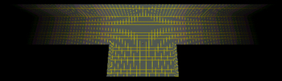
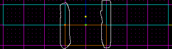
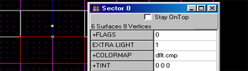
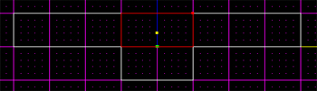
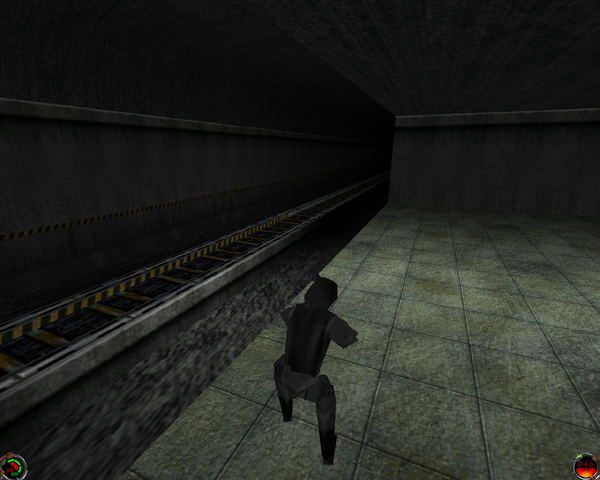

Author: Jepman

I will first warn that while writing this tutorial I am assuming that
you are familiar with JK and JED terms. If you miss out on a certain
term, visit other tutorials or the [Basics](/basics/) section at
[Massassi](http://www.massassi.net/). I can't afford to spend time on
explaining every minor term and topics editors might not understand...

Now, I will be teaching you how to make lighting fade in your tunnels or
long hallways (as seen in Fig 1). I will teach you the basics, but for
the length of the fade and the intensity, I will point you in the right
directions for you to do the experimenting.

Fig 1 : Tunnel Fade Example  

1.  First, start off by creating four adjoined sectors as seen in Fig 2.
    Make sure that the two center sectors are of the same length and
    that the circled surfaces in Fig 2 are aligned. If they are not, it
    sometimes happens that the fade simply does not work and does not
    look right.
    
    Fig 2 : The Sectors  
    

2.  Now select the sector as seen in Fig 3, and press Enter to bring up
    the Sector Property window. Change the EXTRA LIGHTING in that sector
    to 1, while leaving all the other sectors at 0. This will make the
    selected sector be brighter while the others will be black without
    lighting.
    
    Fig 3 : Sector Properties  
    

3.  It is now the time to place the light to create the fading. Simply
    place a lighting unit in the center of the sector selected in Fig 4.
    Now simply press Ctrl+L to calculate the lighting and check it out
    in 3D preview. It should look fine, and then make sure you check it
    out in-game for it to look right\!
    
    Fig 4 : Sector to light up  
    

4.  Since the lighting technique is done now, I will quickly show you
    how to alternate the fade looks. If you want a 4-way or 3-way fade,
    then extrude a sector on the other side of the sector selected in
    Fig 4, and make sure its EXTRA LIGHT is at zero, and also set the
    EXTRA LIGHT of the sector selected in Fig 3 back to 0. To edit the
    length of the fade, open up the light unit's properties by selecting
    it and pressing Enter, and then play around with the INTENSITY and
    RANGE of the light.

Thank you for reading this tutorial, I really hope this will help you
add some detail to your levels.  Here's a screenshot of a level I made using 
this technique.  It's a subway tunnel:

This tutorial was brought to you by Jepman of Specter Studios.
