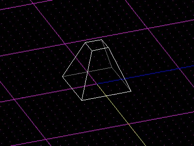

Author: Jon\`C

The first thing that I'd like to point out is that this tutorial assumes
you are very familiar with the JK engine. I'm not gonna hold your hand
while you work through these effects: if you come across something and
you're not quite sure what I'm talking about, hold off on this tutorial
until you learn what I mean.

On that note, while I'd like to see people use this effect, I don't want
to see people overusing it. These are meant to enhance the overall feel
of the level; they aren't meant as a crutch. If you can't make a
good-looking level without these, maybe you should work on the other
aspects of your editing instead.

You also might notice that there's a little 1 beside the title there.
That means that if I get another idea, I might end up writing another
one of these to tell about it.

Putting that aside:

## 1 - Coronas:

Adding a corona to your level is very simple. First off, you need the
corona .3do, .mat, and .cog files. You can get those
[here](glowstuff.zip). Feel free to make your own, but these are
samples of what I did. Now, you need to add the corona template to
your .tpl file:

```plain
# DESC: Pinhole/corona
# BBOX: -.2 -.03 -.2 .2 .03 .2
pinhole _decor collide=0 size=.283945 movesize=.283945 model3d=pinhole.3DO
```

Insert a new thing with that template. You'll notice that the surface
in the .3DO is actually off-center. This is normal, so your corona
doesn't end up inside the light source thing (if you use one). The
only step remaining is to add the cog to the level and set up the only
variable (corona), but that's pretty self-explanatory.

## 2 - Light Hole:

This is way more tricky. You can choose to do this whichever way you
want, through architecture or through a 3DO; the results are the same.
For the purposes of this tutorial, it will be a .3do. Make a prism. It
should be like a pyramid with a flat top:



Now, here's probably the most confusing part. You want to texture the
sides with lampglow.mat (found in the .zip file linked to above); but
you have to scale the texture up. This is what makes the effect. For
the demo level (see below), I used the scale 0.005. That's big.

The white area should be on top, the black area should be on the
bottom. Make sure the division is in approximately the middle of the
surface, with no white at the bottom and no black at the top.  
  
You can use the template I provided for the corona here, too.

You can grab the demo level [here (13k)](glowdemo.zip). It's not much
to look at, but you can reverse-engineer it if there's anything you
don't quite understand.
