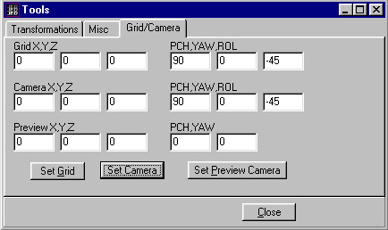
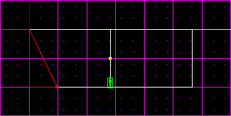
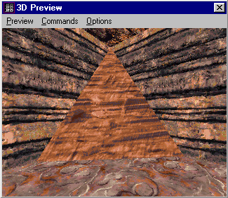

Author: PedHead
  
This tutorial will show you how to cleave in a certain angle you cannot
normally cleave, by switching to normal side views such as shift+2 and
shift+3. Once you learn how to do this technique, it can add character
to your level, whether it is a canyon wall or an architecture beam. So
let's get started.

The very first thing you want to do when you're in JED is press **F9**.
The **F9** hotkey will load up the Tools window. Once you see the Tools
window, click on the **Grid/Camera** tab. Be sure to fill out everything
you see in the picture below. I'm going to rotate the sector in a -45
degree angle. You can choose different angles you would want to cleave
in by punching in a certain number in your ROL column. Look at the
picture below for an example.

Once you have those columns filled in, click on **Set Camera**. This
should rotate the sector in a side view in a -45 degree angle. Go ahead
and close down the Tools window. But wait\! There is no grid. I cannot
cleave without a grid\! In Jed click on the **Command** tab and you will
see **Grid to View**. Once you click **Grid to View**, the grid will
appear so that you're able to cleave. For me, I am going to cleave the
corner of this sector in a slope. Look at the picture below.

As you can see, I want a sloped corner in the sector. Once I've cleaved
and deleted, I'm going to go see what it looks like in 3D Preview.
Hopefully you can create a better sloped corner than me with more of a
jagged slope. It is a fun technique which not many people do in JED.
Happy Cleaving\!

