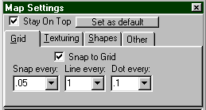
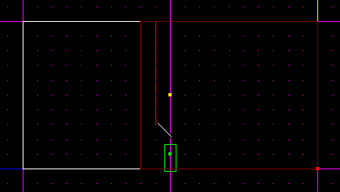
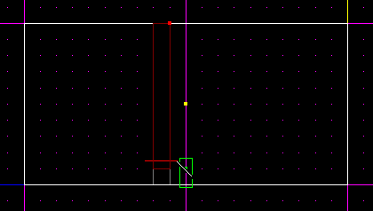
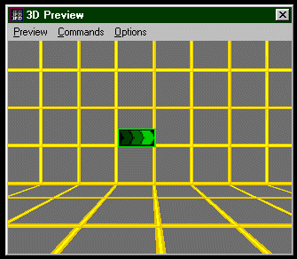
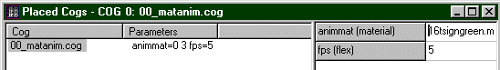

Author: PC\_McCloud
  

OK... there are a few things you must understand about animating .mats -
NOT ALL mats can be animated, only multi-celled mats, and you will see
that if you try to animate a single-celled mat all you do is repeatedly
show the same cell over and over and you see nothing. In other words
you're wasting a .cog. OK, now that we are past that let's open up
JED...

-----

Now, go in to Map Setting and Make a Dot every ".1" and a line "1" and
place snap every ".5"

Select the surface you plan on cleaving to place your sign and make two
cleaves as I have done about .1 JKU apart or 1 dot across

Now make two more cleaves as I have done about .5 across, going the
other way to make your surface for your .mat  

Now Select the Surface and Press "ENTER" and Change Material to
"16tsigngreen.mat" (this is done by clicking on the "+MATERIAL"). Check
it in 3D Preview "F12" and do any straightening out to make it look as
mine does:

Now, Press "F7" and "Add COG" and select "00\_matanim.cog" and add it.
Now select your surface and make a note of the Mat name. Return .cog and
put in the .mat name "16tsigngreen.mat" and you're done. Mission
Objectives Complete **\*Note:** Every Mat that you animate will be
animated throughout the level... So if you really don't want the .mat
animated elsewhere in the level.. I suggest you make use of a different
.mat or not animate it.

Happy Animating\!

