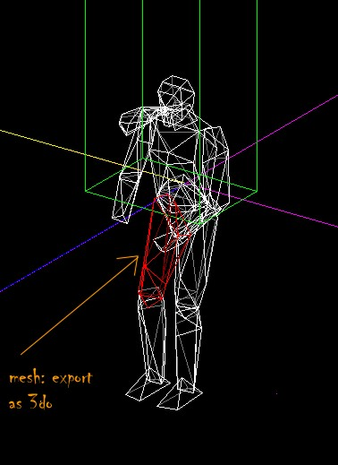
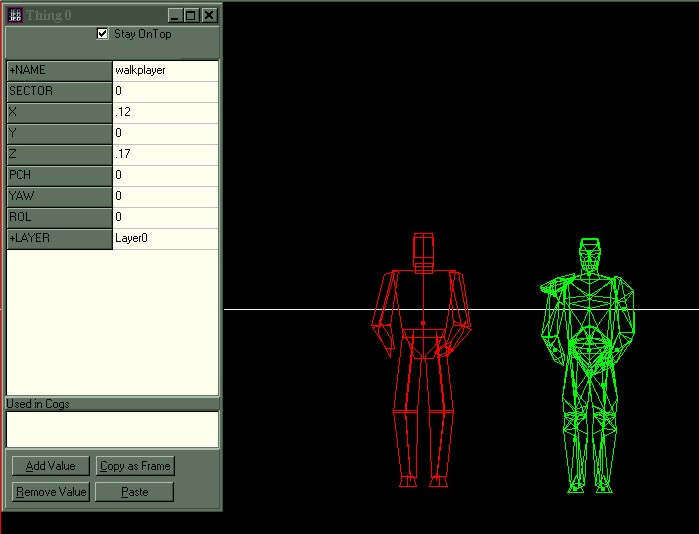
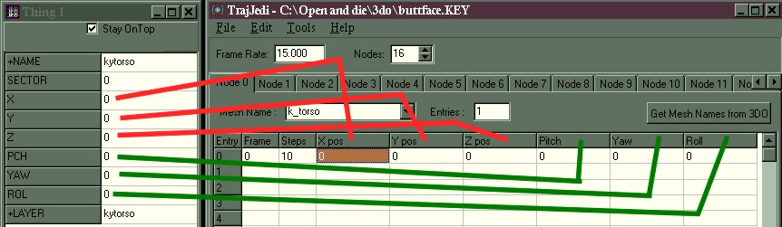

# Animation made easy\!\!\!\!

Allright Jedi Knightnicks\! I've always wanted to create new player
animations and animations for new enemies, but the task is has been so
daunting {daunting (daun' ting) adj, def: scary} with the current
version of Trajedi; the only utility that can do keyframes for Jedi
Knight and MotS. But kids, it's easy. Jed (that marvelous and loveable
little program) does half of the work for you. I'll show you what I
mean\!  
  
You will need:

* Jed beta .91 (any version that has the Quick and Dirty Template Maker is 
  cool)
* Trajedi (for obvious reasons)
* An ungobbing utility (Conman, JKGob,etc.)
* Puppetjedi (kind of as a conveinence)
* A firm grip on your sanity
  
Ok\! First pop open your ungobbing utility and extract Ky.3do and save
it to a new file folder.  
Crank up Jed and Import Ky.3do.

Now comes the fun part\!

Select a mesh (part of Kyle's body) and press enter Select a mesh (part of 
Kyle's body) and press enter (click the check box
that keeps the Item Editor on top to keep it on top). Look under the
Item Editor and find the mesh's Layer name. Export the mesh as a 3do.
Save that 3do to the directory you saved Ky.3do with the Layer name as
the name of the 3do.  

Do the same thing to all the other body parts. You can delete the parts
you've already exported to keep track.

  
You'll find that as you're exporting that Kyle has 
no Right Hand.  Cycle
through the meshes with N or P and watch the Layer names for K\_Rhand.
When you find that Export it too.

Now\! Once you've exported all meshes, start a new Jed Project. Save it
as whatever you like under the same directory that we've been saving
things in.  
  
Go to Thing mode and insert a new thing (Don't get rid of the
Walkplayer)  
  
Now go to your Tools and select the Template Maker.  
Push the 3do button and select one of the 3do meshes that you exported.
(i.e. K\_Torso)  
Repeat this process until you've made a template for each of Kyle's
parts.  
  
Now insert a whole buncha things and change them into the parts of Kyles
bod.

**Now we get to play Frankenstien\!\!\!\!\!**

Now we gotta put Kyle together. Mash the F4 button and change the "snap
to" setting to .005. Now select K\_Torso and go to the Item Editor and
put the number zero in for the entries: X Y Z Pitch Yaw and Roll. This
will set the torso at absolute zero. Drag all of the body parts to the
torso.  
  
Using the Walkplayer as a reference put Kyle in order. It doesn't have
to be perfect. (It won't be) It helps if you set things as Wireframes.
(View- View thigs as- Wireframes)  
  
About placeing the right hand: The small dot that is the right hand is
very important. It tells the game where to put the gun or saber or fist
that Kyle is using. Put it somwhere near the end of Kyle's Right Arm.

Now we have a working model of Kyle\! "So what" you may ask? Open
Trajedi now.

You'll notice that the entries in the Items Editor correspond to the
entries in Trajedi\!

Press "Get Mesh Names from 3do" and select the Ky.3do from you project
directory. This will set you up with all the mesh names. Click the Nodes
entry up to 16. (Kyle has 16 body parts) And name each of them a
different name from the drop down menu, "Mesh Name".

Now comes the long and tedious part, entering the coordinates for each
part of Kyle. Simply select a part in Jed and get the XYZ PYR entries
from the item editor and type them into Trajedi.

## Part 2

Now that the setup is all completed It's time to animate\!\!
Unfortunatly I can't help you with this part, because this part is up to
you. I've given you the means, now the world is your oyster. (so to
speak) I can give you some pointers tho.  
  
\-If you've ever seen Claymation in production, you know that the
modellers move the figure a little then take a picture. move it a little
and take a picture, move it a little and take a picture (Juxtaposition,
great art school word\!). Essentially that is what Character Keys are
about, except that instead of taking a picture you're copying the
coordinates into Trajedi. In Jed flip your view around using Hotkeys 1,
2, and 3. (pressing shift at the same time flips the grid to your view,
which is helpfull.) In different views you can move the different parts
to different locations.  
  
\-Stand in front of a mirror and perform the action that you want Kyle
(or other) to do. This will give you a good perspective of what the move
will look like, which in turn will make the move look more realistic.
(If you want Kyle to do a double somersault in midair and finish with a
flying kick, you can forget about doing that in front of a mirror).  
  
\-When doing upper body moitions the legs don't move much. Right cick
copy and paste leg entries to save time.  
  
\-When doing complex arm movements telling the Right Hand which Pitch
Yaw and Roll what they will be might become sort of a challenge. You may
use a gun mesh such as bryg.3do in place of the right hand in order to
sort this out.  
  
\-Use Puppet Jedi and Trajedi side by side to study keys already made by
LEC. This will help you understand a little better, how they work.  
  
\-Increasing the number of steps in the "steps" collum in Trajedi makes
animations like walks and idles more smooth and slow, that also cuts
down on the number of entries that are in the Key. 10 steps is a good
number to put in for those kind of animations. However quick animations
like punches and saber swings use 1 in the steps collum and have less
frames.  
  
\-In most keys (Except for Deaths) whatever part of Kyle that moved
returns to the position that it started in at frame zero. Think your
keys through. If a punch connects with a face, you're only halfway done.
You can experiment on your own, but my own observations have shown that
the meshes return to thier origional stations whether you want them or
not. (For some odd reason a five frame key turned into a seven frame
key).  
  
\-Use Puppet Jedi to check your work instead of using booting up Jedi
Knight.  
  
\-This technique works with other multiple mesh 3do's as well. Less body
parts, less work\!  

Well Kids, that's about it\! Get out there and make Kyle pick his nose
or something. I'd like to thank God real quick because He was the one
who gave me this idea.

