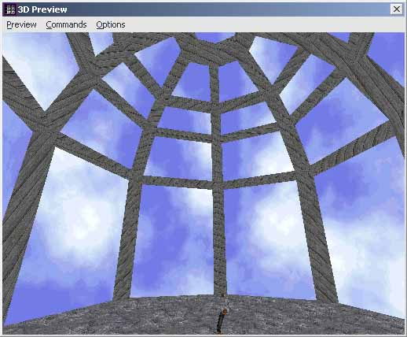

Author: Linus 'ThreeDee' Rachlis

[TOC]

## Preface

 This tutorial assumes basic knowledge of Jed. If you get stuck, try
 reading the basic tutorials first. Make sure you know all about
 multiselection. Mangore Kiramin's ([Domes Tutorial](/tutorials/domes/))
 is also recommended reading.

## Building the Dome

We start this off by building a dome using the same method as in
Mangore Kiramin's tutorial (link above), except we make our initial
cylinder differently.

Begin with the default Jed box. Press F4 and set:

**Snap every**: 0.1  
**Dot every**: 0.2

Using the cleave tool, cut up the box from the top view (**Shift-1**),
using the images below to guide you.

>    

Do those same two cleaves in the other four corners:

> 

Delete the extraneous sectors, so you have just one octogonal sector.
Now enter surface mode (**F**) and select the top surface of the
cylinder. Then, holding down **Shift** so the cleave tool snaps to
verticies, cleave from vertex to opposite vertex, until you have
divided the top surface into 8 "pie" pieces.

> 

Enter vertex mode (**V**) and select the vertex you just created in
the centre of the top surface. In the front view (**Shift-2**), raise
the vertex 2 JKUs along its Z axis.

> 

Enter surface mode and multiselect all the surfaces in the cone you
just created (not the surfaces on the sides of the cylinder). Cleave
those surfaces at 2 grid dots above the original top of the cylinder,
then lower the vertex on top of the cone by **0.8 JKUs** (4 grid
dots).

> 

Again, multiselect all the surfaces above where you just cleaved, and
cleave them at **0.2 JKUs** (1 grid dot) above where you cleaved
before. Then, lower the vertex on top by **0.3 JKUs** (1.5 grid dots -
if you can't seem to get it, make sure you set your **Snap every**
setting correctly to **0.1**). Enter sector mode (**S**), and cleave
the sector **0.2 JKUs** above the cleave you just made. Delete the
tiny sector on top.

> 

## Preparing the Beams

### Vertical Beams

First we will cleave the outlines of the beams into the walls of the
dome. Drop into front view (**Shift-2**), and set your grid snap
setting to **0.05** with **F4**. Now, multiselect the surfaces shown
in the following screenshot. Make sure they're the surfaces on the
NEAR side of the dome. They will appear brighter than the surfaces on
the far side.

> 

Now, make a parallel cleave to the right of the left edges of those
surfaces (the vertical line in the centre). Make it as close to that
line as you can get (this should be within **0.05 JKUs**). Here is
mine after cleaving, with the newly created surfaces selected for your
viewing pleasure.

>    

Make sure you're in **Shift-2** view. Hit **Shift-Left Arrow** 9
times. This will orient the view so that it's the same as before,
except that you're looking straight at the next edge, going
counter-clockwise around the dome. You can confirm this by holding R
and looking around, but when you're done, return to this view.

Go to **Commands \> Grid to view** to line up the grid with the
camera. This is important; otherwise your will not be able to cleave
correctly. Now do the same as you did before. Multiselect the surfaces
to the right of the line down the centre, and cleave them as before.
Again, make sure you select the surfaces on the NEAR side of the dome.
Once you're done, you should have this (I have again selected the
surfaces we just created, for clarity only):

> 

Using the same method, keep going counter-clockwise around the dome,
multiselecting and then cleaving the surfaces in exactly the same way,
until all 8 sides have been cleaved:

> 

### Horizontal Beams

Now, go around and multiselect all the large surfaces (not the thin
ones) on the bottom section, like so. Look closely, you will see that
I have in fact only selected the large surfaces:

> 

Settle into **Shift-2** view, and cleave the very tops off of those
surfaces, just **0.05** JKUs below their tops (the horizontal line).
Déjà vu, anyone? Here's mine, after cleaving (I have selected the
newly created surfaces for clarity):

>    

Do the same thing to the 3 other sections, and it's on to step 4\!

> 

## Extrusion

This step can be a bit tedious, but at least it's dead simple. Go
through every one of the "large surfaces" in the dome (including the
octogonal surface on the very top), press **Shift-X**, and extrude it
by **0.1 JKUs**. This part is probably why most people have trouble
figuring this technique out. When you look at ribbed domes, it seems
that the beams *intrude*, while it is actually the other surfaces that
*extrude*.

> 

Tada\!

Here is the final product in 3D Preview, textured for clarity, and of course 
your viewing pleasure.

> 

You can also get a great open-air feel by changing the textures around.

> 

Thank you for reading and have fun! :)

Credits

  - **Written by Linus 'ThreeDee' Rachlis**
  - Idea garnered from question asked by **PedHead**
  - Proof Readers
      - Elmo

