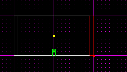
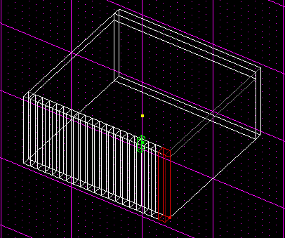
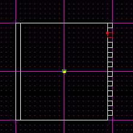

Author: Brian Lozier
  
I can't stress enough how important it is for a level to have a large
amount of detail. It helps to make it more realistic, and just outright
more interesting. One of the things I have used in the past are beams,
support structures. This tutorial addresses beams, but you can also
apply this to adding door frames, window frames, supports for catwalks,
and many, many other things.  
  
That said, let's get started. The first thing I would suggest is
switching your map grid settings and snap to settings to 0.1. This will
help in being able to cleave more complex structures. Once you are
finished learning how, you can always decrease the grid snap, to create
even smaller details.

1.  Okay, the first thing I would do is create the sector in which you
    want to be the inside of your structure. In this tutorial, I am
    going to use the default sector. I would suggest counting the number
    of grid spaces so you can cleave the correct number of beams. For
    example, if you are just creating beams in the inside of a room,
    you'd want the beams to start in each corner, but if you have an
    even number of grid spaces, you will end up with a beam in one
    corner, but then it wouldn't work out to be in the other corner as
    well. It's not important right now, but you'll see what I am talking
    about as this tutorial progresses.  
      
2.  Okay, the first thing to do is switch to the side view
    (\[shift+2\]), and cleave the sector edges to create the width of
    the beams. Below, I have cleaved the sector along one side, and the
    small remaining sector will be the width of my beams.  
      
    
      
      
3.  Now do the same with the other side.  
      
    
      
      
4.  Now you have the two sides, but you have to remember that beams go
    along the top of a structure also. So, making sure the center sector
    is selected, cleave the top as shown below.  
      
    
      
      
5.  Okay, now to start cleaving the beams. Make sure one of the side
    sectors is selected, and switch to the other side view,
    \[shift+3\].  
      
6.  Now, cleave that sector in the shape of vertical beams. As you
    cleave, I would suggest switching back and forth in all the views to
    make sure you are cleaving the correct sector.  
      
    
      
    This is the view from an angle, for clarity.

    
      
7.  Okay, now to actually make them show up. As of now, all the beam
    cleaves are adjoined, so they don't show up. The easiest way to make
    them show up is to delete every other beam. Start at one side, and
    select every other beam, and delete it.  
      
    
      
      
8.  Now, if you go to the 3D preview, you will be able to see the beams.
    I have textured them below briefly for clarity.  
      
    
      
      
9.  Now, it's time to repeat the cleaves and deletes with the other side
    and with the top. First, making sure the other side is selected,
    cleave it just as you did the first side. When you start deleting,
    make sure you delete the sectors that are directly opposite the ones
    you deleted originally. If you don't, they will be offset.  
      
    
      
      
10. Okay, now for the top. Making sure the top sector is selected,
    cleave just like you did on the sides, and delete the ones that are
    in line with the ones you deleted for the sides.

  
  
After you finish all that, you can texture, and you're done\!  
  
**Some final notes:** Make sure to be careful where you use this
technique. As you can see, it creates a lot of sectors. If you have too
huge of a room, it could end up with a bad framerate for some people.  
  

