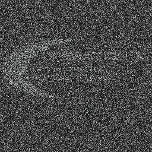
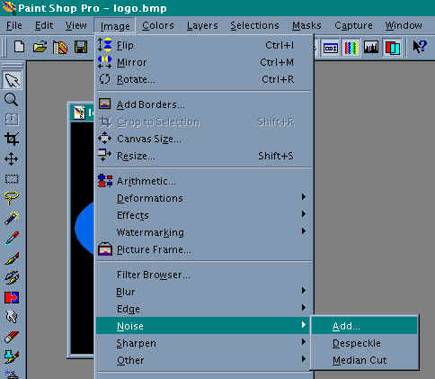
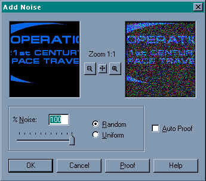
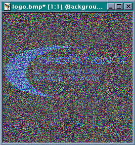
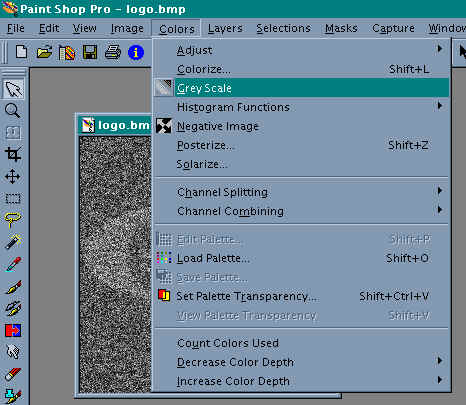
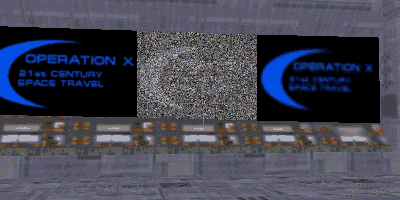

Author: Patrick "EL3CTRO" Grant
  

Ok, this is an effect I found while I was messing around with the
different tools in [Paint Shop Pro](http://www.jasc.com/download_4.asp).
I'm not sure if you can re-create this effect in other paint packages
because I haven't had a chance to try them, but I'm sure theres
something similar. What this effect actually creates is similar to what
you see when your TV has a very weak signal, this shot will better
illustrate this:

That is what the picture will look like after you have applied the
various filters. If you look closely there is a faint outline of a logo
there. This tutorial assumes that you know [how to make basic
mats](/tutorials/mats/).

-----

Now, First things first, make sure you have a mat that you want to add
the effect to, for this example I'm going to use a logo from one of my
upcoming levels.

Ok, now I'm going to load this into Paint Shop Pro and apply the filter.
The filter that we are using is called "Noise" and it can be found by
going to: Image\>Noise\>Add... (for this to work, all the layers should
be merged, and the colour depth has to be 24Bit (16 million colours)

(Excuse the crappy compression.)

Ok, once you have selected that, the following dialogue should come up:

Set the slider bar to 100 and make sure the "Random" radio button is
selected, then click OK. Once it has done this, you should be left with
something like this (note: I performed the above operation 3 times
because I wanted a lot of interference. You can just do it once or twice
depending on how much you want.)

Now some people might prefer one like this, with the different coloured
interference, but I like the black and white once best (more realistic).
All you have to do to make it black and white is to select "Greyscale"
from the colours menu.

Now this black and white picture goes well with the narsh pallet (CMP)
from JK, but I haven't tried it with others. If you're a boring person,
you can go away now happy that you got a new mat for your level. But if
you're the interesting type you can [animate
it](/tutorials/mats_multicell/). Simply put, do that procedure (the
whole tutorial up to now) 3 times on the same picture, and save them
under different names (eg. broken1.jpg, broken2.jpg, broken3.jpg).
Because the noise filter is random, it creates the dots in different
places on every picture\!

Now go take your 3 pictures and put them together in an animated mat.
The finished article should look like this\!

Cool, eh?
