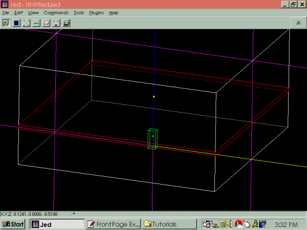
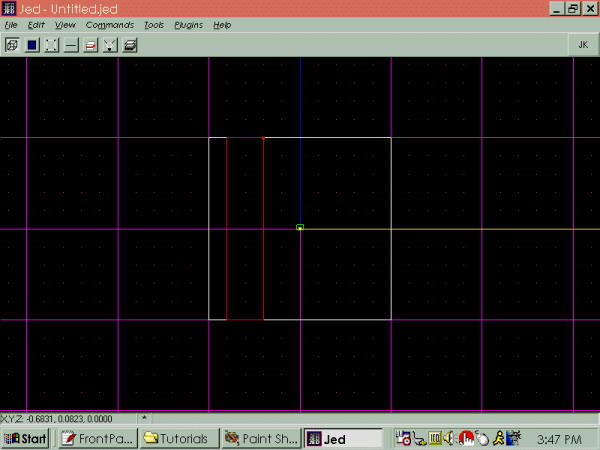

Author: SL\_Ric\_Olie  
  

\*Note: additions to the original tutorial are marked with asterisks.
Anyway, here goes. :)

First off, so I don't get sued, I would like to thank the Massassi
Temple for their tutorials. Especially Brian
Lozier with his ["Creating Outdoor
Buildings"](/tutorials/outdoor/) tutorial. This tutorial contains the
same basic principal, except more detailed. This tutorial was not made
to insult advanced editors, but to give "newbies" some techniques.
Anyway, thanks again to the Massassi Temple for helping get my start in
editing. Also, thanks goes to Alexei
Novikov for such a great JK editor\!\!\!

With that taken care of, I was working on a level for my clan, Sabers
Lightside, when I got the idea to create catwalks (actually, I already
had the idea, but I ended up playing with Jed and figured out how to
make them). Just to let you know, this is my first tutorial, so bear
with me :).

First off, fire up JED and you will see the basic cube. First, press F4
to bring up the map settings window. Set the snap to 0.01, there is
going to be a lot of detail involved, sort of :). With that done, snap
to side view, shift-2, and cleave where you want the top of your catwalk
to be. Next, cleave just a little below to make the catwalk itself. You
do not want a fat catwalk, thus the cleave right below.

Note: Make sure when you cleave your lines are straight, or else you'll
get a crooked catwalk. this is important because of the small snap.

Next, switch to the top view with the small sector selected, and cleave
out how wide you want the catwalk to be. Make sure you have the right
sector selected before you switch to the top view.

My catwalk is the small sector on the left. Go on down to the next step.

\*Now comes the next step. If you want to be able to walk on the catwalk,
you need to select the top surface of the walk. Ok? Now, press enter and
the surface box thingy comes up. Double-click on the surface flags. To
make the surface usable, make sure the flag "Floor" and "Impassible" is
checked, like so:

\*After all that is finished, select the small sector and delete it\!\!
That's right, get rid of it\! This creates a negative-space effect,
explained in the next paragraph. Read on. :)

\*Now to explain how these negative-space effects are achieved. It is
really quite simple. The sector that was deleted created a kind of
"hole" in the big sector itself. Since JK knows this can't be, and JED
also knows this can't be. The surfaces that were part of the sector were
shared with the surface directly above them in the other parts of the
sector. When am I going to get to the point? Well here it is: the
surfaces on the surrounding sectors wrap around the hole that was made,
creating a solid catwalk. Hope that clears up any doubt as to why this
worked for newbies. :)

If you go to 3d preview, you will see a catwalk. Here is mine, textured
for clarity of course\!

And Presto\! An excellent catwalk if you ask me. If you want another
catwalk above it, repeat the steps, just be sure that you know where you
are cleaving and which sector you are deleting beforehand. Have fun and
happy catwalk creating\!
