Author: Darth DarKal
  

This tutorial will demonstrate how to add separate sectors onto parts of
a 3do without misaligning the original .MATs. Hopefully it will save you
the time it takes to edit the .MATs by hand, and still create the
desired effect.

|   |   |
| - | - |
| Open JED and start cleaving out the basic shape of the sector you want to add. You may move the walkplayer thing out of the way, because it will not be used in the creation of the 3do. (For the purposes of this tutorial, I will make a ponytail to add to a previous Exar Kun skin I created.) | 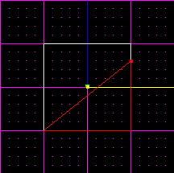 |
| After you have the desired shape, make sure all sectors are merged, or selected (Hold down the "shift" key to multi-select). | 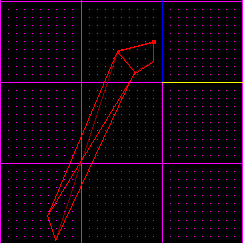 |
| Next from the "edit" menu, copy the sector.| 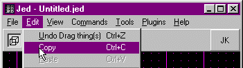 |
| Go to the "file" menu then to "import" and choose the desired 3do that you wish to add to. (I suggest you save your project when prompted in case you goof. I have plenty of times.)| 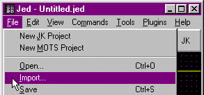 |
| Now on the "Map Settings" set "Snap every:" to the smallest increment. | 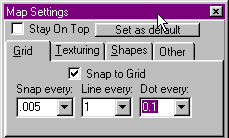 |
| Now delete all the sectors of the 3do, except for the one that you will be adding to. (In my case it would be the head.) | 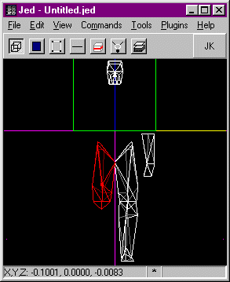 |
| When you have just the one sector, go back to the "Edit" menu and "paste" your copied sector on to the screen. | 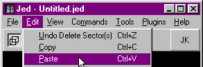 |
| In the "Tool Window" scale your pasted sector to the desired size. | 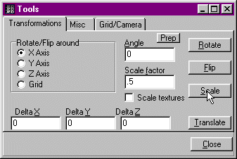 |
| Now hold the "Ctrl" key and move the sector into the desired position. (***Important!*** Do not touch the imported 3do, as it will pull all the .MATs out of place and destroy the point of this tutorial!! If you do, quickly select "Undo" from the "Edit" menu before you do anything else) | 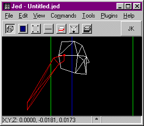 |
| Now hit "Enter" on the ponytail sector of the 3do and double check that the mesh name under "+Layer" is the same as that of the head's | 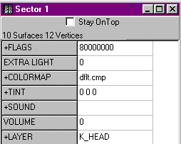 |
| Holding down the "shift" key, multi-select both your sector and that from the imported 3do. Make sure the 3do's sector is highlighted orange and yours is blue or else it will throw the centering off. | 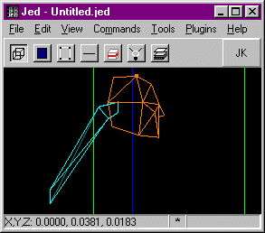 |
| From the "File" menu choose "Export Sector(s) as 3do..." and name it what ever you want. Congratulations! You now have your new 3do sector! Now you just have to replace the normal section of the 3do with this one (in my case the head.) | 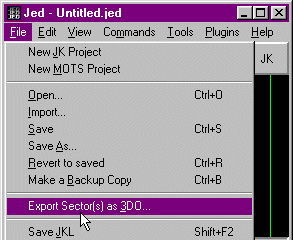 |
| Open up your edited 3do sector, and the model you wish it to place it in. At the top of both you'll find a list of the Materials (MATs) and their number. Locate the MATs present in both models correspond and write them down somewhere along with their respective numbers.  In your created 3do sector, you may have a number for "dflt.mat" Change this to the nearest MAT of the part edited. (Since I added a ponytail I will use "exarfaceb.mat" because I added it to the back of the head.) | 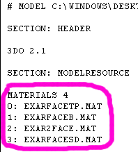 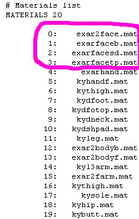 |
| Next scroll down to the "FACES" section of your edited sector, and change all instances of each number with it's counterpart from the destination 3do file. This is only to be done with the second number in each row.  Here the numbers: 0, 1, 1, 2, 2, 2, 2, 2, 2, 2 Would be be changed to: 3, 1, 1, 0, 0, 0, 0, 0, 0, 0. | 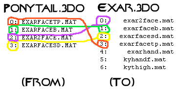 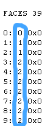 |
| Now highlight from the Mesh Name (K_head in this case.) to the last line above "SECTION: HIERARCHYDEF" in your edited sector, and go to "Edit" then "Copy." | 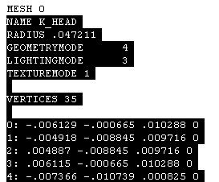 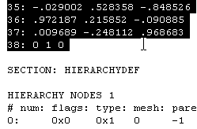 |
| Then find the first corresponding mesh in the destination 3do and highlight from the mesh name down to the line before the next "#Mesh definition," and go to "Edit" then to "Paste." If you wish you may also paste over the other meshes of the same name in the 3do (There are usually Three more.), But doing so may slow down gameplay. | 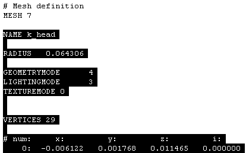 |
| And that's it! Here you have a successfully edited 3do. | 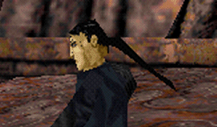 |

This method will throw off the centering of the main mesh when edited
though it is not that noticeable on the head there are some body parts
that can't be edited. To fix this on other body parts try exporting with
a small cube highlighted orange in the 3do. It should use that as the
centering point.
