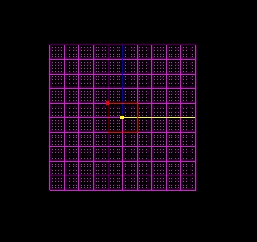
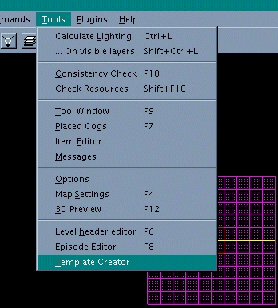
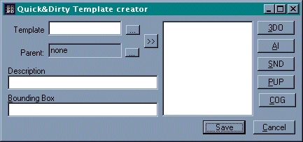
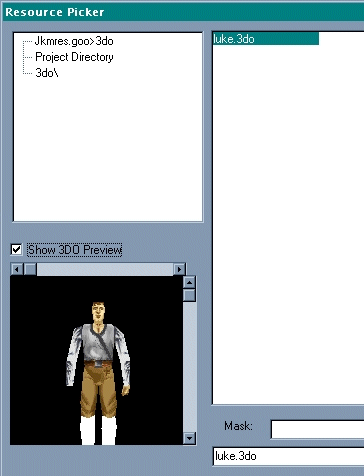
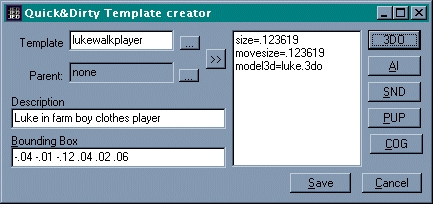
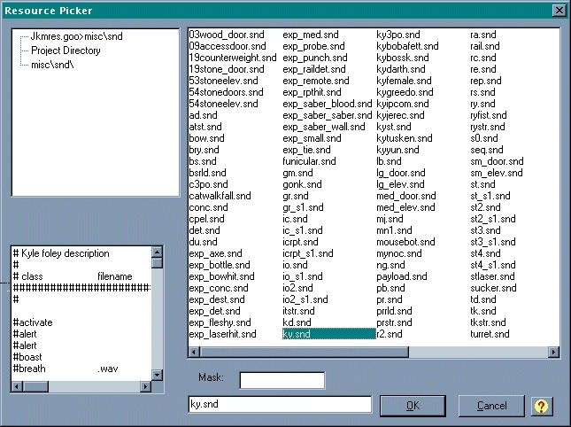
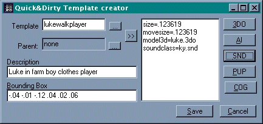
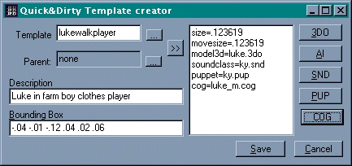

Author: Lee Howett

Hi everybody\! Previously, there was a tutorial posted on creating New
Player Characters. The author didn't cover what I feel is the easiest
way to make new player characters, as well as new enemies, ships, etc.

That's what this tutorial is for.  I'll tell you how to do all the
things above. It's very easy to do.  If you have any questions or you
don't understand something I say, just email
me with your question.

Things you need, plus a link where to get it, if necessary:

- JED V. 0.85 (The newest version, you don't need it but it's what I use)
- The 3do's and mat's for your new character.
- Jedi Knight, or the Mysteries of the Sith Add-on Pack

Okay, here we go.  By the way, I'm using MotS.

Your brand, spanking new, well, box.

First of all, make sure all your 3do's and Mats are in your project
directory.  Save your project, if you don't you won't be able to add
your new guy, then click Tools, Template Creator.

Template Creator selected in the Tools menu:  

Here is where you will tell Jed what you want the new thing to be called
in the Rescource Picker, the 3do, the AI class, the Snd class, the
Puppet File, and the Cog.  You can ignore the Bounding Box, everything
goes in there automatically when you choose something.  You also can
ignore the Parent: field, I'm not sure what that does.

1. Type what you want your new thing to be called in the Rescource
Picker in the Template field.  For example, LEC would have typed
walkplayer for Kyle or marawalkplayer for Mara.

2. Click the 3DO button and then click Project Directory on the left. 
Your new 3do should show up on the right, if it doesn't, then it isn't
in your project directory.

     A pic of Luke in farm boy clothes in the Rescource Picker.

3. After choosing your 3do, press OK.  Your Template Creator should now
look like this: 

    If the Template Creator doesn't have the size= and movesize= fields,
don't worry, they aren't required.  For the description, you can put
whatever you want. Only Jed v. 0.85 and above will put the size= and
movesize= fields in, so if you don't have the latest version, be sure to
download it.

4. Now it's time to choose your AI class.  This is just something that
will tell JK or MotS how smart the thing is.  If you are putting in a
stationary object, or something that doesn't have a brain, (ie. crates,
etc.) you can ignore this.  I usually just use an AI class that is for
something that resembles my thing.  When you click on an AI file in the
rescource picker, it will tell you what that AI file is for.  If you are
making a new player character, you can also ignore this.

5. Snd classes.  This is sometimes difficult.  If you are making a male
character, then I usually use Kyle's. In this case, I'm making a male
character, so I'm going to use Kyle's.  You choose a .snd class the same
way that you choose a 3do or an AI class. 

    This is what the Snd. class picker looks like: 

    This is what the Template Creator should look like now: 

    You will notice that I now have a soundclass=ky.snd place.  If you are
doing a female character, you can use kyfemale.snd or mj.snd.  Both are
Mara Jade foley descriptions.  BTW, I have no idea what foley means,
it's just what LEC calls them.  If you want to use your own Snd class,
you can just put the .snd file in your project directory, but if I went
in how to make new .snd classes, we would need another tutorial, so I
won't.

6. Now we do the Puppet file, then, finally the Cog file, and we're
done\!  To choose a Puppet file, you do the exact same thing as that you
did when you chose everything else. What are puppet files you ask? 
Well, read on.  They are essentially text files that tell JK what
keyframes to play when a player does an action.  Keyframes are like mini
cutscenes that are played when a character does something.  For
instance, when you press the space bar, Kyle/Mara reaches out, this is a
keyframe.  When you walk or run, Kyle/Mara's legs moving are a
keyframe.  So, if you are just making a human male, you can use Kyle's
puppet file (ky.pup), or if you are making a human female, you can use
Mara's puppet file (mj.pup).  If you aren't making a human, you can look
through the list.  When you select a puppet file from the list, it will
tell you what it is for on the left, just like in the AI class thing. 
Once again, if you are an advanced editor, and you have your own .pup
file, stick it in your project directory and then click Project
Directory on the left, and then click your .pup file on the right.  When
you have chosen a .pup file, click OK.  
  
7. Now we get to choose a cog file.  This is very important, it will
tell JK what your thing really is, it's the difference from making a
player character and a piece of debris.  If you are making a player with
a lightsaber, you can use Kyle's for a male, or Mara's for a female.  If
you are making Luke, like I am, Luke has his very own cog, because of
the secret level in MotS.  Luke doesn't have his own in JK.  Yet again,
if you are advanced, or know the basics of Cog, you can edit one if you
want a character without a saber, then rename it for your character,
stick it in your project directory and choose project directory on the
left, then your new cog on the right in the Rescource Picker.  You can
also change the saber color by editing the Cog, just replace
sabergreen0.mat and sabergreen1.mat for kyle in JK to whatever color you
want, for example, saberorange0.mat and saberorange1.mat for the saber
that he uses at the end of JK and in MotS.  To do this, just locate
where it says the saber color (the name of the .mat file that is the
color, like the ones above) and replace it with the new .mat file.  This
is pretty complicated, and I tried to put it in as simple terms as
possible, but you still might not understand it, if you don't then
email me and I'll try to explain it better.

    This is what the finished Template Creator looked like for my Luke
Character: 

Wow\! I didn't think this would be such a big tutorial\!  Good luck\! By
the way, if the spacing is all wrong, this is not my fault, it's just my
stupid HTML program doesn't like me.
