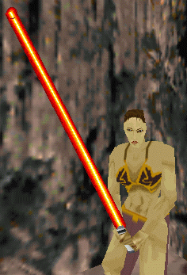
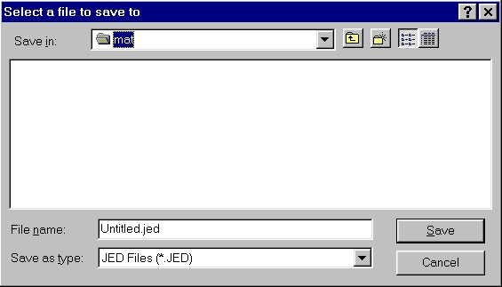
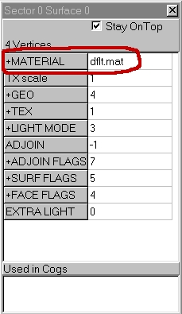

Author: Red
  
**Note**: This tutorial assumes that the author has general skinning
skills and just a smidgen of JED skills.

Lately I've noticed several pallet problems in Jedi Knight Skin. What
does a pallet Problem do? Check out these Leia's:

1)  2) 

Notice how her dress shade changes. This is because each Color Map
changes a select few colors in its palette (someday I'll make a list of
these and send it in). In the most drastic case (a level with a
dflt.cmp) these colors that change would be neon pink (Ouch\!). That's
why it's a good idea to check for these.

1.  Open JED
2.  Hit File -\> Save As and Save it (as **Untitled.JED**) to the
    directory with all you mats.  
    
3.  Click the Surface button () on the top menu bar.
4.  Click Tools -\> Item Editor
5.  Double Click +MATERIAL  
    
6.  Click on Project Directory (upper left hand) and scroll down your
    mat list. If you see something like this in your lower left hand
    side:  you have a problem :-)  
    That is what your lovely skin would look like in a level with the
    dflt.com -- see why we fix that?
7.  Just re-edit your mat -- trying to get rid of the bad color. And
    then repeat the checking process.

Happy Hunting :-) I'll get the pallet done if I have a free day (and
I'll send it to Massassi)  
  
~ Red
