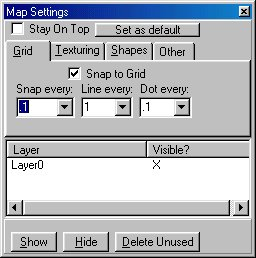
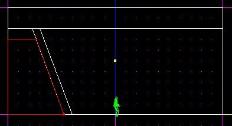
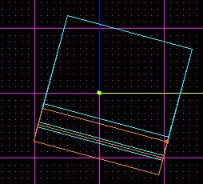
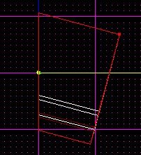
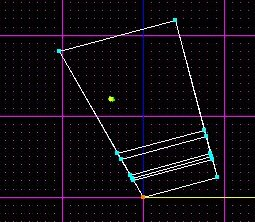
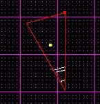
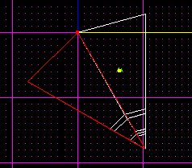
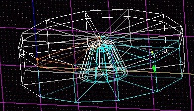
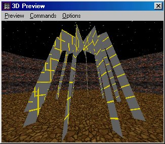
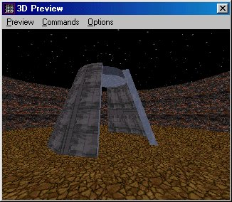

Author: Jkior Kav
  
Note: This tutorial requires a certain amount of working knowledge of
Jed and the F9 tool.

I have long wondered how to easily construct perfectly circular exterior
level architecture, such as domes and the like. Rotating and cleaving
was not sufficiant. Therefore, I came up with this method the other day
and tried it out. Easy as pie... well, maybe a pipe. :-)

That said, lets get started.

1.  The first thing I would suggest is switching your "map grid" and
    "snap to" settings to 0.1. This will help in being able to cleave
    more easily.  
      
      
      
2.  Okay, first cleave out a half side view of your desired shape. In
    this tutorial, it will be a circular pillar, tapering off towards a
    flat top.  
      
    At this point, do NOT delete anything.  
      
      
      
3.  Now, go to the top view and multiselect all sectors. Rotate it 15
    degrees "by the grid" (You need Jed 0.92, or just rotate it around
    the z-axis). It should look like this now:  
      
      
      
4.  While still in the top view, cleave and delete along the grid, like
    this:  
      
      
      
5.  Now, rotate it the other way by -30 degrees, and snap the grid to
    the vertex I have selected:  
      
      
      
6.  Back in sector mode, cleave and delete along the grid again, like
    this:  
      
      
      
7.  Now, copy it \[Insert\], and rotate the new one by 30 degrees to
    line up with the old sector. (you may have to do some snapping of
    the grid.) Use the \[Insert\] key once again, rotate the new sector
    by 30, and position it correctly.  
      
      
      
8.  Continue this until you have a circle, like this:  
      
      
      
    (BTW, this part might make more sense if you go to the [perfect
    pipes](/tutorials/pipes/)
    tutorial)  
    Note: Because you will have to adjoin everything in the end, you
    might try adjoining as you go.  
      
9.  Adjoin all sectors that are not already adjoined, except for the
    ones in the walls of the pillar.  
      
      
      
10. Now, delete out the walls and roof of the building, like this:  
      
      
    And, Voila\! You now have perfectly circular exterior architecture\!
    Enjoy and have fun\!
