Author: Brian Lozier

-----
  
This is a brief tutorial on how to create pipes (or anything for that
matter) that curve nicely and easily. First of all, create the sector
you want to use as a pipe. I created a simple octagon. To do that (for
the newbies out there), just switch to the sideview (shift+2) and cleave
off the corners of the sector. Then, delete them.  

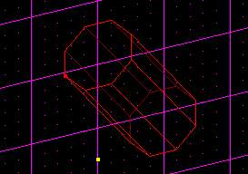

Now, with that pipe sector selected, go to the top view by pressing
\[shift+1\]. Then, press the \[Insert\] key. This will insert a new
sector exactly the same as the old sector.  

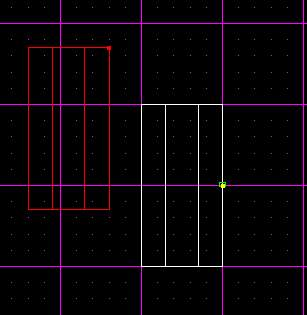

Now, since we are working on a 90 degree angle to start out, we need to
rotate this pipe sector 90 degrees, so it is at a right angle to the
original sector. To do that, make sure the new sector is selected, and
then go to the "Tools" menu, and press "Tool Window." If you want, you
can use the shortcut key \[F9\].  
  
Now, we want to rotate this sector around the "Z axis" 90 degrees. So,
in the window, select "Z axis," type in 180, then press "rotate."  
  
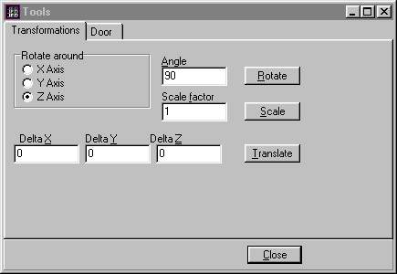

Now, you will end up with two sectors at right angles to eachother. It's
easiest to move them so they square up with the grid, as I have in the
diagram below.  

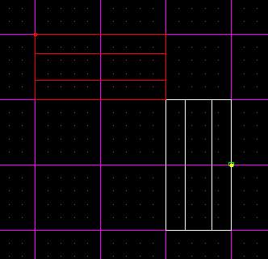

Now, we have to cleave both of these sectors' ends off at 45 degree
angles. That way, they meet up at a 90 degree angle. To do this, just
use the grid squares as guides, and cleave from corner to corner. I did
this below.  
  
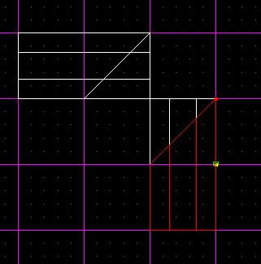

Now, delete the extra sectors as shown below.  
  
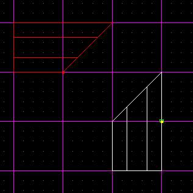

Notice that now we have two edges that look like they will fit together
nicely. That's the whole point of this tutorial. Next step is to move
them together, as shown below.  
  
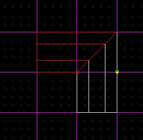

It is important to check from a side view to make sure they are aligned,
as shown below.  
  
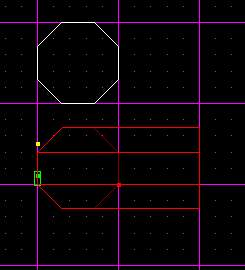 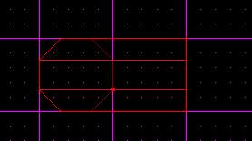

The left pic is before I aligned them, the right is after.  
  
Now, select the surface that is common between both sectors, as shown
below, and press the "a" key. This will adjoin the sectors and allow you
to walk between them.  
  
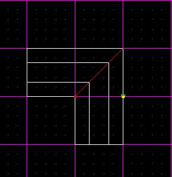

That's it\! Very easy. Below is the finished product.  
  
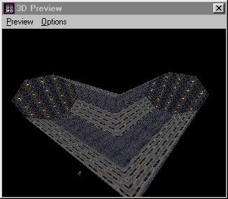

The rotate tools can be used in many ways.. for instance, you could make
your pipe curve straight up or down using the other axis. If you want
the transitions to be less, don't use 1 45 degree angle, use less of an
angle, but do it twice. I hope that makes sense. That's it for now, good
luck on your pipes.
