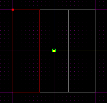
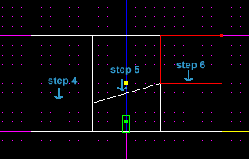
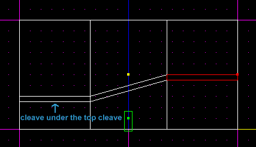
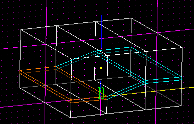
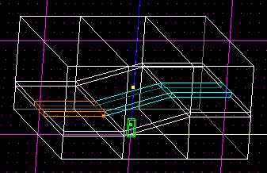
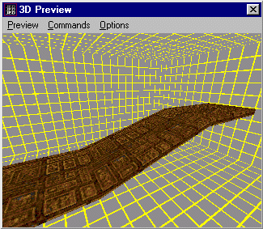

Author: Bulworth
  
I'm sure some of you have already read the [Catwalks
Tutorial](/tutorials/catwalks/), well this a "Crooked" Catwalks Tutorial
so there is a difference. First off, I'd like to thank Brian of the
Massassi Temple because I've learned everything I know reading all of
the tutorials on his page (well, not all of them). This tutorial is for
beginners, or if some of you advanced dudes don't know this, then it's
for you too...

OK here we go...

1.  First start up JED and you'll have that cube on the grid...

2.  Then go to the Map Settings option (F4). Set the snap to 0.05. For
    this tutorial I work with the dots set to 0.1, but that's not
    necessary.

3.  Now go into the top view (1), start by cleaving (C) the sector, or
    cube, into three even parts...
    
    
    
    Try to cleave them evenly.

4.  OK now you should have three sectors... switch to the side view (2),
    select the sector that's on the left and cleave where you want the
    top of your catwalk to be.

5.  Now select the middle sector and cleave (C) it so the top of the
    ramp is "crooked" or pointing up. Check out the picture below, its'
    a lot easier to understand when you've seen it...

6.  After you've finished step five select the last sector, the one on
    the right, and cleave it so it starts from the ending of the last
    cleave (step 5). Again, look at the picture; it's easier to
    understand.
    
    
    
    This is what your cube should look like by now.

7.  Now you have to create the "bottom" for your catwalk. Do the same
    thing you did for the top, except cleave under the one that we
    cleaved for the top (look at the picture and you'll know what I'm
    talking about).
    
    
    
    Now you've made a catwalk, see?

8.  Rotate the cube a little bit and select the catwalk part, which
    should be a thin line going through the three sectors. Select by
    clicking on the sector and pressing space.
    
    
    
    Select those 3 sectors...

9.  Switch to Top View (1) and cleave the catwalk so it's in the middle
    of the cube...
    
    
    
    The selected sectors are the catwalk...

10. Now select the catwalk, like you see above, and delete it...

11. This is what it should look like when you're done... after texturing
    it...
    
    
    
    Nice, eh?

Well that concludes my tutorial. I sure hope this helped you because
these things look really cool in levels, especially if they're big...
it's better to make catwalks by cleaving than to use 50,000 3DOs, you
know what I'm talking about... \*LAG\*

Happy editing\! If you have any questions or comments send them to me.
