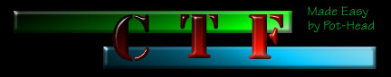
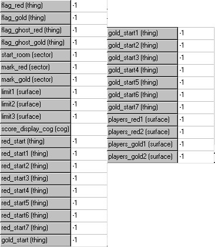
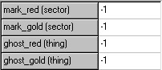
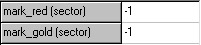
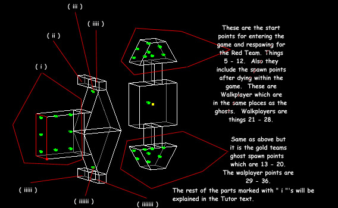

CTF (Capture The Flag) is a incredible composition of complex COG work
and level design. CTF can be very easy to install, however it can also
be painstaking work if you have never had experience with it. I hope
this tutor will help you. Some of the terms that I am going to use may
be a little bit more advanced since this tutor was not written for a
novice editor. Enough of that, on to how to make CTF.  
  
The problem I had with CTF was how to place the things. You must have
the "Thing Placement" in the "JKL" file in correct order.  
  
Here is the correct "Thing Placement" for CTF to work correctly. (Note:
The terms that I use will be explained later, and I've used "Thing
Numbers" 1 - 46 in in my chart.  
  

| **Thing Number** | **Thing Name** | **ThingFlags** | **Notes**                                                                                                   |
| ---------------- | -------------- | -------------- | ----------------------------------------------------------------------------------------------------------- |
| 1:               | ctf\_redflag   | 0X400          |                                                                                                             |
| 2:               | ctf\_redflag   | 0X400          |                                                                                                             |
| 3:               | ghost          | None           | This is where the flag is spawned back to if it was captured or a player was killed with it. Red Teams.     |
| 4:               | ghost          | None           | Same as above but for Gold Team                                                                             |
| 5 - 12:          | ghost          | None           | These are the start points for the red team when entering the game.                                         |
| 13 - 20:         | ghost          | None           | Same as above but for the Gold Team.                                                                        |
| 21 - 28:         | Walkplayer     | 0X20080501     | Red Teams player start points after entering the CTF enviroment.                                            |
| 29 - 36:         | Walkplayer     | 0X20080501     | Same as above but for the gold team.                                                                        |
| 37 - 44:         | Walkplayer     | 0X20080501     | These are the player points which are used when entering the game.                                          |
| 45:              | ghost          | None           | Used in CTF\_SAFEENTY.COG to teleport a player back if there is too much lag. More on this later. Red Team. |
| 46:              | ghost          | None           | Same as above. Gold Team.                                                                                   |

Ok now that I have shown you the correct order in which "Things" should
be placed. I will now go on to installing CTF, which will use my
definitions of things above within it.  
  
Now I will add the appropriate thing values of what they should be in
your placed COG which is CTF\_MAIN.COG.  

  
  

| **Value**          | **Thing Number**              |
| ------------------ | ----------------------------- |
| Flag\_Red          | 1                             |
| Flag\_Gold         | 2                             |
| Flag\_Ghost\_Red   | 3                             |
| Flag\_Ghost\_Gold  | 4                             |
| Start\_Room        | Explain Later                 |
| Mark\_Red          | Explain Later                 |
| Mark\_Gold         | Explain Later                 |
| Limit1 Limit2 Limit3 | These are surface values used for setting the score limit. I know how to use these but I have been unable to display the texture correctly it always ends up like if you were holding up say the letter "B" and looking in the mirror at it completly ass-backwards. If you can figure this out please let me know. |
| Score\_Dislay\_Cog | Not to sure what this is for. |
| Red\_Start         | 5                             |
| Red\_Start1        | 6                             |
| Red\_Start2        | 7                             |
| Red\_Start3        | 8                             |
| Red\_Start4        | 9                             |
| Red\_Start5        | 10                            |
| Red\_Start6        | 11                            |
| Red\_Start7        | 12                            |
| Gold\_Start        | 13                            |
| Gold\_Start1       | 14                            |
| Gold\_Start2       | 15                            |
| Gold\_Start3       | 16                            |
| Gold\_Start4       | 17                            |
| Gold\_Start5       | 18                            |
| Gold\_Start6       | 19                            |
| Gold\_Start7       | 20                            |

Don't worry about the last 4. Same problem as with the Limits  
  
I will now explain CTF\_SAFEENTRY.COG.  
  
  
  
| **Value**   | **Thing Number** |
| ----------- | ---------------- |
| Mark\_Red   | Explain Later    |
| Mark\_Gold  | Explain Later    |
| Ghost\_Red  | 45               |
| Ghost\_Gold | 46               |

Last COG is called CTF\_RESPAWN.COG  
  
  
  
| **Value**  | **Thing Number** |
| ---------- | ---------------- |
| Mark\_Red  | Explain Later    |
| Mark\_Gold | Explain Later    |

  
Now the format of the level will be explian using a simplistic level
with the basic components needs for a CTF level to work correctly.  
  
  
  
(i) This is your start sector so get the sectors number and put that
into the CTF\_MAIN.COG where it says Start\_Room. The things that are
present in this sector are things 37 - 44 these are the inital start
places for players.  
  
(ii) This is defined in CTF\_SAFEENTRY.COG under the value of Mark\_Red.
So get the value of the sector and input it under the Mark\_Red value.
This is important to the game because if lag is to great and you are not
teleported into the game with your color it will put you back infront of
the team select sector.  
  
(iii) This is the Ghost\_Red value in the CTF\_SAFEENTRY.COG mark the
thing number under that value.  
  
(iiii) This sector has two functions. The first is Mark\_Red in the
CTF\_MAIN.COG. the second function is for CTF\_RESPAWN.COG which the
sectors value is placed again in the Mark\_Red.  
  
(iiiii) Same as (ii) but for the Gold team.  
  
(iiiiii) Same as (iii) but for the gold team.  
  
(iiiiiii) Same as (iiii) but for the gold team.  
  
Ok now that all this values are entered and if you have done this
correctly your CTF should work.  
  
Now for a explanation of the mechanics.  
  
The CTF\_MAIN.COG designates the Walkplayers from 37 - 44 as the start
players thats why you must define a start sector.  
  
Next a player has entered a game and he/she decides to goto the Red team
so they enter the Mark\_Red sector or (iiii) as I have defined above and
then the CTF\_RESPAWN.COG chooses a random start point using the ghost
things 5 - 12. Say a player does not enter the game correctly the
CTF\_SAFEENTRY.COG teleports the play back to the Ghost\_Red thing so he
can try to enter again.  
  
Thats it except for when a player dies the CTF\_MAIN.COG has a internal
code which is not defined to Respawn players from Walkplayer 29 - 36 for
Red Team and 37 - 44 for Gold Team.  
  
Questions or Comments, feel free to ask: Pot-Head
