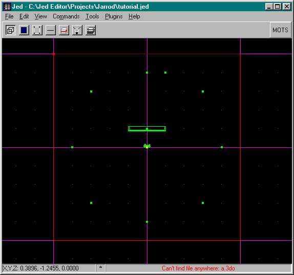
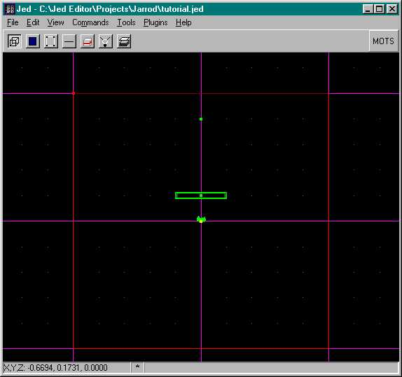

by Jay "Jarrod Li" Leno
  
This tutorial requires the following files:  
[tutorial.zip](tutorial.zip) - tutorial.cog (below) and jabba.wav (1.05
megs)  
[tutorial.cog](tutorial.cog) - download this if you don't want to wait
for the wav file to download. You will then have to create your own
jabba.wav file.  
  
First off I would like to thank **Alexei Novikov** for such a great
program and **Antony Espindola** for his cutscenes tutorial, without which,
this could not have been written. Please read his original tutorial, I
have taken the intro out of it but all of it is informative and should
be read before attempting this tutorial.

(His original words are noted.)

The programs that you will need, which you most likely already have,
are:

- JED 0.x (0.8 is currently available\!\!\!)
- Cogwriter (0.3 is currently available)
- Conman (0.7a is available and also optional)

All of which can be downloaded at: www.jediknight.net/darkjedi/

>Antony: One of the best features of the Jedi Knight series of games is the
>fact that they contain "cutscenes" when you finish either a level or
>certain objectives. These are like mini-movies which help with the flow
>of the story being told by the game. The cutscenes in Jedi Knight were
>pre-recorded video which is then saved to the CD in a special format and
>then played back. With the Mysteries of the Sith add-on pack, the
>cutscenes changed from video to being "acted" out by the graphics engine
>of the game itself. These cutscenes were also recorded to the CD (as
>.san files) but were created using the game engine and COGs. "

I have seen many questions about creating MotS style Cutscenes on the
Message Boards by so called "Newbies." I have had these same questions
since MotS was released, and so, not two weeks ago I decided to dive
headfirst into creating a cutscene of my own. First I would like to give
credit where credit is due: __Alexi Novikov for JED, Antony Espindola for his Cutscenes tutorial__,
and __Dak aka Jason Burton for the cog that Antony modified which, in turn, I modified for this tutorial__.
Please read Antony's tutorial ***before*** starting this,
it will give you a good idea of how to go about designing your
particular cutscene, besides that, he put a lot of work into it and it
is an enjoyable read. J

This tutorial is based on the premise that you have a rudimentary
knowledge of how to move objects using frames. If you do not know how to
do this please download and read the tutorial on elevators before
continuing. It is also based on the premise that you have a basic
knowledge of the Cog language. You do not need to know how to write a
brand new Cog just yet. If you do not understand Cog, download the
article "A Force of Your Own." Both of these are available at the
Massassi Temple where you downloaded this file. There is also a file on
your MotS CD called Cutscenes.zip. It is in the Gamedata/Resource/Video
subdirectories. Unzipping it will give you lots of Cutscene Cogs to look
at later.

###Description

We are going to create a simple room with a console. The player will
start in that room, walk up to the console, activate it (by pressing the
space bar) and then the cutscene will begin. The cutscene will exit to
an external view (like pressing F1), show a message that it has been
activated, then the camera will rotate 360 degrees around the player,
while playing a sound. Then it will play another sound just as it
finishes the rotation and then return back to an internal view.

###Step One

Open your copy of Cogwriter and JED. You do not need to open ConMan
unless you want to look at some other cutscene cogs later.

###Step Two

In your project directory create a subdirectory called Tutorial. In JED
save the level as tutorial.JED in the Tutorial project directory. Place
the Tutorial.cog and the Jabba.wav files that came with this level in
your project directory as well. Now using the default sector size,
texture the floor with some sand (mdm15fsand.mat) and the sky
(4309sky01.mat). Next place an item (console5) just in front of Kyle.
Adjust the heights of Kyle and the console as necessary so they are
sitting just on top of the sand and not in it. Next we are going to be
placing the camera's. The cameras are in the template directory. We will
be using 9 camera's for this example. That may seem like a lot but it
will give a somewhat smooth 360-degree rotation around Kyle.

###Step Three

Now we are going to place the cameras in a counter clockwise position
around Kyle. Four of the cameras will be at the cardinal points N,S,E,W.
If your grid is set at 0.2 these cameras will be 4 "dots" away from the
middle in each direction. Then next four cameras will be in-between the
first four cameras at a X,Y coordinate of 3,3 (3 dots up and 3 dots
over). Now on to the ninth camera. It will be placed just to the right
of the North (\#1) camera. However the cog doesn't like it to be in the
exact same position so we will fool it and the viewers eye. Change your
grid to 0.1 and the snap to 0.02. Now move that last camera over next to
camera \#1. You will have to zoom in to make sure that it is next to
camera one but not in the same spot. I am going to spoil you and give
you the necessary coordinates for each of the cameras.

| Camera | X    | Y    | Z   | PCH   | YAW |
| ------ | ---- | ---- | --- | ----- | --- |
| 1      | 0    | .8   | .55 | \-.35 | 180 |
| 2      | \-.6 | .6   | .55 | \-.35 | 225 |
| 3      | \-.8 | 0    | .55 | \-.35 | 270 |
| 4      | \-.6 | \-.6 | .55 | \-.35 | 315 |
| 5      | 0    | \-.8 | .55 | \-.35 | 0   |
| 6      | .6   | \-.6 | .55 | \-.35 | 45  |
| 7      | .8   | 0    | .55 | \-.35 | 90  |
| 8      | .6   | .6   | .55 | \-.35 | 135 |
| 9      | .2   | .8   | .55 | \-.35 | 180 |
  
  

The view above is what you should see before you place camera \#9 in
it's correct spot. If you look at the 3D Preview window all of the
cameras should be facing inward towards Kyle and downward at him as
well.

|               |        |
| ------------- | ------ |
|  | Next we will select Camera \#1, and start adding values to it. The first value we need to add is NUMFRAMES and then we need to add 9 FRAME values. In the NUMFRAMES field goes, yep you guessed it, the number 9.Now select the first camera and hit the "Copy As Frame" button and paste the value into the first frame box. Continue this in a counter clockwise position until you are finished. Now delete all of the cameras except for Camera \#1. Next change Camera \#1 into a ghost. This is done by double clicking on the name and selecting "ghost" under the Template menu. Now save your level and open your copy of CogWriter.  Your finished product should look just like the picture at left. |
  
###Step Four

The next stage of our cutscene involves the Cog for our cutscene, so
make sure that the file Tutorial.Cog is in your project directory. Go
into JED and open the "Placed Cogs" menu and Add the Tutorial.cog you
just put into your project directory. Select the Cog that you just added
and it should ask you for the Cam(thing) number, the Console(thing)
number and the Speed(flex) number. The speed should already be filled in
so just fill in the camera and console thing numbers and save the level.
Now hit F2 to save the JKL and GOB the level.

Now it is time to test out your newly made cutscene. When the level
loads you will see a console in front of you. Walk up to it and press
the spacebar. It should switch to an external view, print "This is your
first cutscene" on the screen, play the .wav file Jabba, and circle
around Kyle. Then it should play the .wav file kk60058.wav just as it
switches back to the player view and prints "The End of your first
Cutscene" on the screen. Then it will return Kyle to your control.

###Finally

This has given you a sample cutscene that you can use to discover the
ways of cameras, ghost objects, and the cogs that control the cutscenes.
In Antony's tutorial he goes much more in depth into the cog. He also
covers .pup files which make the player perform certain functions like
crouching or dropping an item. So if you want to create a cog that's
totally new, read his tutorial again and study the cog provided with
this tutorial to discover what each of the functions does. Also look
over some of the cogs that came on your MotS disc. Lastly enjoy your new
skill, practice, practice, practice, experiment with the cog, it's the
**only** way to really learn how to use it
and give us lots of great SP levels with great Cutscenes, oh, and have
fun too.J
