-----

Author: Mangore Kiramin
  
I have always liked domes, especially in 3D games. In my first level,
The Hall of Sabers, I wanted to make the main chamber a massive dome. Oh
boy... I tried cleaving in all different ways, and moving vertexes all
over the place.... It turned out really horrible. Nothing ever lined up
right and I ended up with non-convex sectors and faces galore\! The
other day (almost six months later) I was playing around with the room
in JED and all of a sudden I realized how to do it\!  
  
My chamber began like this, as all new JED levels do:  
  

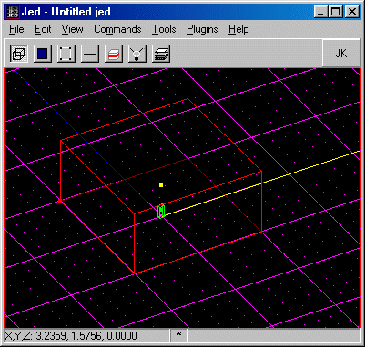

  
  
First off, most domes are kinda round, so you need to cleave off the
corners of the sector. My dome will have eight sides, which is a good
number of sides for something "round" in Jedi Knight. This method
however, will work with any sector as long as it has an even number of
walls (4, 6, 8) etc. Anyway, lets stay simple and do an 8 sided dome.
Cleave the edges like so:  
  

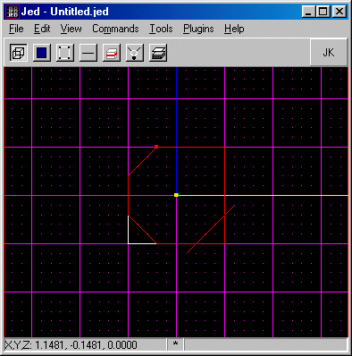

  
  
Make sure the ceiling is selected, and the grid is snapped to it.
(sometimes the grid will snap crooked. In that case sometime you can
snap the grid to the bottom face, and then reselect the top) Now, you
want to cleave it like a pizza pie\! Vertex to vertex, right across the
center. (IF you hold down SHIFT while cleaving, then it will snap to
vertex)  
  

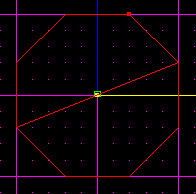 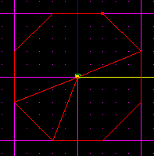

  

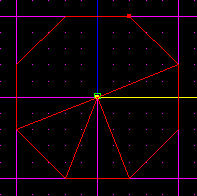 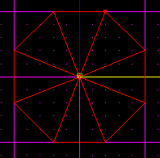

  
  
Now snap to one of the surfaces that runs along the grid lines. If you
snap to one of the surfaces created when you cleaved, the grid wont line
up correctly, and your dome will be crooked. I know that doesn't make
much sense. Just make sure that you can move the vertex STRAIGHT up. If
you want you can just select the vertex, go to the item editor, and add
like 2 to the z value. It should now look like an upside down cone.  
  

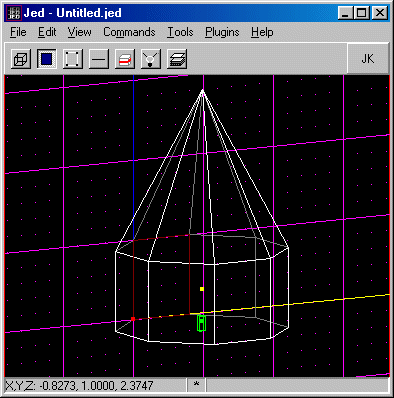

  
  
(The distance I give may vary depending on what size you wish to make
your dome. The central vertex should be placed so that edge of the cone
has a slope of 2 \[60%\]. This means that the line goes up 2 grid boxes
for every 1 it goes inward). Select one of the triangle surfaces. Then
multiselect the rest. Hold down alt and draw around all of the surfaces
of the cone. Don't get all the walls...  
  

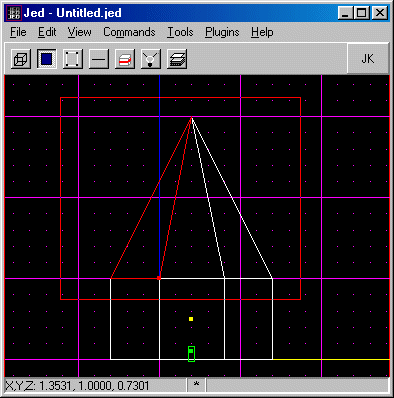

  
  
Now position the view flat against the grid, and cleave all the surfaces
half way between the bottom of your cone and where you want the top of
your dome to be when you are finished.  
  

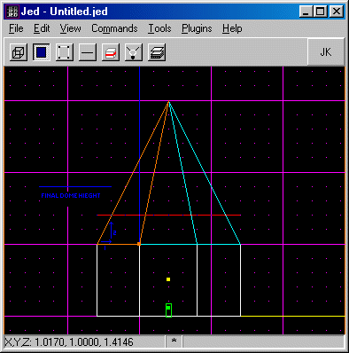

  
  
Grab the vertex again, lower it so the line has a slope of 1 (45%). This
means that the edge of the cone goes up 1 dot and over 1 dot at one
time). Next, multiselect the top triangles, and cleave again this time
3/4 the way between the bottom of the cone and the top of your dome.  
  

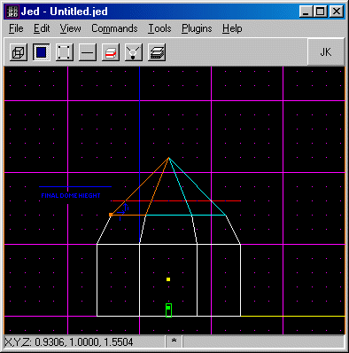

  
  
Yet again, lower the vertex, this time so it makes a slope of 1/2 (30%).
It only goes up one dot, but inward 2 dots. But don't multiselect\!
Instead, select the whole dome sector itself, and cleave along the line
of the dome's final height. Delete the little cone of top.  
  

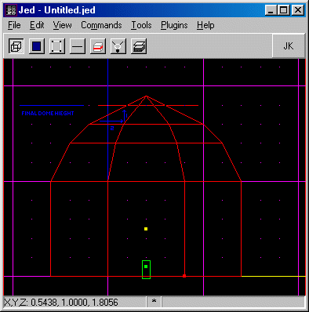

  
  
TADA\! Take a look at your dome.  
  

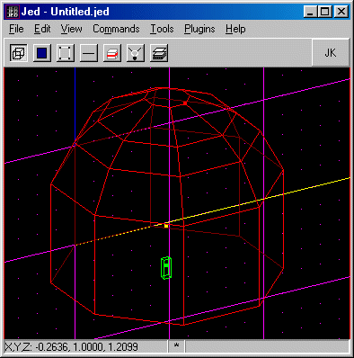

  
  
I hope this helped you make a good-looking dome. If you have any
questions, please feel free to post them on the
[Massassi Message Board](http://forums.massassi.net/).
  
Also, check out the [alternative technique](/tutorials/domes_easy/) by
Razor.
