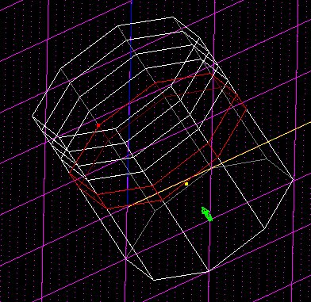
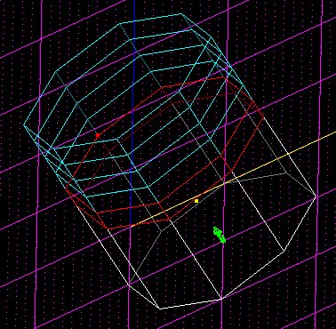
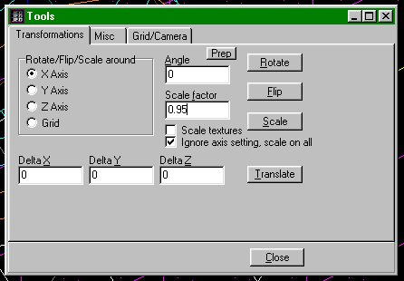
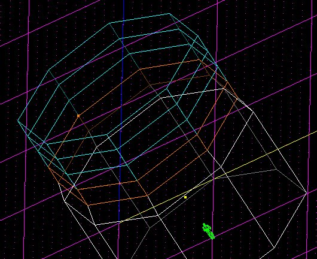
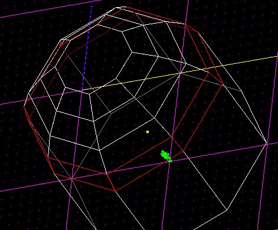

-----

Author: SavageX
  

Step 1: First, To add a dome to your sector, extrude a sector out of the
side you want to dome at, and then extrude the new sector until you have
serveral layers on top of each other.

Step 2: Multi-select all but the one sector you want to make a dome out
of.

Step 3: Go into tools (F9 key) and then set the scale to 0.95. Now,
click scale to scale the mutil selected sectors.

Step 4: As you see, the sector that was not multi selected had been
created in a cone affect. Now, repeat steps 1 - 3 but, in step 3, set
you scale to 0.1 less than the previous (if last was 0.95, then next
would be 0.85). Once you have the dome effect made, then your done\!

