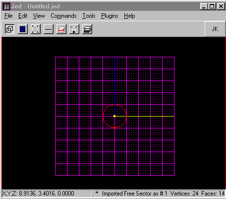
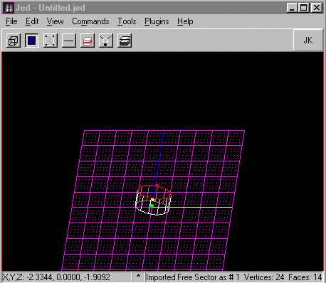
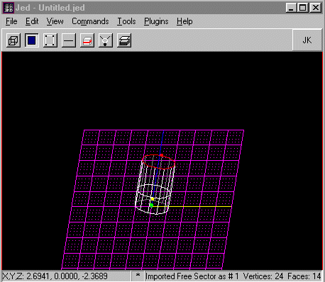
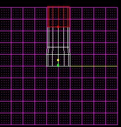
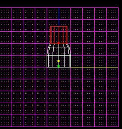
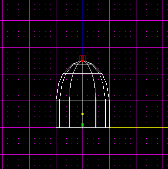

-----

Author: IRN\_Razor\_CORE
  

When I first read the [Creating a Dome in JED](/tutorials/domes/)
tutorial made by Mangore Kiramin I
thought, "wow, this is really awesome\!"  
However, lazy as I am, I started trying to find an easier way, and one
day it clicked. Just like Mangore, I was just playing around in JED
trying to figure it out, here is what I found:

First you need to make a polygon. Personally, I use the freesector
plugin (lazy as I am) but you can also do it manually (see [Perfect
Polygon tutorial](/tutorials/perfect_polygons/) made by Brian
Lozier).

How many sides it has doesn't matter, it doesn't even have to be a
polygon.  
This is what I started with:

  

1\. Now first change your sector flags to preview as 3do. This is done
by selecting your sector and pressing enter, then double click on +Flags
and check preview as 3do. Now rotate your sector a bit (shift+arrows)
and choose surface mode by pressing F or clicking on the surface icon.
Select the top surface of the polygon.

2\. Now extrude that surface. Now select the top of surface of the new
sector.

3\. Now extrude that surface. Then switch to sector mode by pressing S
or clicking on the sector icon.  
Select the top sector. It should look like in the picture below now:

4\. Now switch to side view by pressing shift+2. Press F9 to bring up
the Tools Window. Change Scale Factor to 0.9 and Delta Z to -0.1. Now
press translate a couple of times this depends on how big your polygon
is. Now press scale once. Now switch to surface mode (or do it in 3D
Preview) and select the top surface of the top sector and extrude it.
The switch to sector mode and select the new sector. If you didn't use
3D Preview you probably need to switch to side view (shift+2).

5\. Hopefully it looks like this now. Now press F9 and translate the
same or more times than before. Now scale it twice.  
After scaling it you might want to adjust the height a bit by pressing
translate again. This is how mine looked at this stage:

6\. Now switch to surface mode and select the top surface again and
extrude it then select the new sector and translate and scale it (about
5 times).

7\. Repeat step 6 but scale it much more so it looks something like
this:

8\. Now simply delete that sector and then press F12. Now go to your
walkplayer and when you get to it look straight up.  
Click once on the surface you are looking at. Now click beside the 3D
Preview window and then press M. Now press F12 once more and select the
next surface your looking at and click beside the window once more and
press M. Repeat this till you can't see any more surfaces and it's all
black.

9\. What now? Well your done with your dome, I guess it's now where you
send me some cash as a thank you gift :)
