-----

Author: Pot-Head
  
Making doors is actually very easy. Please follow the steps that I
demonstrate and you will be able to create a door every time. Ready?  
  
1\. First of all make a structure similar to the one I have made below.
Note the Extruded sector (smaller one) should be two grid spaces high by
one wide. Use the .2 grid size for this.  
  

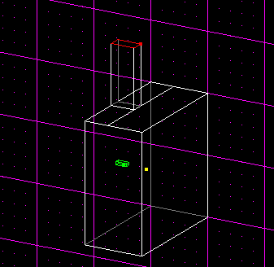

  
  
2\. Next, you need to make a sector in which the door will be inside of,
so first of all press F4 to bring up the map settings window. Choose the
"snap every" option of 0.05 which will allow you to make smaller precise
cleaves. You might also want to set grid size to 0.05 so that you can
cleave right along the grid line, but I don't do this. Now cleave the
extruded sector twice, like I have in the diagram below. This will leave
you with a total of 4 sectors.  
  

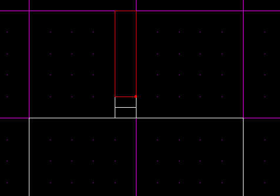

  
  
3\. Now, go to a side view, select the surface mode, select the "top" of
the door sector, and extrude it as demonstrated below.  
  

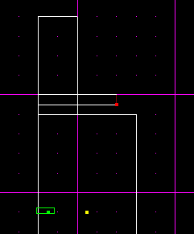

**NOTE:** If you are using JED Beta 5 you will have to pull the extruded
sector out a bit to make it higher.  
  
4\. Now that you have that, select the surface that you originally
extruded from and, and press "M" to merge the two sectors. Now you will
now have one larger sector.  
  
5\. You must now add in a appropriate sized door. Select Thing Mode and
insert this object: 2x3door. Now align it in the center of the large
sector as demonstrated below.  
  

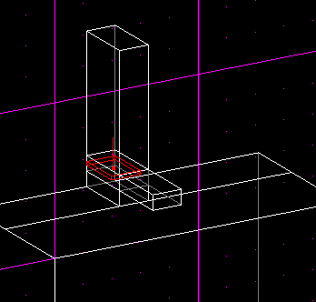

  
  
6\. Now that you have aligned it in the center of the lower part of the
sector press F12 to view your level.  
  

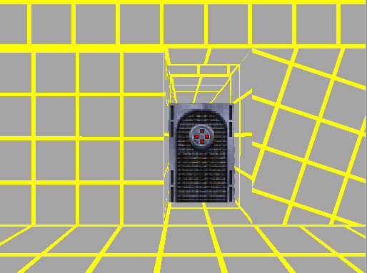

Oh no\! Look\! There is a GAP at the top of the door\! I've done this on
purpose because sometimes you may have this problem. Don't worry, I'll
explain how to make it look correct.  
  
7\. Select Sector mode then move your level to a view as demonstrated
below.  
  

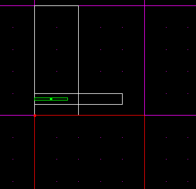

  
  
8\. If you are using JED Beta 5, which I hope you are, you will notice
that the door does not fit in the sector. You will have to cleave off
the tops of the sectors that surround your door. Please view the diagram
below on which sector to cleave.  
  

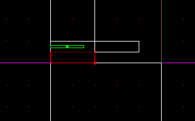

  
  
9\. Look at the following diagram. Select the sector that I have
selected, then cleave where I have.  
  

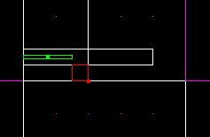

  
  
10\. Now select the smaller cleaved off sector which is to the right in
the diagram above and press \[delete\].  
  
11\. Next, do the same thing to the sector on the other side of the
door. It is important that you do not do this to the door sector, as the
door needs a place to go when you open it\!  
  

Now press F12 and it should look like this.

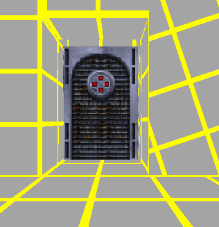

  
  
Great\! Now its on to the next part, making this door move up and
down\!  
  
1\. Select thing mode, then select the door and press enter to bring up
the various values menu.  
  
2\. Now click on Addvalue, enter "ThingFlags" (no quotes) as the value.
You will notice that in the values menu, a new box has appeared, and it
is called "ThingFlags." Now, in that box, set the value to 0x400448.  
  
3\. Add another value using the "Addvalue" button, and call it
"NUMFRAMES" When the box appears, set the value to 2.  
  
4\. Now add two more values, each called FRAME.  
  
We will now discuss how to achieve these values.  
  
1\. First of all, click on the "Copy As Frame" button. Then paste that
value into the first "FRAME" box. Easy enough.  
  
2\. Now you will need the second frame value. Do what I have done in the
diagram below by moving the view of the grid, then sliding the Door to
the right.  
  

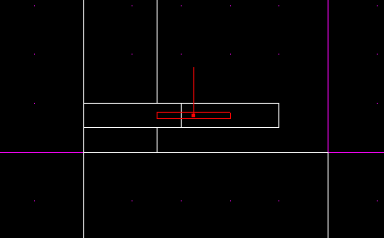

  
  
Great\! If you did that, you are now ready to input the second frame
value.  
  
3\. Bring up the thing values menu, click on "Copy As Frame" and paste
it into the second "FRAME" box. Now you're set\! All you have to do is
move the door back to it's original position.  
  

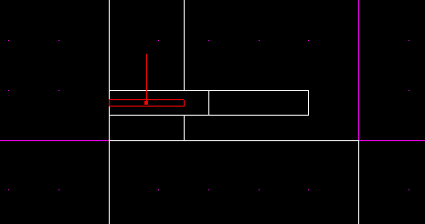

  
  
Almost done\! It's now on to adding the correct cog\!  
  
1\. Click on the "tools" menu, and select "placed COGS." Then click on
"Add Cog," enter in "00\_Door.cog" (no quotes), and click "ok".  
  
You will now see the following values:  

```
    door0(thing)       -1
    door1(thing)       -1
    door2(thing)       -1
    door3(thing)       -1
    moveSpeed(flex)     8
    sleepTime(flex)     2
    lightvalue(flex)  0.5
```

2\. Change the "door0(thing)" value to the "thing number" of your door.
(the thing number is displayed when you are in the "thing" mode and a
"thing" is selected) Leave the other 3 door values "-1"  
  
3\. "moveSpeed(flex)" is the speed you want your door to travel. (Just
leave this at "8" for the time being, you can experiment later)  
  
4\. "sleepTime(flex)" is how long you want your door to stay open. This
is another value you can experiment with at your leisure.  
  
Finally You're done\! You can now GOB your level and test it. Note that
the 00\_Door.cog is already present in the res2.gob, so you do not need
to add this to your gob. You may also want to texture the level to make
it pretty like I have. Load up JK and try it out\! Your door should
work.  
  
I hope this tutorial has made things much more clear. Below is my door
working.  
  

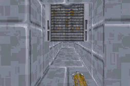
