Author: Brian Lozier
  
This tutorial focuses on creating a simple elevator that goes up (or
down) when you step on it. Elevators controlled by switches will be
covered in a later tutorial.  
  

1.  We are going to create a 2x2 elevator, at floor level of the default
    sector, that goes down a shaft to another room. The first thing I
    always do when I'm working with numbers is space the grid to 0.1.
    Whenever I do that, I also snap the grid to 0.1.  
    
2.  Now, we switch to surface mode and cleave a 2x2 square out of one of
    the corners. Don't worry, it's easy\! Just follow the dots and
    cleave like shown below.  
    
    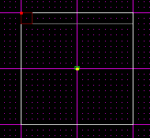
    
    
3.  Now extrude that surface, so it creates a tube going down from the
    floor. The tube will fit the elevator perfectly if you cleaved the
    dimensions right. If you are using Jed Beta 5, you will have to
    extend the tube as shown below, but Jed Beta 3 usually makes it long
    enough.  
    
    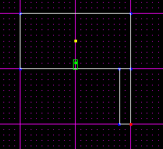
    
    
4.  Now it's time to put the elevator "thing" in. To do this, just
    switch to the "thing" mode, and press \[insert\]. Then, with the new
    thing selected, press \[return\] to bring up the Item Editor Window.
    Now, in the top box, you can double click to bring up a window that
    lets you choose what item it is. Choose the 2x2elev.  
    
5.  Okay, now switch the grid snap to 0.05. This will allow you to
    perfectly place the elevator where it needs to be.  
    
6.  Now position the elevator just below the top of the tube. Make sure
    to check from the top view and the side view to make sure you placed
    it correctly.  
    
    This is the 3D preview of Jed Beta 5. Notice that the top of the
    elevator is just below the floor.
	
    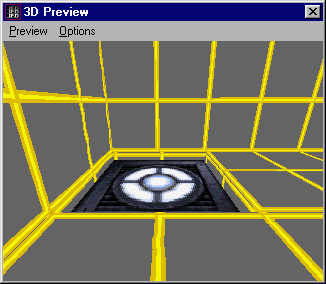
    
7.  Now it's time to start making that elevator work\! With the elevator
    selected, again press \[enter\] to bring up the Item Editor. You
    will notice, at the bottom of the Item Editor, a button called "Add
    Value." We are going to get very familiar with that button. When you
    click on it the first time, it will come up with a box asking you
    what "value" you'd like to add. The first time, it should already be
    filled in with "THINGFLAGS" (no quotes).  
    
8.  Fill that value in with "0x400048" (no quotes). Most of the time,
    this is already filled in also, just double check it.  
    
    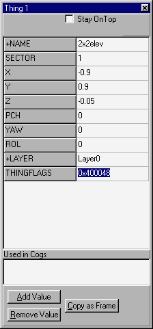
    
9.  Now, add 3 more values using the "Add Value" button. Call the first
    one "Numframes" the second and third call "frame"  
    
    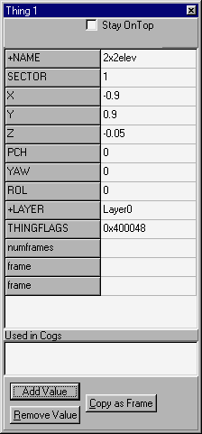
    
10. In the "numframes" box, enter the number 2.  
    
11. The two "frame" boxes are for the starting point and ending point of
    the elevator. They will contain coordinates of the level. The first
    one is the starting point, i.e. where the elevator is now. The
    easiest way to get the coords is to make sure the elevator is
    selected, and press the "copy as frame" button in the Item Editor.
    This will copy the coords into memory. All you have to do to get
    them in the 1st "frame" box is right click in it, and click
    "paste"  
    
    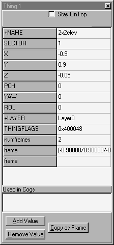
    
12. Now, the first "frame" was very easy. The second one is a little bit
    harder, but not too hard, so don't worry. Like I said, the first
    "frame" is where the elevator starts. The second "frame" is where it
    is going. The easiest way, in my opinion, to get this value, is to
    just add another elevator, exactly where you want your elevator to
    end up. Then, after we get the new elevator's coords, we just delete
    it.  
    
13. To do this, insert your new elevator with the \[insert\] key, and
    position it where you want your elevator to end up. Make sure to
    check it's position from all views. Remember to position it just
    ABOVE the floor of the shaft.  
    
    
    
14. Now, with the temporary elevator selected, press \[enter\] to bring
    up the Item Editor. Now press "Copy As Frame" to record the coords
    in memory.  
    
15. Now, go to your original elevator, bring up the Item Editor, and
    paste the coords from the temporary elevator into the second "frame"
    box.  
    
    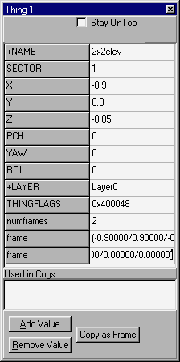
      
16. Now, you can delete the temporary elevator.  
    
17. It is now time for the COG. It is not very difficult, and once you
    learn it and do it a couple of times, it won't be anything at all.
    First of all, go to the "Tools" menu, and click on "Placed Cogs."
    Then, press the button "Add COG." When you are presented a list,
    choose "00\_std\_elev.cog"  
    
18. This cog has a few values that we will be adding.  
    
    
    
19. First of all, I am going to define what the various values are:  
    
    | **Value**                | **Description** |
    | ------------------------ | ------------------------------------------------------------------------------------------------------------- |
    | lower\_adjoin0 (surface) | This will define one of the surfaces the player must walk over to activate the elevator.                      |
    | lower\_adjoin1 (surface) | This is the same thing as "lower\_adjoin1 (surface)," except you can add another surface.                     |
    | elevator (thing)         | This is the Thing Number. When the Thing is selected, this number is displayed at the top of the Item Editor. |
    | start\_wait (flex)       | This is the amount of time the elevator waits before it starts to go up or down. You can experiment with this later, I'm not going to mess with it. |
    | sleeptime (flex)         | This is the amount of time the elevator stays at its destination. Again, I'm not going to mess with it.       |
    | speed (flex)             | This is how fast the elevator travels. I am going to leave this alone also.                                   |
    
20. Okay, first put in the "thing number." In my case it's "1."

Now we are going to discuss how to get both the "adjoin" numbers. As I
said before, these numbers will define a surface, and when a player
walks over this surface, the elevator will go up. To make sense, it must
create the illusion that when the player steps on the elevator, it goes
up. To do this, we put values for the two surfaces surrounding our
elevator.  
  

1.  There is no really easy way to do this. First, you have to cleave
    the original sector to extend the tube up into the room. Note that
    this will not be visible to the player, as all surfaces will be
    adjoined. Cleave the original sector as shown below.  
      
    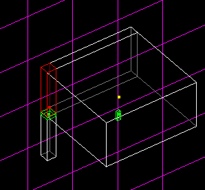
      
      
2.  Now you have to select the surface that the player must walk over to
    activate the elevator. Refer to the following diagram.  
      
    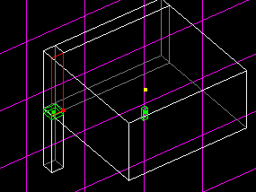
      
      
3.  If you press \[enter\] while this surface is selected, it will bring
    up the Item Editor. At the top of the Item Editor, it will display
    the sector and surface number. Take note of this for the next
    step.  
      
4.  In the first "adjoin" box of the Placed Cogs window, enter the
    sector and surface number separated by a space. In my case, as shown
    below, it is Sector 3, Surface 0.  
      
    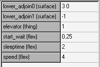
      
      
5.  Now to get the second value. Select the other surface as shown
    below.  
      
    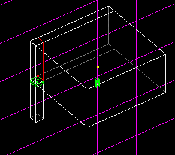
      
      
6.  Place the Sector and Surface numbers in the second "adjoin" box.  
      
    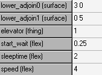
      
      
7.  That's it\! Now your elevator should work\! Just save/gob your file,
    and test it out.

  
  
I realize that this elevator brings you down a tube, and then strait
back up, but I assume you can create a room at the bottom. If not, refer
to my [tutorial on adjoining](/tutorials/adjoining/). Apply what you
have learned\!  
  
**Note:** If you want your elevator to be in the center of a room, and
want it to work the same way, then there is an extra step. I created
mine along a corner because it is easier that way.  
  
The only thing you have to do is add another Cog, the same one as
before. In this new cog, add the two other surfaces that the player can
walk over to activate the elevator. (there will be 4 now, because it's
not against a wall, and each cog will only accept 2) Also remember to
add the Thing Number, or it won't work.
