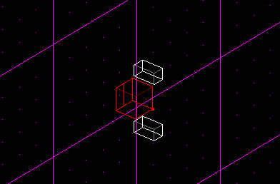
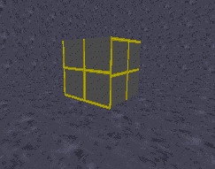
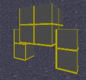
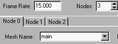
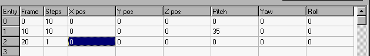
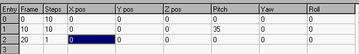
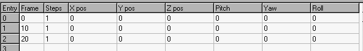

Author: EvanC
-----

Enemy 3dos  

This tutorial will help you create your own basic enemy model using JED,
notpad and Trajedi.  

First of all, create some sectors like this:  



\*NOTE these aren't adjoined  

Export each of the sectoers as a 3do. Export the large one as
enemybas.3do and then the others as leg1 and leg 2  

\*NOTE It really isn't nessecary to make two meshes if they are the same
size and shape but for the purpose of this tutorial I will use two
seperate meshes  

Now what you need to do is open up enemybas.3do with a text editor
(wordpad, notepad ETC). Now find a line that says "MESHES 1" and change
the mesh count to "MESHES 3". Change the:
```
MESH 0
NAME enemybas
```

Into:
```
MESH 0
NAME enemybas
```

Leave a window open with enemybas.3do and then open each leg 3do with a
text editor. Look for a section in leg1 that looks like this:
```
MESH 0
NAME leg1
```

Change the "MESH 0" line into "MESH 1". Now what you need to do is copy
EVERYTHING from and including "MESH 0" to just above "HIERACHY NODES 1"
(don't get the HIERACHY NODES 1 bit). Now go to the bottom of
enemybas.3do Just above the "HIERACHY NODES 1" of enemybas.3do, push
CTRL-V to paste the stuff you have just copied. Now you have to do a
similar thing with Leg2.3do except with leg2 you have to change "MESH 0"
into "MESH 2". Copy and paste it Just like leg1.  

Now, go into enemybas.3do and scroll to the bottom. There will be a
section called "HIERACHY NODES". Change the "HIERACHY NODES 1" into
"HIERACHY NODES 3". Then add these lines:
```
1:     0x0    0x1   1      0      -1       2        0            0  0  0  0.0    0.0  0.0   0.0     0.0    0.0     leg1
2:     0x0    0x1   2      0      -1      -1        0            0  0  0  0.0    0.0  0.0   0.0     0.0    0.0     leg2
```

Now go to the first line and change it to this:

`0:     0x0    0x1   0     -1       1      -1        2            0  0  0  0.0    0.0  0.0   0.0     0.0    0.0     main`

\*NOTE The NUMCHILDREN has been changed to 2  

Finally, change the "HIERACHY NODES 1" to "HIERACHY NODES 3". Now, save
the 3do and then go into JEDs template file and add these lines to the
end:
```
# DESC:   enemybas
# BBOX: -0.2104616 -0.4739575 -0.1266591 0.2112462 0.1834475 0.1065705
enemybas       _humanactor       thingflags=0x404 model3d=enemybas.3do size=0.125000 movesize=0.125000 puppet=enemybas.pup soundclass=kd.snd cog=actor_kd.cog mass=3000.000000 maxvel=0.600000 weapon=+kellbite health=500.00 maxhealth=500.00 maxthrust=1.00 maxrotthrust=120.00 typeflags=0x2028100 aiclass=kddefault.ai
```
Now, in JED, go to the "commands" menu and then "reload templates".
Create a new JK project. This will be a large default sector. Insert a
new thing and then change its template into "enemybas". Now go to 3d
preview. You should see this  



Now what you have to do is make it so that the legs are in the position
you want them to be(on the side of the large box). To do this you have
to change the offset values of the leg meshes(in the "HIERACHY NODES"
section). At the top of the hierachy section is a title bar: \# num:
flags: type: mesh: parent: child: sibling: numChildren: x: y: z: pitch:
yaw: roll: pivotx: pivoty: pivotz: hnodename:  

The columns we're interested in are the ones below "x: y: z:" These are
the x-offsets,y-offset and z-offsets respectivly. For this 3do these
values are not hard to work out but for a complex 3do you might have to
muck around a bit. We are also interested in the pivot values.  

\*NOTE If you alter a 3do after JED has viewed it in 3d preview you will
need to restart JED to see the new 3do's changes.  

What I have done is change the offset values and the pivot values. Here
is the new hierachy section:
```
SECTION: HIERARCHYDEF

HIERARCHY NODES 3
# num: flags: type: mesh: parent: child:  sibling:  numChildren: x: y: z: pitch: yaw: roll: pivotx: pivoty: pivotz: hnodename:
0:     0x0    0x1   0     -1       1      -1        2            0  0  0  0.0    0.0  0.0   0.0     0.0    0.0     main
1:     0x0    0x1   1      0      -1       2        0            0.075  0  -0.05  0.0    0.0  0.0   0.075     0.0    -0.05     leg1
2:     0x0    0x1   2      0      -1      -1        0           -0.075  0  -0.05  0.0    0.0  0.0   -0.075     0.0    -0.05     leg2
```

\*NOTE The x-offsets has changed to 0.15 and -0.15 for the legs. This
makes the legs move outwards from the centre of the 3do. The z-offsets
have both been changed to -0.1 which makes the legs go downward from the
3do. Here is what you should see if you restart JED and go to 3d
preview:  



The 3do is finished\! It may look pathetic but it is only a basic demo
of what to do. You can make complex shapes(like stormtroopers) with this
technique. This 3do is just easier to show you what to do.  

It is time to animate the 3do. Normally you would make lots of
animations for an enemy, Deaths, run, walking ETC but all we are going
to do is make one key which will make the 3do "walk". If you don't have
it yet, get Trajedi from http://www.darkjedi.com/  

Open up Trajedi. To start with we need to get the mesh names for our
3do. Push the "Get mesh names from 3do" button and select enemybas.3do,
which we just made. Now click on the little arrows next to "NODES". It
will make more nodes appear. We will need 3 nodes so make sure it is set
to 3. Now in each node (you can change nodes by clicking on the little
tabs at the top of the form) set a different mesh. Node 1 shoudl be
main, node2 should be leg1 and node3 should be leg2. Here is what we
should have:  



What we need to do now is make it so that the legs move. Go to node1 and
fill it in like this:  



Now fill node2 in like this:  



Finally, fill in node0 like this:  



Save the key as "enemybas.key" Now open up a gob program and export the
pup file "kd.pup" Open it up and then change all of the key files into
"enemybas.key" Delete the "JOINTS section" at the bottom(carefull to
leave the "end") It should now look like this:

```
#puppet file for kell dragon (kd.3do)
Mode=0                  # Idle
stand       enemybas.key    0x00    0   0   # standing
walk        enemybas.key    0x01    2   2   # walk
run             enemybas.key    0x01    2   2   # run
walkback    enemybas.key    0x01    2   2   # walk backwards
strafeleft  enemybas.key    0x01    2   2   # turn left
straferight enemybas.key    0x01    2   2   # turn right
death       enemybas.key    0x14    5   5   # die
death2      enemybas.key    0x14    5   5   # alt. die
hit         enemybas.key    0x28    1   4   # hit (recoil)
turnleft    enemybas.key    0x00    2   2   # shufflin'
turnright   enemybas.key    0x00    2   2   # shufflin'

mode=1, basedon=0           # weapon drawn
stand       enemybas.key    0x00    0   0   # standing
fire        enemybas.key    0x28    1   4   # attack

end
```

Save it as enemybas.pup Now put the key file, 3do and pup into your
project directory. Gob up your level and watch the 3do move.  

\*NOTE The 3do looks pathetic but that is not the idea of this tutorial.
When you make a proper enemy you will spend more tme debuging the
animation and making the model more complex.  

You will notice the enemy is not complete. It still doesn't sound
different. SND files and AI are not very difficult to do so I won't
waste time writing about them. If you feel that you need some help with
these I'd be happy to write a tutorial about them. If this tutorial
helps you to edit your own enemys please tell me. Also if you have
problems useing this tutorial just email me. Any comments/suggestions
are also welcome.  

Evan C
