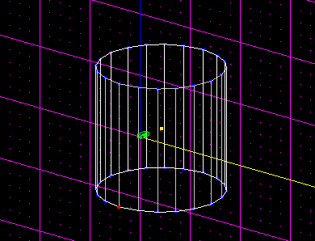
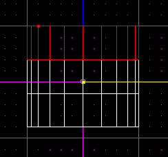
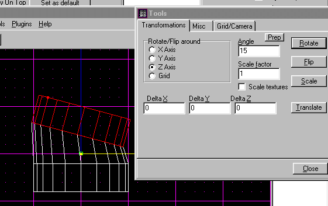
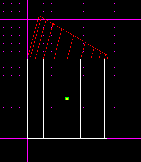
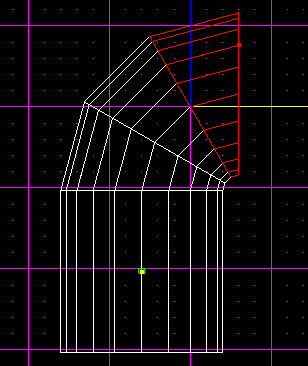
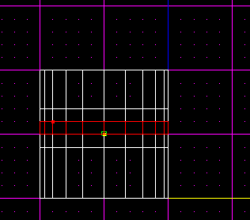
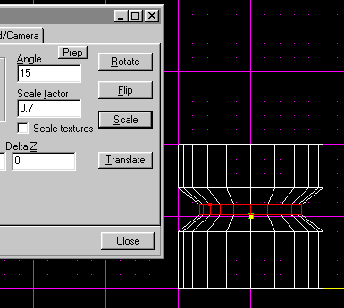
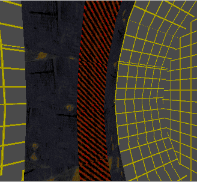

Author: EvanC

Pipes can be used in many different ways. In the original JK levels
pipes are used a lot for things such as feul storage and drains. Level 9
has a whole section of amazing pipe architechture. This tutorial is
designed to help you make fantastic pipe architechture with some quick
and simple techniques.  
  
The first thing we'll look at is creating bends in the pipe. I've
started by cleaving out a simple pipe sector. The shape I've chosen for
this is a circular pipe but octagons and other shapes could be used.  
  

  
What we'll do now is copy the sector(CTRL + C) and paste a new one in
the level(CTRL + V). This sector will be a temporary sector we use to
create the bends for the pipe. Cleave it into 3 peices, each one 0.6
jkus long(delete the left over sector at the end).  
  

Select one of the end sectors and push F9 to go into the JED tools box.
We are now going to rotate the sector a bit along the z-axis. We will
rotate it 15 degrees.  
  

Now select the other end sector. Do the same as before only rotate it
-15 degrees.  
  

Delete the 2 end sectors. We now have a section of the pipe bend. Rotate
it 15 degrees to make it straight with the other sector. Line it up with
our other sector(NOTE: it may be nessecary to line it up from 2
different views).  

Copy the sector twice and then line each of these new sectors up.  

We now have a completed bend on our pipe. To finish it off just adjoin
the surfaces between the peices. The number of peices in the bend is
determined by the amount the ends are rotated. In this example we used
15 degrees which means each peice covered 30 degrees(15 each side). 30
goes into 90 degrees 3 times, so we have 3 peices. If we had made the
rotation 5 degrees and -5 degrees each peice would cover 10 degrees,
meaning 9 would be needed to complete a 90 degree bend.  
  

The next thing we'll learn is how to create beams inside the pipes. Take
our default pipe again and cleave it up into 5 new sectors like in the
picture.  

Select the middle sector and then go to the tools menu again(F9). Now we
will re-size the middle sector by 0.7. What you should now see is that
the pipe has shrunk in the middle to create a circular beam around the
pipe.  

If we now look at the pipe in 3d preview you will see the beam around
the outside of the pipe(textured for clarity).  
  

These techniques should help you create some nice looking pipes. Good
luck\!  
