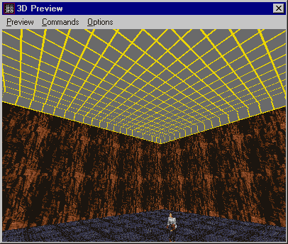
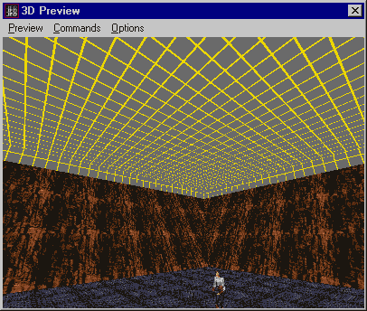

Author: Farrax

A word of indoctrination before we begin:

  - flat = boring
  - boring = bad
  - good = not bad
  - sloped = not flat
  - sloped = good

Say that over and over until you get sick of it. Then come here and
learn how to make fast slopes\!

The first step: take JED's default cube, and use Extrude By...
\[shift+x\] on one surface. (Doesn't matter which. I used the top
surface, extruded 0.1 JKUs.) It should come out looking like this.

Select the top sector, pull up JED's tools box \[F9\], and scale that
baby. Play around with the scale factor to get your desired result --
it'll give you a very funky result over 2.5 though. To get an inward
sloping wall, put in a value under 1. This is a screenshot of what I got
with 1.6 as the scale factor.

This is the most simple example of what you can do with this technique;
making a more complex starting sector will resulting a more complex end
result. In addition, if you cleave the sloped sector in half then scale
again, you'll have even funkier results, FAST\! [This
screenshot](screen3.jpg) tells all.

Two caveats about this technique: one, it shouldn't used on sectors that
have adjoins, because it screws them up. Workaround: Unadjoin then
re-adjoin. Two, it won't work on multiple sectors. Bummer.

As a final note, nothing is an island except an island. Use other
techniques to make platforms, tunnels, etc to detail up areas created in
this way. Your levels will thank you.

