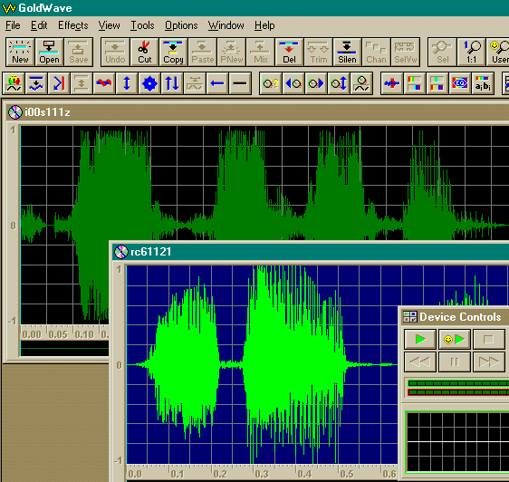
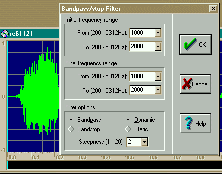
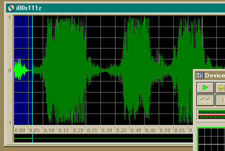
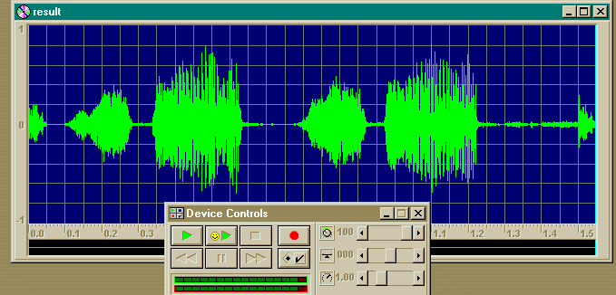
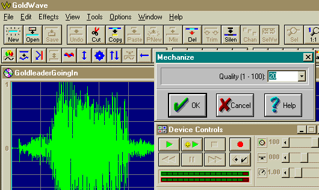
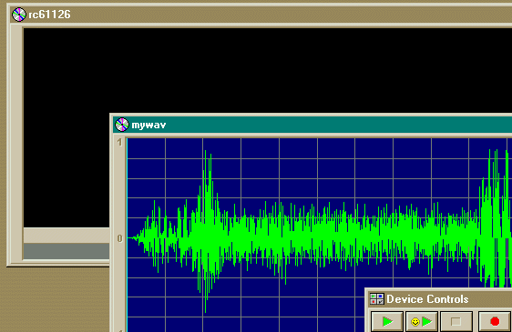

Author: Tobbi Dala

-----

So you are tired of the Stormtroopers dialogue, or it just doesnt fit the 
action of say your new cutscene? Well then you are fortunate\! Fiddling around 
with various sound software the other day, I finally
discovered a way to make a normal sounding sound file have that filtered sound 
of a stormtrooper. Now im sure that some of you already know how to do this, 
but i had never gotten my stormie sounds to be this
precise. Also included are ways of making garbled radio chatter like the x-wing 
pilots in Sw:Anh, and an easy way of making sure your new wavs have the 
correct header when saving it. So without further adue heres some tips on
how to make your own filtered wavs:

Ok, you need two programs for this. (Other than Jk and Mots of
course) The first one is ConMan (Container Manager v0.9a) - for extracting 
the sounds from the Gobs and Goos, its available in
[the programs section](/programs/#gob). The other one is a sound editor
called Goldwave, you can download at
[www.goldwave.com](www.goldwave.com)

Now remember that this sound editor is a shareware program, you
can use all the fancy stuff, save your stuff and so on, but it shuts down
after you have used it for a while.Not a problem
though, just open it again.:) Remember, if youre going to buy an audio
shareware prog, this is
it. I have mostly all of the fancy sound stuff out there, but this one
is still my favourite since the days of Dark Forces because it can handle a
variety of sound formats inluding Df's
Voc's.

Note: For this Tutorial im using Goldwave 3.24.There is a newer
version out now, but its a beta.(you use it the same way in that one anyway)
And im using sounds from both Jk and Mots, since the stormtroopers
in Mots dont have any "clicking" sounds when they speak mysteriously
enough...

 
* Extract i00s111z.wav from Jk's Res1hi.gob

* Extract rc61121.wav from Mots's JKMsndLO.goo

* Open them both up in Goldwave, this is what you should see:
 
 
 
* Select the rebel commando wav, rc61121.wav (which we will make
into a stormtrooper)
and access the effects pulldown menu.Now choose "Filter", followed
by "Bandpass/stop"
This is the filter that you will use:

* For this particular wav file we dont have to change any of the
presets really, just 
set it to "Dynamic" and the steepness to 2, that should do it.Now
these variables vary 
on other sound files, you are going to have to experiment with
them yourself.And there 
are loads of other fx you can come up with, com radio chatter and
so on. I myself managed 
to fix up a filter who sounded exactly like the Rebel pilots
garbled radio communications 
with each other on the attack of the death star.I'll show you how
to do that further down. 
 
 
Ok, take a listen to the new rebel commando wav, sounds like a
stormtrooper right? Almost. 
First we have to polish it up a bit, select this part of the
stormie wav, copy it and use "paste at 
beginning" on the rc wav, like this: 
 

* This lets the our new stormie wav have those clicking sounds
that are missing from Mots, repeat 
it with the end "click" noise from the original st wav like this:

 
 
There ya go, with the filter laid and both clicking sounds, the
end result should look something like this: 

 
 
Ok, that would be it, you may find it a bit too quiet, so did i.
thats easy to fix though. 
Just raise the volume of it in goldwave. :) 
 
Oh yeah, the garbled x-wing radio communications ala Sw:Anh... 
Makes the sounds a bit Wobbly.(Watch the film if you cant
remember\! :) ) 
Thats another filter called "Mechanize" it looks like this : 
 
 
 
This one is easier to apply, but harder to get it right, since
there are fewer options. 
On some sounds you have to use another filter to make them more
radio-like. 
GoldleaderGoingIn.wav here is a stormtrooper wav which i used
mechanize quality 20 on. 
Since it already had a radio-ish quality to it, it sounded
exactly like the rebels in A new hope. 
 
As an extra tip: If your own custom wav file that you have recorded yourself,
should be in  some sort of wrong format. i.e. not mots or jk's, or the Hz of
the file would be wrong,  thats easy to fix too, just do this:

 
 
1. Open both your wav and the either one from mots or jk. 
2. Use "Cut" on the mots/jk wav so its totally black. 
3. Paste your wav into the empty mots/jk one. 
4. Save it under a new name, and dont change the settings in save. This lets 
   your new wav keep the header settings of the one its pasted into. 

Well, thats it really.Just remember: The LucasartsWavs in Jk/Mots are 
Copyrighted, i only used these for a demonstration everyone owning these games 
could follow.So dont go editing them, use these filters with your own sounds. 
And dont stick to the preset filters either.Experiment wildly, the results can 
be weird\! :)

Happy editing\!
