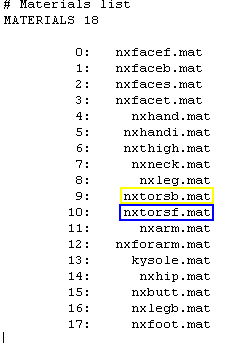
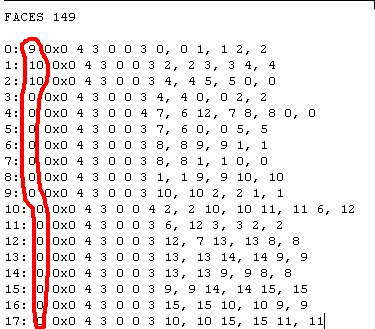
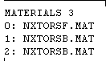

Author: GuNbOY

Fix skin textures\!\!\!

how to fix a skins textures after you edit the 3do.

once you have edited your skin 3do (we will use the torso for now) you
will probably see that your textures are very skrewy. Ill use RobX's
ninjaX skin as an example cuz i had to change over 200 lines of his
3do(i dont like doing that so im writing this\!\!). see how the face is
on his chest because he added a sword to the torso 3do? well we
have

to fix that right? so here is how you go about
doing that.

Open the 3do up in word pad, and look at the texture
list.

see the nxtorsf.mat's number? well remeber it (10)
also note that nxtorsb.mat is number 9. now go to the edited section of
3do for the torso mesh. go to the faces section and look at the number
right after the colen. thats the numbers we have to change. as you can
see those numbers DO NOT corrispond to the ones for the torso
mats

all those 0's should be changed, but into what???? a
10? or a 9? well open up the edited 3do for your torso, just the torso\!
not the whole thing. and look at the texture list. this is what it
would- ....er did look like.

now remember the texture
number 9 in the skin was nxtorsb.mat and its number 1....and 2 here( i
dont know what robX was thinking) so go back to the skin 3do and change
all those 0's in the face list of the torso mesh to 10's and all the 2's
and 1's to 9's. see thats not too hard huh?now your mats are fixed and
it looks good\!\!\! SEE???? and you dont have to ask somone else to
change 200 lines in a 3do for you, arn't you special\!

now
his chest is fine

send any questions or comments to me
GuNbOy
