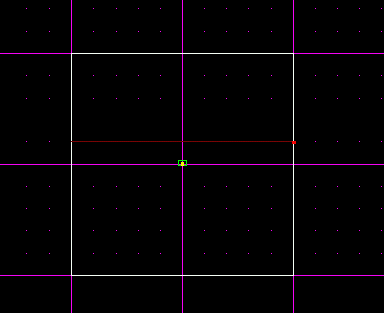

Author: Executor
  
Breaking glass. Seems so neat... then it must be hard, right? Actually,
it's REALLY easy. It's as easy as 1, 2, 3... well, maybe 1, 2, 3, 4, 5,
but you get the idea. Here's all you have to do:

1.  Start up JED and make a new JK or MotS project. Now, go into sector
    mode and select that main square sector. Cleave it in half, and move
    the player a little to either side of the cleave, to make sure the
    player doesn't startup right in the middle of a glass pane. Your
    cleaved sector should look like this:  
      
    
      
      
2.  Now, go into surface mode and select one of the sides of that middle
    line. Go to that surface editor thing...you know, the one you use to
    select the textures and flags of surfaces. Ok, in there,
    double-click the +MATERIAL box and select a glass texture to use.
    These are the available glass textures:  
      
    MotS:
        <ul>
        <li>00_glass.mat</li>
        <li>00wglas1.mat</li>
        <li>00wglas2.mat</li>
        </ul>

    JK:
        <ul>
        <li>00wglas1.mat</li>
        <li>00wglas2.mat</li>
        </ul>
      
    Select whatever texture you want, click OK, and press Enter. Now,
    you have to change the settings of +GEO, +ADJOIN FLAGS, and +FACE
    FLAGS. Change +GEO from 0 to 4, so the glass shows up. Change
    +ADJOIN FLAGS from 7 to 5, so that you can't just walk through you
    glass. (Note: DON'T set +ADJOIN FLAGS to 15...I have done this
    before, but when I did, I couldn't walk past the glass even AFTER
    was broken)  
      
    Finally, set +FACE FLAGS to 2 so that the glass is translucent, and
    you can see through it.  
      
3.  Repeat step 2 on the opposite side of the glass pane.  
      
4.  Now, to set the cog file\! Click Tools, and then select Placed Cogs.
    Click Add Cog and select 00\_breakingglass.cog from the list. Now,
    you have that cog in the window, with its values, glass, glass2,
    spawnpoints, and density.  
      
    Ok, now, select one side of your glass pane (doesn't matter which
    one), and go to the surface editor again. This time, look at the top
    of it, where it says Sector 1 Surface 5 or Sector 0 Surface 5. Take
    down the 2 numbers, like 1 and 5 or 0 and 5. Now, go to your placed
    cog window again, and select your 1 and only cog.  
      
    For the first value, glass, put those 2 numbers, separated by a
    space. Like 1 5 or 0 5.  
      
    Now, you know that once you've used one of these pairs, the other
    pair goes in glass2. BUT, these numbers won't always be like this.
    Make sure you have the right numbers, or you may wind up breading a
    wall or something.  
      
    Leave spawnpoints and density alone for now :)  
      
5.  Now, just save your level and test it\! Shoot the glass, and it
    should break into lots of little shards. Congratulations\!\! You
    just made breaking glass\!\!
